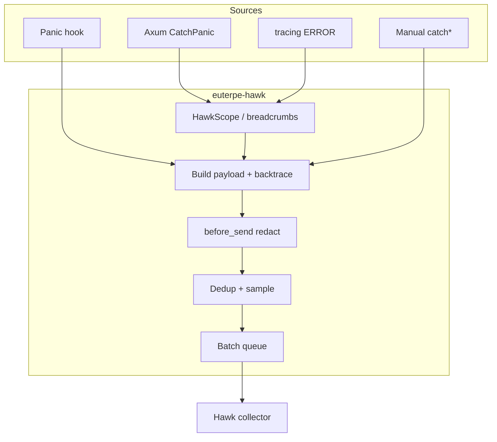

# Hawk Rust Catcher (`euterpe-hawk`)

Rust error catcher for [Hawk.so](https://hawk.so). Sends events in the [Codex Team Hawk event format](https://docs.hawk.so/event-format) (`catcherType`: `errors/rust`).

This crate lives inside the **Euterpe** monorepo workspace today. It is written so it can be extracted later into a standalone repository and published as **`hawk.rust`** (crate name on crates.io may change at that time; the in-tree name remains `euterpe-hawk` for now).

Related official catchers:

| Language | Repository |
|----------|------------|
| Python | [codex-team/hawk.python](https://github.com/codex-team/hawk.python) |
| Go | [codex-team/hawk.go](https://github.com/codex-team/hawk.go) |

Design ideas (batching, flush guard, scope, backtrace trim, tracing layer) are aligned with [Sentry Rust SDK](https://github.com/getsentry/sentry-rust) patterns where they fit Hawk’s wire format.

---

## Features

- **Async HTTP delivery** to the Hawk collector (`reqwest` + rustls)
- **Global panic hook** for background / non-HTTP panics
- **Axum integration** (optional): per-request scope, sanitized HTTP addons, `CatchPanicLayer` with a single report per handler panic (no duplicate with the global hook)
- **`tracing` layer** (optional): `ERROR` → Hawk events; `INFO` / `WARN` → breadcrumbs on the request scope
- **Backtrace** capture with optional frame trimming (`std::`, `tokio::`, `tower::`, …)
- **`std::error::Error` chain** in `payload.description`
- **Runtime context**: OS, arch, hostname, environment
- **Batching** and **flush on shutdown** via `HawkGuard`
- **Sample rate** and **deduplication** windows
- **Default `before_send`** redaction of sensitive header/context keys

---

## Requirements

- Rust **1.70+** (2021 edition)
- Tokio runtime for async flush and the background sender task
- A valid Hawk **integration token** (base64-encoded JSON with `integrationId`)

---

## Installation

Add to `Cargo.toml` (path or git until the crate is published):

```toml
[dependencies]
euterpe-hawk = { path = "../euterpe-hawk", features = ["axum", "tracing-layer"] }
tokio = { version = "1", features = ["rt-multi-thread", "macros"] }
tracing = "0.1"
tracing-subscriber = { version = "0.3", features = ["env-filter", "registry"] }
```

### Cargo features

| Feature | Default | Description |
|---------|---------|-------------|
| *(none)* | ✅ | Core catcher: config, sender, panic hook, manual `catch*` APIs |
| `axum` | | `apply_layers`, request scope middleware, HTTP panic layer |
| `tracing-layer` | | `HawkLayer` for `tracing-subscriber` |

---

## Quick start

### 1. Environment

Create a project on [Hawk.so](https://hawk.so) and copy the integration token.

```env
HAWK_TOKEN=eyJhbGciOiJIUzI1NiIsInR5cCI6IkpXVCJ9...
# Optional:
# HAWK_RELEASE=1.2.3
# HAWK_ENVIRONMENT=production
# HAWK_COLLECTOR_ENDPOINT=https://<integrationId>.k1.hawk.so
```

If `HAWK_TOKEN` is missing or invalid, the catcher is **disabled** (no-op): `install_from_env` returns `(None, None)`.

### 2. Initialize and keep the guard

Like Sentry’s init guard, **`HawkGuard` must stay alive** until shutdown so pending events are flushed (default timeout: 2 seconds).

```rust
use euterpe_hawk::Hawk;

#[tokio::main]
async fn main() {
    let (hawk, _guard) = Hawk::install_from_env(Some(env!("CARGO_PKG_VERSION")));
    // _guard dropped at process exit → flush

    if let Some(hawk) = hawk {
        hawk.catch_message("something went wrong", "AppError", Default::default());
    }
}
```

- **`release`** in events: `HAWK_RELEASE` or the `default_release` argument (typically your **application** version).
- **`catcherVersion`** in events: version of this crate (`euterpe-hawk`).

### 3. Programmatic config

```rust
use euterpe_hawk::{Hawk, HawkConfig};

let mut config = HawkConfig::from_token("YOUR_TOKEN")?;
config.release = Some("my-app@1.0.0".into());
config.environment = Some("staging".into());

let hawk = Hawk::try_new(config)?;
hawk.init();

// Prefer install_from_env — it returns (Arc<Hawk>, HawkGuard) with matching flush timeout:
// let (Some(hawk), Some(guard)) = Hawk::install_from_env(Some("1.0.0"));
```

`Hawk::try_new` + `init()` does not create a `HawkGuard`; call `hawk.flush(timeout).await` before exit or use `install_from_env` for shutdown flush.

---

## Catching errors manually

| API | Use when |
|-----|----------|
| `catch_error(&err, opts)` | `err` implements `std::error::Error` — fills `description` from `source()` chain |
| `catch(err, opts)` | Any `Display + Debug` (type name → event `type`) |
| `catch_message(title, type, opts)` | Fully custom title and type string |

```rust
use euterpe_hawk::{CatchOpts, EventLevel, AffectedUser};
use serde_json::json;

let opts = CatchOpts {
    context: Some(json!({ "job_id": "42" })),
    user: Some(AffectedUser {
        id: Some("user-1".into()),
        name: Some("Alice".into()),
        ..Default::default()
    }),
    level: EventLevel::Error,
    ..Default::default()
};

hawk.catch_error(&my_err, opts);
```

### `CatchOpts` fields

| Field | Description |
|-------|-------------|
| `context` | Extra JSON merged into `payload.context` |
| `user` | Affected user (overrides scope/config default) |
| `release` | Per-event release override |
| `addons` | Hawk addons object (e.g. HTTP, mechanism) |
| `description` | Override error chain text |
| `level` | `Warning` (4), `Error` (8), `Fatal` (16) |
| `urgent` | Skip batch delay; trigger immediate flush (panics) |

### Custom `before_send`

```rust
let hawk = Hawk::try_new(config)?
    .with_before_send(|event| {
        // Strip or mutate event before enqueue
        if event.payload.title.contains("ignore") {
            event.payload.title.clear();
        }
    });
```

The built-in hook runs first, then yours. Default redaction removes keys matching `password`, `authorization`, `cookie`, etc.

---

## Panics

| Source | Behavior |
|--------|----------|
| **Axum handler** (`CatchPanicLayer`) | Reports once, sets thread-local flag; global hook **skips** second report |
| **Other threads / tasks** | Global `panic::hook` → Hawk + urgent flush |

Panics use `EventLevel::Fatal`, mechanism addon `{ "type": "panic", "handled": false }`, and HTTP addons when a request scope is active.

---

## Axum integration

Enable feature `axum`.

```rust
use std::sync::Arc;
use euterpe_hawk::{axum, Hawk};

let hawk: Arc<Hawk> = /* from install_from_env */;
let app = axum::Router::new()
    .route("/health", axum::routing::get(|| async { "ok" }));

let app = axum::apply_layers(app, hawk);
```

`apply_layers` adds:

1. **`request_context_middleware`** — `HawkScope` per request (`request_id`, method, URI, redacted headers)
2. **`catch_panic_layer`** — 500 response + Hawk event

Per-request user can be supplied via `CatchOpts::user`, `HawkConfig::default_user`, or a custom Axum middleware that builds `HawkScope { user: Some(...), .. }` and wraps the handler with `scope::with_scope`.

---

## `tracing` integration

Enable feature `tracing-layer` and register `HawkLayer` on a `tracing_subscriber::Registry`:

```rust
use tracing_subscriber::layer::SubscriberExt;
use tracing_subscriber::util::SubscriberInitExt;
use euterpe_hawk::HawkLayer;

let (Some(hawk), _guard) = euterpe_hawk::Hawk::install_from_env(Some("1.0.0"));

tracing_subscriber::registry()
    .with(tracing_subscriber::EnvFilter::from_default_env())
    .with(tracing_subscriber::fmt::layer())
    .with(HawkLayer::new(hawk.clone()))
    .init();

// ERROR → Hawk event (with structured fields in context)
tracing::error!(job_id = %id, "download failed");

// INFO/WARN → breadcrumbs (attached to the next event on this task)
tracing::warn!("retrying");
```

**Recommendation:** use either **`tracing::error!`** or manual `hawk.catch`, not both for the same failure, to avoid duplicate events. The layer deduplicates identical `(target, message)` within 5 seconds.

---

## Configuration reference

### Environment variables

| Variable | Default | Description |
|----------|---------|-------------|
| `HAWK_TOKEN` | — | Integration token; empty / invalid → catcher disabled |
| `HAWK_COLLECTOR_ENDPOINT` | `https://{integrationId}.k1.hawk.so` | Collector URL override |
| `HAWK_RELEASE` | — | Release string in payload |
| `HAWK_ENVIRONMENT` | — | `context.environment` |
| `HAWK_BACKTRACE_TRIM` | `true` | Hide framework frames in backtrace |
| `HAWK_BATCH_MAX` | `1` | Max events per HTTP POST batch |
| `HAWK_BATCH_INTERVAL_MS` | `1000` | Max wait before flushing a batch |
| `HAWK_SAMPLE_RATE` | `1.0` | Random drop probability `0.0`–`1.0` |
| `HAWK_FLUSH_TIMEOUT_SECS` | `2` | Flush timeout on shutdown / `Hawk::flush` |
| `HAWK_DEDUP_WINDOW_SECS` | `5` | Suppress duplicate `(type, title)` events |

`RUST_BACKTRACE=1` or `full` enables optional source lines in frames (see `HawkConfig::source_code_enabled`).

### `HawkConfig` fields (code)

Same semantics as env vars, plus:

- `context` — global JSON merged into every event
- `default_user` — default `AffectedUser`
- `source_code_lines` — lines of source around each frame when backtrace is enabled

---

## Event pipeline



Wire JSON shape (simplified):

```json
{
  "token": "<integration-token>",
  "catcherType": "errors/rust",
  "payload": {
    "title": "error message",
    "type": "Error",
    "level": 8,
    "description": "root: cause1: cause2",
    "backtrace": [{ "file": "...", "line": 1, "function": "..." }],
    "release": "1.0.0",
    "catcherVersion": "0.1.0",
    "user": { "id": "..." },
    "context": { "environment": "production", "runtime": { "os": "...", "arch": "..." } },
    "addons": { "http": { ... }, "mechanism": { "type": "panic", "handled": false } }
  }
}
```

---

## Flush and shutdown

```rust
use std::time::Duration;

hawk.flush(Duration::from_secs(2)).await;
```

On drop, **`HawkGuard`** schedules a non-blocking flush (safe inside a Tokio runtime). Panic reports also request an urgent flush so events are not lost on crash.

---

## Development

From the workspace root:

```bash
cargo test -p euterpe-hawk --features axum,tracing-layer
```

Integration tests use [wiremock](https://github.com/LukeMathWalker/wiremock-rs) for collector HTTP.

---

## Full application example (Axum + tracing)

See [Euterpe server `main.rs`](../euterpe-server/src/main.rs) for a production wiring:

- `Hawk::install_from_env(Some(CARGO_PKG_VERSION))`
- `tracing_subscriber::registry()` + `HawkLayer` + fmt
- `AppState` holds `Option<Arc<Hawk>>` for `axum::apply_layers`

---

## Roadmap (standalone `hawk.rust`)

Planned when extracted to its own repository:

- Publish on [crates.io](https://crates.io) under a stable crate name
- Examples crate (`examples/axum`, `examples/tracing`)
- CI, changelog, and parity table with `hawk.python` / `hawk.go`

**Out of scope today:** WebSocket transport, suspected commits / git metadata, performance transactions, OpenTelemetry.

---

## License

Apache-2.0 — see the workspace root `LICENSE`.

---

## Links

- Hawk.so: <https://hawk.so>
- Event format: <https://docs.hawk.so/event-format>
- CodeX Team: <https://codex.so>
