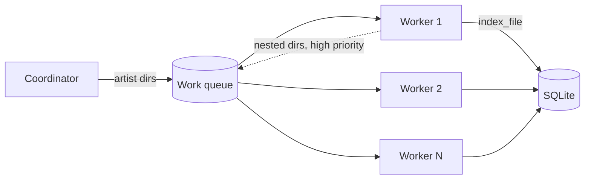

# Планы на будущее

Документ фиксирует функции **вне текущих Phase 0–5**, но согласованные с архитектурой Euterpe. Реализация — **строгий TDD**, как и весь проект. Нумерация FP-1…FP-10 — порядок обсуждения, не обязательно порядок релизов.

## FP-1 — Получение Qobuz-токена из приложения ✅ (выполнено)

Реализовано: OAuth start/callback, `qobuz_accounts`, шифрование UAT, Settings connect/logout, `.env` на старте.


### Проблема сейчас

На Phase 1–2 пользователь вручную копирует `user_id` и `user_auth_token` из DevTools play.qobuz.com или задаёт env в Docker ([oauth-and-tokens.ru.md](../05-qobuz/oauth-and-tokens.ru.md)).

### Цель

Подключить Qobuz **из UI Euterpe** (или wizard при первом запуске), получить токен через **OAuth redirect**, сохранить в БД — без ручной вставки в env.

### Пользовательский сценарий

1. Settings → «Подключить Qobuz»
2. Редирект на Qobuz OAuth (или встроенное окно / новая вкладка)
3. После успеха — callback на `https://<euterpe>/api/v1/qobuz/oauth/callback`
4. Сервер сохраняет учётную запись, показывает имя / тип подписки (Studio и т.д.)
5. Дальнейшие sync/download используют токен из БД

### Backend (черновик)


| Endpoint                                  | Назначение                                  |
| ----------------------------------------- | ------------------------------------------- |
| `GET /api/v1/qobuz/oauth/start`           | URL для редиректа + `state` (CSRF)          |
| `GET /api/v1/qobuz/oauth/callback`        | Обмен code → UAT, запись в `qobuz_accounts` |
| `POST /api/v1/qobuz/accounts/:id/refresh` | Обновление UAT (если API поддерживает)      |
| `DELETE /api/v1/qobuz/accounts/:id`       | Отвязать аккаунт                            |


Референс реализации OAuth: исходники **qobuz-dl-go** в `docs/references/qobuz-dl-go` (клон вручную); при необходимости ветка **qobuz-dl** с PR #331 в `docs/references/qobuz-dl`. Сводка путей: [oauth-and-tokens.ru.md](../05-qobuz/oauth-and-tokens.ru.md).

### Хранение в БД

Таблица `qobuz_accounts` (см. [sqlite-schema.ru.md](../02-backend/sqlite-schema.ru.md#qobuz_accounts-future)):

- `user_auth_token` — **только в зашифрованном виде** (ключ из env `EUTERPE_SECRETS_KEY` или file)
- `user_id`, `display_name`, `membership_label`
- `uat_obtained_at`, `uat_expires_at` (если удаётся распарсить JWT `exp`)
- `oauth_refresh_token` — optional, если появится в flow

**Не** хранить UAT в `settings` или env; только `qobuz_accounts` + OAuth в UI (см. FP-1).

### UI

- Settings: кнопка «Подключить», статус «подключено до …»
- Toast при истечении токена + кнопка «Переподключить»
- Phase 4+; зависит от Phase 2 server routes

### Milestones (TDD)


| ID    | Scope                                                       |
| ----- | ----------------------------------------------------------- |
| FP-1a | ✅ OAuth start/callback + insert `qobuz_accounts` (mock Qobuz) |
| FP-1b | ✅ UI connect flow (Vitest + MSW)                              |
| FP-1c | Live OAuth test `#[ignore]`                                 |
| FP-1d | Auto-refresh / уведомление об истечении                     |


**Целевая фаза:** **Phase 2b** (после базового API Phase 2) или начало **Phase 4** вместе с Settings UI.

---

## FP-2 — Очередь загрузок: очистка и удаление заданий ✅

### Проблема сейчас

На Phase 3–4 в UI есть **отмена** активного job (`DELETE /downloads/{id}` → `cancelled`), но нет:

- массовой уборки «старых» записей в списке;
- удаления конкретной строки из истории очереди (не путать с cancel running).

### Цель

1. **Полная очистка очереди** — одной операцией убрать все **завершённые/устаревшие** jobs, не трогая:
  - **новые** (`queued`);
  - **активные** (`running`).
  - Типично удаляются: `completed`, `failed`, `cancelled` (точный набор — зафиксировать в OpenAPI).
2. **Персональное удаление** — кнопка у строки: убрать **один** job из списка/БД (для finished jobs; для `queued`/`running` — либо запрет, либо сначала cancel).

### Backend (черновик)


| Endpoint                                | Назначение                                                                              |
| --------------------------------------- | --------------------------------------------------------------------------------------- |
| `POST /api/v1/downloads/purge`          | Удалить все jobs со статусом ∉ `{queued, running}`; ответ `{ "deleted": N }`            |
| `DELETE /api/v1/downloads/{id}?purge=1` | Удалить запись job из БД (не cancel); **409** если `running` без предварительной отмены |


Альтернатива: отдельный `DELETE` только для terminal status; cancel остаётся как сейчас.

### UI (`/queue`)

- Toolbar: **«Очистить историю»** + confirm dialog
- Row action: **«Удалить»** (иконка) для terminal jobs; для running — **Cancel** как сейчас

### Milestones (TDD)


| ID    | Scope                                                      |
| ----- | ---------------------------------------------------------- |
| FP-2a | ✅ OpenAPI + `download_jobs::purge_finished` + contract tests |
| FP-2b | ✅ `DELETE` purge single job + state rules                    |
| FP-2c | ✅ Queue UI: purge + per-row delete (Vitest + MSW)            |


**Целевая фаза:** **Phase 4b** (доработка UI) / **Phase 3b** (API).

## FP-3 — Favorites: сортировка таблицы ✅

### Проблема сейчас

Список избранного (`GET /api/v1/qobuz/favorites`) отображается в порядке БД/sync без сортировки по колонкам; **нет поля поиска** по названию / исполнителю; **нет миниатюр обложек** в таблице (данные обложки с Qobuz при sync либо не сохраняются в DTO, либо не отдаются отдельным URL для ``).

### Цель

**Сортировка — сразу на сервере:** `GET /api/v1/qobuz/favorites` принимает `sort` и `order`; ответ приходит уже в нужном порядке (`ORDER BY` в SQL с whitelist колонок). Клиент только отображает порядок и переключает параметры запроса (TanStack Table **manual sorting** / `getManualSortingRowModel`, без локальной пересортировки всего списка как источника правды).

| Колонка    | Параметр `sort` | Поле в SQL      |
| ---------- | --------------- | --------------- |
| Title      | `title`         | `title`         |
| Artist     | `artist`        | `artist_name`   |
| In library | `in_library`    | выражение `in_library` (JOIN) |

- Значения по умолчанию зафиксировать в OpenAPI (например `sort=title`, `order=asc`).
- Сохранение последнего выбора в `sessionStorage` optional.

**Поиск:** поле над таблицей — при пагинации обязателен **серверный** фильтр `GET …/favorites?q=…` + `LIKE` по `title` / `artist_name` (и тесты `api_qobuz`). При отсутствии пагинации допускается client-side только как временный режим.

**Обложки:** колонка или ведущая миниатюра слева от названия: приоритет **локальная** обложка из библиотеки (`albums.cover_path` / `GET …/library/albums/{id}/cover`, если `in_library`), иначе **URL с Qobuz** (после расширения sync или `album/get` кэша — URL из `image.thumbnail` / `small` / `large` в ответе API, сохранённые в БД или отдаваемые в OpenAPI как `cover_url` без прокси либо через безопасный прокси с TTL, если нужен CORS/кэш).

### API

Сортировка и **пагинация по ключам** (keyset / seek: **без** `OFFSET` и без «страницы по номеру»; размер страницы задаётся **`LIMIT`** уже **после** предиката «после курсора»):

`GET /api/v1/qobuz/favorites?sort=title&order=asc&limit=50&cursor=<opaque>`

- `sort` ∈ `{ title, artist, in_library }` (whitelist); неверное значение → **400** или fallback на default (решение зафиксировать в OpenAPI).
- `order` ∈ `{ asc, desc }`.
- `limit` — размер страницы (верхняя граница на сервере, напр. ≤ 100).
- **`cursor`** — непрозрачная строка (например base64url), кодирующая **набор значений ключей** текущей позиции: поля, по которым идёт `ORDER BY` (включая стабильный **tie-breaker**, обычно суррогатный id строки), чтобы следующий запрос продолжил выборку условием вида «после этой точки в порядке сортировки». Пустой / отсутствующий `cursor` — первая страница.

Тот же **стиль query-параметров и ответа** для списков зафиксировать как общий контракт (**FP-8**): `limit`, `sort`, `order`, `cursor`; в теле ответа — **общая форма** (`items`, `next_cursor`, при необходимости `has_more`; опционально отдельный endpoint для `total`, если нужен точный счётчик без полного скана).

Поиск и обложки (черновик):

| Параметр / поле | Назначение |
|-----------------|------------|
| `GET …/favorites?q=…` | Серверный поиск по title / artist_name |
| `cover_url` в элементе списка | Прямая ссылка на картинку Qobuz или относительный путь к прокси `GET /api/v1/qobuz/favorites/{qobuz_id}/cover` (решение по безопасности и кэшу зафиксировать в OpenAPI) |

### Milestones (TDD)


| ID    | Scope                                                                                                                                                 |
| ----- | ----------------------------------------------------------------------------------------------------------------------------------------------------- |
| FP-3a | ✅ OpenAPI: `sort` / `order` / `limit` / **`cursor`** + whitelist; форма ответа **как в FP-8** (keyset); `favorites::list_albums_keyset` + SQL + `api_qobuz` тесты |
| FP-3b | ✅ Vitest: смена сортировки / load more → `cursor`/`sort`/`order` |
| FP-3c | ✅ Artist + In library: sort + SQL |
| FP-3d | ✅ Фильтр **в библиотеке / нет**: `in_library` + UI |
| FP-3e | ✅ Поиск: `q` + debounce в UI + `api_qobuz` |
| FP-3f | ✅ Обложки: `cover_url` (migration 007), sync, колонка; Library cover при `in_library` |


**Целевая фаза:** **Phase 4b** (frontend + контракт) и **Phase 2b** (SQL/OpenAPI на сервере для сортировки в первую очередь).

---


## FP-7 — Библиотека сразу после скачивания (без обязательного rescan)

### Проблема

1. **Избранное:** колонка «В библиотеке» — `JOIN albums ON albums.qobuz_album_id = qobuz_favorites.qobuz_id`.
2. **Library UI:** список альбомов/треков читается из SQLite (`albums`, `tracks`), а не с диска на лету.

После download worker уже держит **`AlbumDetail`**, список `TrackSummary`, финальные пути (`library/paths::track_path`) и знает `download_jobs.qobuz_id`. **Полный `POST …/library/scan`** для только что скачанного альбома избыточен: те же поля приходится заново читать с диска (lofty + SHA256), хотя источник правды уже в памяти.

### Принцип (целевое поведение)

| Событие | Индексация |
|---------|------------|
| Успешный download альбома | **Сразу** upsert `artists` → `albums` → все `tracks` из `album/get` + относительные `path`, `qobuz_*_id`, обложка (`cover.<ext>`) |
| Файлы добавлены вручную / старая библиотека | `library/scan` (FP-9 — параллельный обход) |
| Починка рассинхрона | Опциональный rescan каталога или всей библиотеки |

Rescan остаётся **инструментом восстановления**, а не обязательным шагом после каждой загрузки.

### Сделано

- **FP-7a (done):** после всех треков — `register_album_from_qobuz_download`: **`albums`** + `path`, `qobuz_album_id` = `download_jobs.qobuz_id`.
- **FP-7b–7c (done):** тот же вызов upsert **всех `tracks`** из `AlbumDetail` (API-поля + `track_path`, `file_mtime` без SHA256); unit + worker-тесты без `library/scan`.
- Обложка: `apply_album_cover_after_download` → `cover.<ext>` + привязка к альбому (после register).

### Реализация (`register_download.rs`)

Один вызов в конце `run_album_job` (после цикла download, до/после cover — зафиксировать порядок с FP-5):

```
register_library_from_qobuz_download(pool, library_root, favorite_catalog_id, album, quality)
  → artist upsert (как сейчас)
  → album upsert → album_id
  → для каждого TrackSummary в album.tracks:
        path = track_path(library_root, album, track, quality.format_id())
        tracks::upsert из API-полей (title, track_number, duration, qobuz_track_id, year, …)
        file_mtime / size с диска (stat), file_hash — опционально (см. ниже)
  → albums.cover_path после cover step
```

**Источник полей:** `AlbumDetail` / `TrackSummary` (плюс FP-5 для записи в файл и симметрии с `read_tags`). **Не** вызывать `read_tags` / полный SHA256 по всему файлу на hot path, если метаданные уже из Qobuz — иначе теряется смысл «данные уже есть».

| Поле БД | Откуда |
|---------|--------|
| `albums.*` | `AlbumSummary` + `favorite_catalog_id` |
| `tracks.title`, `track_number`, `duration_sec` | `TrackSummary` |
| `tracks.qobuz_track_id` | `TrackSummary.id` |
| `tracks.path` | `track_path(...)` (тот же, что при download) |
| `tracks.file_mtime` | `metadata()` после записи файла |
| `tracks.file_hash` | **опционально** (отложить или sample hash); не блокировать FP-7 |

Пропуск повторной загрузки (файл есть, размер совпал): трек **всё равно** upsert в БД по API + path — файл на диске уже есть.

### Связь с FP-5 и FP-9

- **FP-5** — запись тегов **в файл**; FP-7 — запись **в индекс SQLite**. Логично делать в одном проходе после `rename` (теги → stat → `tracks::upsert`) или один раз в конце альбома из API без повторного чтения файла.
- **FP-9** — ускорение **полного** обхода для legacy; не заменяет FP-7 для новых download.

### API

Без новых endpoints: поведение только в download worker. Опционально позже: `POST …/library/scan?root=<album_dir>` только для ручного repair (FP-7e).

### Milestones (TDD)


| ID    | Scope                                                                                         |
| ----- | --------------------------------------------------------------------------------------------- |
| FP-7a | (done) upsert `albums` после download                                                         |
| FP-7b | (done) upsert **всех `tracks`** из `AlbumDetail` + paths; unit-тесты без `library/scan`       |
| FP-7c | (done) worker integration: `tracks::list_by_album` после job без scan                         |
| FP-7d | Согласовать порядок с FP-5 (теги в файл + индекс); skip-by-size всё равно индексирует       |
| FP-7e | (optional) Scan одного каталога альбома для repair / файлов вне worker                      |
| FP-7f | UI: убрать/смягчить подсказку «запустите сканирование» для свежих download                  |


**Целевая фаза:** **Phase 3b / 5b** (FP-7b раньше FP-9: быстрый выигрыш без параллельного scan).

---


## FP-4 — Автозаполнение тегов из внешних каталогов

### Проблема

После rip или загрузки файлы часто с **неполными или неточными** тегами; ручное редактирование в Library утомительно.

### Цель

Подсказка / автозаполнение метаданных по запросу к открытым и полуоткрытым источникам (с приоритетом и fallback):


| Источник                                                   | Назначение (черновик)                                                           |
| ---------------------------------------------------------- | ------------------------------------------------------------------------------- |
| [MusicBrainz](https://musicbrainz.org/doc/MusicBrainz_API) | Релизы, MBID, AcoustID (через отдельный сервис при необходимости)               |
| [Discogs](https://www.discogs.com/developers/)             | Каталог релизов, обложки (лицензия/attribution по правилам Discogs)             |
| **GnuDB**                                                  | Freedb-совместимые данные (CD TOC / длительности треков)                        |
| [TrackType.org](https://tracktype.org/)                    | Дополнительный справочник метаданных (если API/условия использования позволяют) |


Пользователь выбирает кандидата (или доверяет лучшему совпадению) → превью diff → запись в файл через существующий путь `lofty` (как в Phase 5).

### Ограничения

- **Ключи и rate limits** — Discogs и др. требуют регистрации приложения; ключи только на сервере (env), не в браузере.
- **Юридическое** — соблюдать ToS каждого API; кэшировать ответы разумно, не злоупотреблять.
- **Совпадение** — эвристика (artist/album/title/duration, TOC) + явный «не уверен» в UI.

### Backend / UI (черновик)


| Компонент                                         | Идея                                                                        |
| ------------------------------------------------- | --------------------------------------------------------------------------- |
| `POST /api/v1/library/tracks/:id/metadata/lookup` | Вход: опционально принудительный провайдер; выход: список кандидатов + поля |
| `POST /api/v1/library/tracks/:id/metadata/apply`  | Применить выбранный кандидат → `lofty` + обновление индекса                 |


### Milestones (TDD)


| ID    | Scope                                                          |
| ----- | -------------------------------------------------------------- |
| FP-4a | MusicBrainz lookup по artist+album (mock HTTP) + DTO           |
| FP-4b | Discogs lookup + конфиг `EUTERPE_DISCOGS_*`                    |
| FP-4c | GnuDB / freedb-style path (если актуален для сценария CD rip)  |
| FP-4d | UI Library: кнопка «Подтянуть теги», таблица кандидатов, apply |


**Целевая фаза:** **Phase 5b** / **Phase 6** (после стабилизации ручного редактирования тегов).

---


## FP-5 — Автопроставление тегов из Qobuz при скачивании

### Проблема сейчас

Worker Phase 3 (`download_track` в `euterpe-server`) после записи файла **не вызывает** текстовые теги: только переименование `.part` → финальный файл. Метаданные из ответа `album/get` (и связанных вызовов) **не переносятся** в ID3/Vorbis-комментарии. Отдельно после альбома выполняется только **обложка** (`cover.<ext>` по MIME + embed через lofty в `covers.rs`) — без title/artist/album и т.д.

### Цель

После успешной загрузки трека **автоматически** записывать в файл максимально полный набор тегов, доступный из уже имеющихся (или расширенных) данных Qobuz, через существующий путь `**library/tags.rs`** (`TrackTags` + `write_tags`, lofty).

### Что уже можно сопоставить «из коробки» (текущие модели `euterpe-qobuz`)


| Тег / поле     | Источник в Rust-моделях                                                                          |
| -------------- | ------------------------------------------------------------------------------------------------ |
| Title          | `TrackSummary.title`                                                                             |
| Album          | `AlbumSummary.title`                                                                             |
| Artist         | `AlbumSummary.artist` (политика vs `TrackSummary.performer` — зафиксировать явно)                |
| Track #        | `TrackSummary.track_number`                                                                      |
| Year           | парсинг из `AlbumSummary.release_date_original` (строка даты)                                    |
| Qobuz track id | `TrackSummary.id` → уже поддержано в `TrackTags` / комментарий `QOBUZ_TRACK_ID`                  |
| Длительность   | опционально из свойств файла после записи (как в `read_tags`), не обязательно дублировать из API |


### Расширение для «максимума»

Реальный JSON `album/get` у Qobuz обычно **богаче**, чем десериализуется в `AlbumDetail` / `TrackSummary`: поля вроде жанра, лейбла, номера диска, ISRC, композиторов и т.д. **отбрасываются**, если их нет в структурах serde.

- Снять образец ответа API (или опереться на официальную спецификацию) и добавить в `**euterpe-qobuz`** опциональные поля (`#[serde(default)]`).
- Замапить на lofty: стандартные `Accessor` + при необходимости `UserText` / `ItemKey` для полей без прямого сеттера.
- **Запись `QOBUZ_ALBUM_ID`**: в `read_tags` уже есть разбор из комментария; в `write_tags` при желании дописать симметричную вставку (сейчас пишется в основном track id).

### Технические заметки

- **Async vs lofty:** `write_tags` синхронный — в worker вызывать из `**spawn_blocking`** (или отдельный sync шаг), чтобы не блокировать runtime.
- **Порядок с обложкой:** сейчас embed обложки идёт **после** всех треков альбома; избежать лишних двойных `save` на файл или явно задокументировать порядок «теги → обложка» / объединить в один проход при рефакторинге.
- **Пропуск повторной загрузки:** если файл уже существует и размер совпал с remote — `download_track` **выходит без записи**; теги не обновятся. Нужна политика: опция «ретег при совпадении размера», отдельная команда, или оставить как есть.
- **Форматы:** MP3 (format_id 5) и FLAC — тестировать оба; lofty поддерживает оба типа.

### Связь с FP-4

FP-4 — внешние каталоги (MusicBrainz, Discogs, …) для **уже лежащих** файлов. FP-5 — **источник правды Qobuz сразу при download**; пересечение минимальное, но UI «дотянуть теги» может дополнять FP-5, если в API не хватает полей.

### Milestones (TDD)


| ID    | Scope                                                                                                      |
| ----- | ---------------------------------------------------------------------------------------------------------- |
| FP-5a | Функция сборки `TrackTags` из `AlbumDetail` + `TrackSummary` + unit-тесты (год из даты, artist policy)     |
| FP-5b | Вызов после успешного `rename` в worker + `spawn_blocking` + интеграционный тест на mock album + temp file |
| FP-5c | (optional) Запись `QOBUZ_ALBUM_ID` в комментарий + round-trip с `read_tags`                                |
| FP-5d | Расширение моделей `euterpe-qobuz` по реальному JSON + маппинг жанр/диск/лейбл и др. в lofty               |
| FP-5e | (optional) Настройка / флаг «ретег при skip по размеру»                                                    |


**Целевая фаза:** **Phase 3b** (доработка download) или **Phase 5b** вместе с полировкой библиотеки; не блокирует FP-4.

---


## FP-6 — Обложка альбома: загрузка и замена из UI

### Проблема сейчас

После Phase 5 в UI отображается **только существующая** обложка (файл по `albums.cover_path`, отдаётся `GET /api/v1/library/albums/{id}/cover`). Заменить или загрузить новую картинку **из приложения** нельзя — только вручную положить **`cover.<ext>`** на диск (устаревший `folder.jpg` при желании удалять вручную; при необходимости обновить БД rescan’ом, если логика индекса начнёт подхватывать файл без `cover_path`).

### Цель

1. **API:** приём изображения (например `PUT /api/v1/library/albums/{id}/cover` с `multipart/form-data` или `image/jpeg` body), валидация типа/размера, безопасная запись под каталог альбома в библиотеке.
2. **БД:** обновить `albums.cover_path` (относительный путь, как после Qobuz-download).
3. **Файлы:** записать **`cover.<ext>`** (тип и расширение по MIME тела / заголовка, как в `covers.rs` при download), затем **re-embed** во все аудиофайлы треков этого альбома через **`embed_cover_in_track`** (`covers.rs`) с корректным `MimeType` в тегах.
4. **UI Library:** кнопка «Заменить обложку», превью, обработка ошибок; опционально «Удалить обложку» (очистка `cover_path`, файл, снятие picture из тегов — отдельное решение по UX).

### Безопасность

- Тот же класс проверок, что и у `GET …/cover`: путь только **внутри** `EUTERPE_LIBRARY_PATH`, запрет `..`, лимит размера тела.
- При включённом admin auth — только для авторизованных клиентов.

### Milestones (TDD)


| ID    | Scope                                                                           |
| ----- | ------------------------------------------------------------------------------- |
| FP-6a | OpenAPI + `PUT`/`POST` cover + `api_library` (multipart, 400/413, happy path)   |
| FP-6b | Запись **`cover.<ext>`** по MIME + `set_cover_path` + re-embed по трекам с тем же `MimeType` |
| FP-6c | UI Library: file input, optimistic превью, инвалидация запросов альбома/обложки |


**Целевая фаза:** **Phase 5b** / **Phase 6**.

---

<a id="fp-9-api-collections-pagination-sort"></a>

## FP-8 — Коллекции в API: keyset-пагинация и сортировка ✅

### Проблема

Списочные эндпоинты (избранное, библиотека альбомов/треков, очередь загрузок и др.) не должны расходиться в контракте пагинации; в частности **не использовать смещение `OFFSET`** (и номер страницы как его производную): на больших таблицах это даёт деградацию и нестабильные окна при вставках/удалениях. Нужна **пагинация по набору ключей** (keyset): курсор кодирует значения полей сортировки + tie-breaker; при необходимости ограничить выборку используется **`LIMIT`** без `OFFSET`.

### Цель

1. **OpenAPI:** для каждого list-ресурса — единый стиль параметров (или явный поднабор с пометкой «не применимо»):
   - `limit` — размер страницы (жёсткий максимум на сервере);
   - `sort` — **только** whitelist для данного ресурса;
   - `order` ∈ `{ asc, desc }`;
   - **`cursor`** — опакованный **набор ключей** позиции (значения колонок `ORDER BY` + уникальный идентификатор строки); отсутствие / пустое значение — первая страница;
   - опционально `q`, фильтры (`in_library` и т.д.) — по ресурсу, в том же стиле именования.
2. **Ответ:** единая обёртка, например `{ "items": [...], "next_cursor": "<opaque>|null", "has_more": true }`. Полный **`total`** — только если осознанно приемлем по стоимости (отдельный запрос или кэш); не смешивать с обязательным полем каждой страницы без обоснования.
3. **Сервер:** выборка **только** `WHERE … ORDER BY … LIMIT` с условием «строго после декодированного keyset»; состав `ORDER BY` **детерминирован** (всегда добавлять tie-breaker). Неверный `sort` или битый `cursor` → **400** с понятной ошибкой; смена `sort`/`order`/`q`/фильтров — клиент **сбрасывает** `cursor`.
4. **UI:** таблицы с серверными данными — **TanStack Table** в режиме **manual** сортировки и пагинации по **курсору** (кнопка «ещё» / бесконечный скролл / страницы «вперёд» на основе `next_cursor`, без номера offset-страницы как источника правды).

### Охват (по мере внедрения)

| Область | Примеры эндпоинтов |
|---------|-------------------|
| Qobuz   | `GET …/qobuz/favorites`, при необходимости списки вокруг sync |
| Library | `GET …/library/albums`, `GET …/library/tracks` (и родственные списки) |
| Queue   | `GET …/downloads` / история jobs |
| Прочее  | любые новые коллекции — только с контрактом FP-8 |

### Связь с FP-3

Реализация **FP-3** (избранное: сортировка, фильтр, поиск, обложки) **встраивается** в контракт FP-8 для `favorites`; FP-8 задаёт правила для остальных коллекций и для переиспользования в UI.

### Milestones (TDD)

| ID | Scope |
|----|--------|
| FP-8a | ✅ OpenAPI + `api/keyset.rs` (`cursor`, fingerprint, `INVALID_CURSOR`) + `tests/keyset_cursor.rs` |
| FP-8b | ✅ **favorites** keyset (см. FP-3) |
| FP-8c | ✅ **Library** albums keyset + `api_library` + LibraryPage load more |
| FP-8d | ✅ **Downloads** keyset + `api_downloads` + QueuePage (infinite flatten) |
| FP-8e | ✅ `api/keyset.ts`, `useKeysetList`, MSW |

**Целевая фаза:** **Phase 2b** (контракт + первые эндпоинты) / **Phase 4b** (UI на всех экранах со списками).

---

## FP-9 — Параллельное сканирование Library (очередь + пул воркеров)

### Проблема сейчас

`POST /api/v1/library/scan` обходит всю библиотеку **одним** `WalkDir` в одной async-задаче (`services/library_scan.rs`). На больших каталогах (десятки тысяч файлов, полный SHA256 каждого файла) первый и повторный scan занимают много времени и не используют диск/CPU параллельно.

### Цель

Ускорить полный rescan за счёт **фиксированного пула воркеров** (по умолчанию **10**), общей **очереди подкаталогов** и координатора, который наполняет очередь с верхнего уровня.

### Согласованная модель (после ревью идеи)

Идея пользователя **в целом верна**; ниже — уточнения, чтобы не упереться в SQLite и «жёсткую» структуру каталогов.

| Роль | Поведение |
|------|-----------|
| **Координатор** (одна задача на scan run) | Читает только **прямых потомков** `EUTERPE_LIBRARY_PATH` (ожидаемый layout: `{Artist}/{Album}/…`). Каждый подкаталог верхнего уровня → одна запись в очереди. Не индексирует файлы сам (только постановка задач). |
| **Очередь** | Общая для всех воркеров: `path` + `depth` + `priority`. Воркеры **забирают** задачу (async channel / mutex + heap). **Не** порождать отдельную OS-thread на каждую папку — держать ровно `N` долгоживущих воркеров. |
| **Воркер** (пул из `N`, default 10) | Берёт каталог из очереди → обходит **только его поддерево**. Для каждого аудиофайла — тот же `index_file`, что сейчас. При входе во **вложенную** директорию может **положить её в очередь** вместо немедленного рекурсивного обхода (см. приоритет). |
| **Приоритет** | Чем **глубже** поддерево относительно корня задачи исполнителя — тем **выше** приоритет (LIFO внутри ветки: сначала альбомы/вложенные папки, потом соседи). Реализация: `priority = base + depth` или отдельная **стековая** очередь на воркера + общая очередь для корневых «исполнителей». |
| **Лимит** | `EUTERPE_LIBRARY_SCAN_WORKERS` (env), default **10**. Один активный scan run, как сейчас (`SCAN_ALREADY_RUNNING`). |



### Поправки к исходной формулировке

1. **«Многопоточность»** — в Rust-сервере это **пул concurrent tokio-задач** (и при необходимости `spawn_blocking` для тяжёлого I/O/хеша), не бесконечный spawn thread на папку.
2. **«Исполнитель» = первый уровень** — соответствует layout загрузок Euterpe (`library/Artist/Album/track.flac`). Если у пользователя другая схема (`Genre/Artist/…` или плоский корень), координатор должен уметь **fallback**: одна задача «весь root» или настраиваемая глубина seed (`EUTERPE_LIBRARY_SCAN_SEED_DEPTH`, default 1).
3. **Не дублировать обход**: перед постановкой в очередь — `visited` / canonical path (symlink-safe), иначе два воркера проиндексируют одно и то же.
4. **SQLite**: параллельные `upsert` требуют **WAL** + пул соединений (`sqlx`); при contention — короткие транзакции на файл или batch. Имеет смысл вынести в тот же FP или FP-9d **пропуск неизменённых** файлов (`mtime` + size без полного SHA256), иначе 10 воркеров упрутся в чтение диска.
5. **Прогресс SSE** — атомарные счётчики `files_seen` / `files_indexed`; периодический flush в `library_scan_runs` как сейчас (`PROGRESS_EVERY`).
6. **MVP vs полная версия**:
   - **FP-9a (MVP):** координатор кладёт в очередь только каталоги **уровня Artist**; воркер делает **локальный** `WalkDir` по всему поддереву исполнителя (без re-enqueue вложенных папок). Уже даёт ~linear speedup до `N` на типичной библиотеке.
   - **FP-9b:** динамическая постановка вложенных каталогов в общую очередь с приоритетом (как в исходной идее).

### API / конфиг

| Параметр | Назначение |
|----------|------------|
| `EUTERPE_LIBRARY_SCAN_WORKERS` | Размер пула (default 10, min 1, max разумный cap e.g. 32) |
| `EUTERPE_LIBRARY_SCAN_SEED_DEPTH` | Сколько уровней от корня координатор кладёт в очередь (default 1) |
| (опционально) body `POST …/library/scan` | `{ "workers": 10 }` переопределяет env на один run |

OpenAPI / `ScanProgressEvent` **без breaking change**; опционально поле `queue_depth` в SSE для отладки.

### Связь с другими FP

- **FP-7b** — индексация альбома **сразу в worker** после download (без scan); приоритетнее отдельной задачи в очереди FP-9.
- **FP-7e / FP-9** — полный или subtree scan только для файлов **вне** download worker (legacy, ручные копии, repair).
- **FP-8** — пагинация списков Library; UX для новых загрузок зависит от FP-7b, не от rescan.

### Milestones (TDD)

| ID | Scope |
|----|--------|
| FP-9a | Очередь + пул `N` воркеров; seed = подкаталоги 1-го уровня; локальный `WalkDir` на задачу; тесты на temp tree с 2+ «artist» |
| FP-9b | Re-enqueue вложенных каталогов с приоритетом; `visited`; stress-тест без дублей в `tracks` |
| FP-9c | Env + cap workers; документация layout; `#[ignore]` live benchmark note |
| FP-9d | (опционально) skip unchanged files (mtime/size) перед SHA256 |

**Целевая фаза:** **Phase 5b / 6** (после стабилизации FP-7 и пула SQLite).

---

## Связь с дорожной картой


| Функция                                                      | Рекомендуемая фаза   |
| ------------------------------------------------------------ | -------------------- |
| FP-1 OAuth in-app + DB                                       | Phase 2b / 4         |
| FP-2 Queue purge + delete job                                | Phase 3b / 4b        |
| FP-3 Favorites: server sort, filter, search, covers ✅        | Phase 2b / 4b        |
| FP-4 Теги: Discogs / GnuDB / MusicBrainz / TrackType.org     | Phase 5b / 6         |
| FP-5 Теги из Qobuz при download                              | Phase 3b / 5b        |
| FP-6 Обложка альбома из UI (upload / replace)                | Phase 5b / 6         |
| FP-7 Индекс Library сразу после download (+ scan для legacy)   | Phase 3b / 5b        |
| FP-8 List API: keyset-пагинация (`cursor`) + сортировка + UI ✅ | Phase 2b / 4b        |
| FP-9 Параллельный library scan (очередь, пул воркеров)        | Phase 5b / 6         |
| FP-10 Multi-account Qobuz + switch                             | Phase 2c / 4         |
| Ручной token / env                                           | Phase 1–2 (остаётся) |


См. [roadmap.ru.md](roadmap.ru.md) — секция «Phase 6+ / Future».


## FP-10 — Выбор активного пользователя Qobuz ⏸ (отложено)

> Отложено. Очередь purge — **FP-2**.


### Проблема

В доме может быть **несколько подписок** Qobuz (разные члены семьи) или тестовый + основной аккаунт. Сейчас предполагается один глобальный UAT.

### Цель

- Хранить **несколько** привязанных аккаунтов Qobuz
- Явно выбирать **активный** — от него идут sync, favorites, download jobs
- В UI видно, «чьё» избранное и очередь

### Модель данных

```sql
-- активный аккаунт
settings.key = 'qobuz.active_account_id'  → FK qobuz_accounts.id

-- опционально: привязка job к аккаунту
download_jobs.qobuz_account_id NOT NULL
qobuz_sync_runs.qobuz_account_id NOT NULL
qobuz_favorites.qobuz_account_id NOT NULL  -- избранное per account
```

При смене активного аккаунта:

- UI перезагружает favorites / queue для выбранного
- Фоновые jobs **не переключаются** mid-flight — только новые задачи

### API (черновик)


| Endpoint                             | Назначение                             |
| ------------------------------------ | -------------------------------------- |
| `GET /api/v1/qobuz/accounts`         | Список привязанных аккаунтов (без UAT) |
| `POST /api/v1/qobuz/accounts/active` | `{ "account_id": 2 }`                  |
| `GET /api/v1/qobuz/accounts/active`  | Текущий активный                       |


Все существующие routes (`/qobuz/sync`, `/qobuz/favorites`, `/downloads`) используют **active account**, если не передан заголовок `X-Euterpe-Qobuz-Account: <id>` (опционально для API power users).

### UI

- Header или Settings: **dropdown** «Qobuz: Имя (Studio)»
- При одном аккаунте — скрыть dropdown, показать badge
- «Добавить аккаунт» → FP-1 OAuth
- Удаление аккаунта с подтверждением

### Server state

```rust
// AppState: не один QobuzClient, а
QobuzSessionPool {
    get_client(account_id) -> Arc<QobuzClient>,
    active_account_id: RwLock<i64>,
}
```

Клиенты кэшируются в памяти; при обновлении UAT в БД — invalidate.

### Milestones (TDD)


| ID    | Scope                                           |
| ----- | ----------------------------------------------- |
| FP-10a | Migration `qobuz_accounts`, `active_account_id` |
| FP-10b | API list + set active; tests                    |
| FP-10c | Scope favorites/sync by `qobuz_account_id`      |
| FP-10d | UI account switcher                             |


**Целевая фаза:** **Phase 2c** (после FP-1) или **Phase 4** вместе с Settings.

## Не в scope (пока)

- Несколько **локальных** пользователей Euterpe (RBAC) — отдельная тема; FP-10 только про **аккаунты Qobuz** на одном инстансе
- Синхронизация избранного **между** двумя Qobuz-аккаунтами
- Публичный multi-tenant SaaS
- Live code reload

