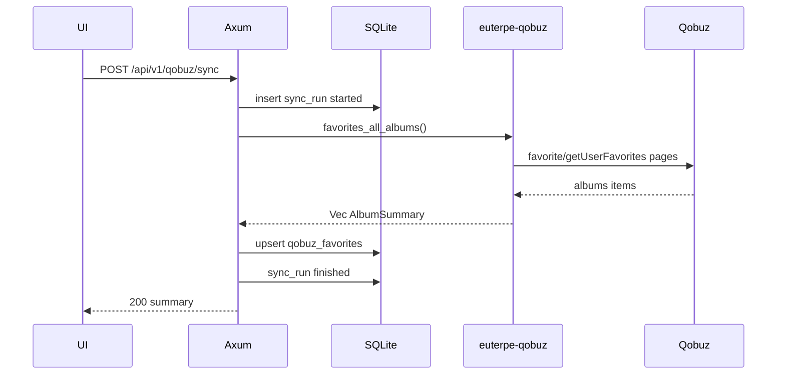
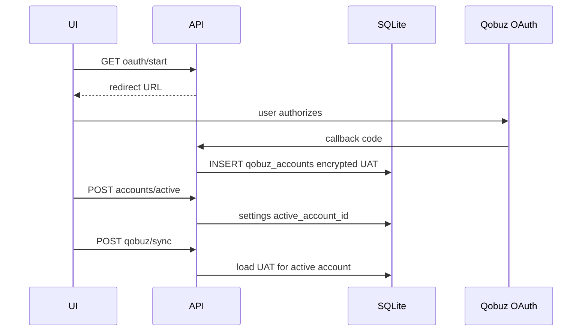

# Потоки данных

## 1. Синхронизация избранного Qobuz



## 2. Добавление в избранное

```
UI → POST /api/v1/qobuz/favorites { album_ids: [42] }
   → euterpe-qobuz::favorite_add_albums
   → Qobuz favorite/create
   → SQLite upsert
```

## 3. Постановка загрузки альбома (Phase 3)

```
UI → POST /api/v1/downloads { album_id, quality }
   → insert download_job queued
   → worker: album/get → for each track getFileUrl → HTTP GET url → write /music/...
   → SSE progress events
   → update job completed
   → optional: rescan track row
```

## 4. Редактирование тегов (Phase 5)

```
UI → PATCH /api/v1/tracks/:id/tags
   → lofty write file
   → update tracks row mtime/hash
```

Source of truth: **файл**; БД следует за файлом.

## 5. OAuth + выбор аккаунта Qobuz (будущее, FP-1 / FP-2)



См. [future-plans.ru.md](../00-overview/future-plans.ru.md).

## 6. Rescan библиотеки (Phase 5)

```
POST /api/v1/library/scan
   → walk /music
   → read tags lofty
   → upsert artists/albums/tracks
```

Может работать без Qobuz.
