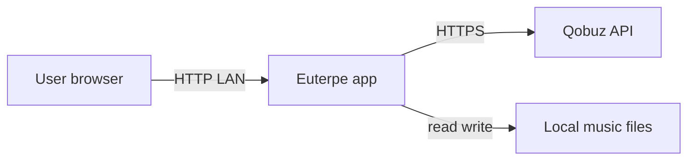
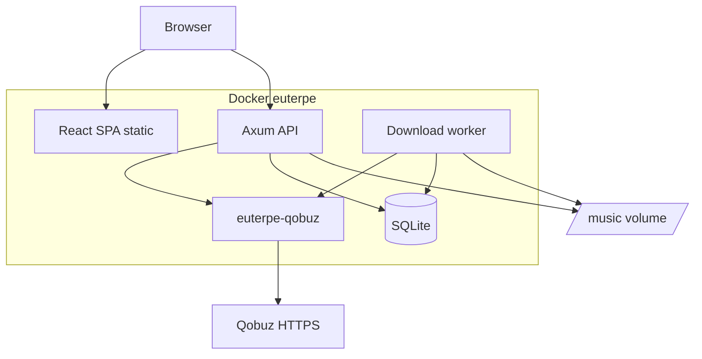

# Системный контекст (C4 Level 1–2)

## Level 1 — Context

- **User** — владелец библиотеки, домашняя сеть
- **Euterpe** — Docker на NAS/PC
- **Qobuz** — облачный каталог, избранное, signed URLs
- **FS** — FLAC/MP3 на volume `/music`

## Level 2 — Containers

Один OS-процесс (рекомендуется): API + worker + SQLite writer.

## Внешние зависимости

| Система | Обязательна | Примечание |
|---------|-------------|------------|
| Qobuz | да (Phase 1) | Подписка |
| DNS / Internet | для sync | Offline — только локальная библиотека |
| Reverse proxy | нет | Опционально Caddy + auth |

## Качество

Разработка: **строгий TDD** на всех контейнерах.
