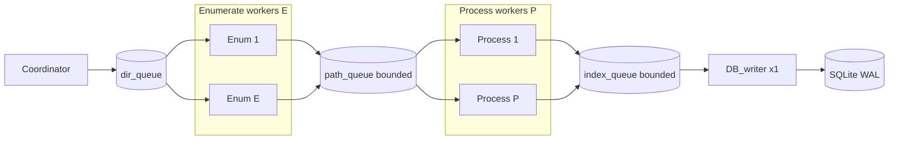

# Library scan (FP-9 / FP-9e)

`POST /api/v1/library/scan` запускает фоновый обход `EUTERPE_LIBRARY_PATH` в `services/library_scan.rs`.

## Двухфазная модель (enumerate → process)

Сначала воркеры **enumerate** быстро обходят поддеревья (`WalkDir`), считают аудиофайлы по расширению и кладут **абсолютные пути** в bounded-очередь `path_queue` (**flume**). Параллельно (streaming) воркеры **process** забирают пути, в `spawn_blocking` читают теги и SHA256, формируют `ScanIndexJob` в `index_queue`. Один **DB writer** пишет в SQLite (WAL).

После того как все enumerate-задачи завершились, `files_seen` фиксируется как **`files_total`** (в БД и SSE; до этого момента в API `files_total = 0` — фаза «discovering»).

### Счётчики

| Поле | Когда растёт | Смысл |
|------|----------------|--------|
| `files_seen` | enumerate | Найдено аудиофайлов (живой счётчик до конца enumerate) |
| `files_total` | после join enumerate | Равно `files_seen` на момент окончания enumerate; дальше не меняется |
| `files_processed` | process | Тяжёлая обработка завершена, job отправлен в `index_queue` |
| `files_indexed` | DB writer | Успешный `persist_index` |

UI: пока `files_total == 0` — «Discovering», indeterminate bar, «Found so far: `files_seen`». После — прогресс `files_indexed / files_total`, ETA по скорости индексации в БД; очередь индекса ≈ `files_processed - files_indexed`.

## Координатор (seed)

- **Координатор** — заполняет `dir_queue` подкаталогами на глубине `EUTERPE_LIBRARY_SCAN_SEED_DEPTH` (default 1). Если подкаталогов нет — одна задача на весь root.

## Env

**Breaking change:** переменная `EUTERPE_LIBRARY_SCAN_WORKERS` **удалена**. Задайте три новых параметра (или используйте defaults).

Ограничение: `EUTERPE_LIBRARY_SCAN_ENUM_WORKERS + EUTERPE_LIBRARY_SCAN_PROCESS_WORKERS <= EUTERPE_LIBRARY_SCAN_WORKER_TOTAL`. Все три значения ≥ 1; при одновременно enum ≥ 1 и process ≥ 1 требуется **`WORKER_TOTAL >= 2`**.

| Переменная | Default | Назначение |
|------------|---------|------------|
| `EUTERPE_LIBRARY_SCAN_WORKER_TOTAL` | 10 (clamp 2..32) | Верхняя граница: enum + process не превышают |
| `EUTERPE_LIBRARY_SCAN_ENUM_WORKERS` | 5 | Пул enumerate-воркеров |
| `EUTERPE_LIBRARY_SCAN_PROCESS_WORKERS` | 5 | Пул process-воркеров |
| `EUTERPE_LIBRARY_SCAN_PATH_QUEUE` | 2048 | Ёмкость очереди путей между enumerate и process |
| `EUTERPE_LIBRARY_SCAN_SEED_DEPTH` | 1 | Глубина seed от корня библиотеки |
| `EUTERPE_LIBRARY_SCAN_INDEX_QUEUE` | 512 | Ёмкость bounded очереди index jobs |

### Отладка и UI

- **Логи воркеров:** `EUTERPE_LIBRARY_SCAN_DEBUG=true` или `EUTERPE_DEV=true` — в консоль сервера (`tracing::info`): старт scan, seed-каталоги, claim поддерева, постановка пути, process, persist.
- **Прогресс в UI:** SSE `scan_progress` с полями `files_seen`, `files_processed`, `files_indexed`, `files_total` + панель на Library.

Follow-up: FP-9b (re-enqueue + visited), FP-9d (skip unchanged без полного SHA256).
