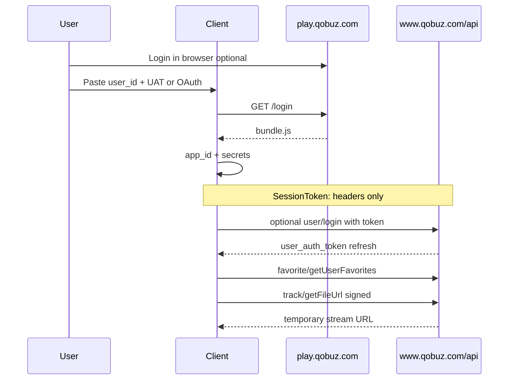

# Qobuz API — обзор

## Disclaimer

Интеграция основана на **неофициальном** reverse-engineering публичного веб/API поведения Qobuz (как [qobuz-dl](https://github.com/vitiko98/qobuz-dl), [streamrip](https://github.com/nathom/streamrip), [qobuz-sync](https://github.com/trevorstarick/qobuz-sync)). Это не партнёрский SDK.

- Требуется активная подписка Qobuz (free tier не даёт stream/download).
- Соблюдайте [Qobuz API Terms of Use](https://static.qobuz.com/apps/api/QobuzAPI-TermsofUse.pdf).
- Euterpe не аффилирован с Qobuz.

## Базовые константы

| Параметр | Значение |
|----------|----------|
| API base | `https://www.qobuz.com/api.json/0.2/` |
| Play base | `https://play.qobuz.com` |
| Метод | Почти все вызовы — **GET** с query params |
| Content-Type | `application/json;charset=UTF-8` (ответ JSON) |

## Аутентификация (2026)

Qobuz **не поддерживает** надёжный автоматический вход по email/password. Используйте **`user_auth_token`** (из браузера или OAuth). См. [oauth-and-tokens.ru.md](oauth-and-tokens.ru.md).

## Типичный поток клиента

## Документы раздела

| Файл | Содержание |
|------|------------|
| [authentication.ru.md](authentication.ru.md) | Login modes, headers, bundle bootstrap |
| [oauth-and-tokens.ru.md](oauth-and-tokens.ru.md) | UAT, OAuth, deprecated password |
| [request-signing.ru.md](request-signing.ru.md) | MD5 request_sig |
| [quality-formats.ru.md](quality-formats.ru.md) | format_id 5/6/7/27 |
| [favorites.ru.md](favorites.ru.md) | Избранное get/create/delete |
| [pagination.ru.md](pagination.ru.md) | limit/offset |
| [api-reference.ru.md](api-reference.ru.md) | Таблица endpoints |
| [errors.ru.md](errors.ru.md) | HTTP и доменные ошибки |
| [reference-implementation.ru.md](reference-implementation.ru.md) | Сравнение трёх проектов |

## Реализация в Euterpe

Rust crate: [euterpe-qobuz](../06-library-euterpe-qobuz/README.ru.md). Разработка — **строгий TDD**.
