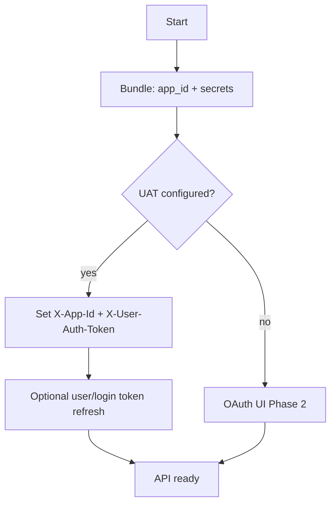

# Аутентификация Qobuz

> **Актуализация (2026):** Qobuz фактически отключил автоматический вход по **email/password** через API (OAuth + reCAPTCHA на сайте). Для Euterpe **основной путь — `user_auth_token`**. Подробно: [oauth-and-tokens.ru.md](oauth-and-tokens.ru.md).

## Режимы аутентификации (приоритет)

| Режим | Enum в `euterpe-qobuz` | Когда использовать |
|-------|------------------------|-------------------|
| **Session token** | `AuthMode::SessionToken` | **Default.** UAT из браузера/OAuth; только headers, login опционален |
| **Token login** | `AuthMode::TokenLogin` | `user/login` с `user_id` + `user_auth_token` (streamrip) |
| **Email password** | `AuthMode::EmailPassword` | **Deprecated** — только для совместимости; ожидать 401 |



## Заголовки HTTP

После bootstrap (и при наличии UAT):

| Header | Когда |
|--------|--------|
| `User-Agent` | Всегда; референсы используют Firefox 83 Win64 |
| `X-App-Id` | После получения `app_id` |
| `X-User-Auth-Token` | **Обязателен** для favorites, getFileUrl, catalog |
| `Content-Type` | `application/json;charset=UTF-8` (как qobuz-dl) |

Пример UA:

```
Mozilla/5.0 (Windows NT 10.0; Win64; x64; rv:83.0) Gecko/20100101 Firefox/83.0
```

## Bootstrap: app_id и secrets

Нужен **всегда** (для подписи `track/getFileUrl`), независимо от способа login.

См. [reference-implementation.ru.md](reference-implementation.ru.md).

### 1. Страница логина

```
GET https://play.qobuz.com/login
```

Regex bundle URL: `(/resources/\d+\.\d+\.\d+-[a-z]\d{3}/bundle\.js)`

### 2–5. bundle.js → app_id, secrets, probe getFileUrl

Без изменений; см. предыдущую версию документа и [oauth-and-tokens.ru.md](oauth-and-tokens.ru.md).

## Рекомендуемый путь: Session token (qobuz-sync style)

Если известны `user_id` и `user_auth_token`:

1. `bundle` → `app_id`, `active_secret`
2. Headers: `X-App-Id`, `X-User-Auth-Token`
3. **Не вызывать** `user/login` (опционально ping `favorite/getUserFavorites` для проверки)

Env (Euterpe):

```bash
EUTERPE_QOBUZ_USER_ID=...
EUTERPE_QOBUZ_AUTH_TOKEN=...
```

## Token login (streamrip style)

```
GET https://www.qobuz.com/api.json/0.2/user/login
  ?user_id=<id>
  &user_auth_token=<token>
  &app_id=<app_id>
```

Ответ (успех): JSON с `user_auth_token` (может обновиться), `user`, `credential`.

Проверки:

- **401** → токен истёк или неверен → запросить новый из браузера / OAuth
- **400** → неверный `app_id`
- `user.credential.parameters` пустой → free account → `IneligibleError`

streamrip:

```toml
use_auth_token = true
email_or_userid = "<user_id>"
password_or_token = "<user_auth_token>"
```

## Email + password (DEPRECATED)

```
GET user/login?email=...&password=...&app_id=...
```

Исторически использовалось в qobuz-dl `qopy.py`. По отчётам пользователей (**апрель 2026+**) Qobuz возвращает **401** при автоматическом login; веб использует OAuth.

**Euterpe:**

- Не показывать пароль в UI Phase 1
- `Credentials::EmailPassword` — `#[deprecated]` в Rust
- Тест: mock 401 → документированное сообщение «use token or OAuth»

Веб-клиент может использовать **POST** `user/login` — при исследовании partner refresh (M6) учитывать отдельно.

## OAuth (будущее)

Локальный OAuth flow — см. [oauth-and-tokens.ru.md](oauth-and-tokens.ru.md), [qobuz-dl-go](https://github.com/Aeneaj/qobuz-dl-go).

## Кэширование credentials

`/data/settings` (Phase 2):

- `qobuz.user_id`
- `qobuz.uat` (encrypted)
- `qobuz.app_id`, `qobuz.secrets_json`
- `qobuz.uat_updated_at`

При 401 на sync — статус «требуется переподключение», не удалять локальную библиотеку.

## TDD

| Тест | Режим |
|------|-------|
| `connect_with_session_token_skips_password_login` | SessionToken |
| `token_login_refreshes_uat` | TokenLogin |
| `email_password_returns_deprecation_hint_on_401` | EmailPassword |
| bundle fixtures | все |

## Безопасность

- Не логировать UAT и пароль
- UAT в env только на homelab; предпочтительно secrets file с правами 600
- См. [security.ru.md](../01-architecture/security.ru.md)
