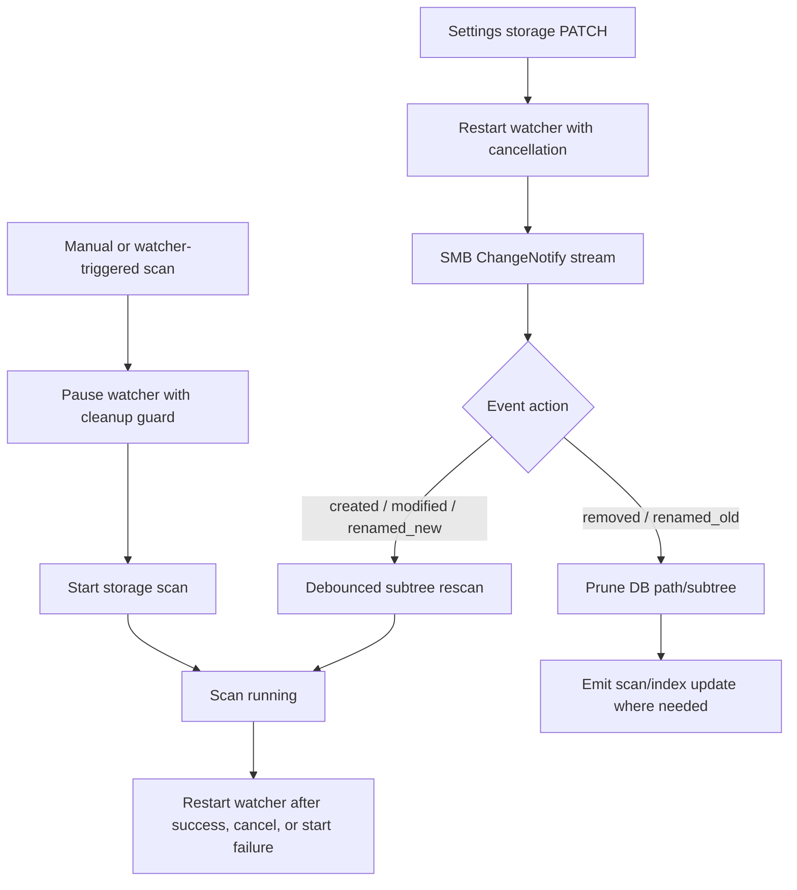

# fix: Close SMB storage review findings

## Summary

This plan fixes the confirmed P1/P2 findings from the SMB storage code review. The work preserves the current direction of the SMB migration: `library_storage` remains the structured server contract, Settings remains the library storage control plane, and SMB/native storage flows stay free of a `/data` temp bridge.

---

## Problem Frame

The SMB migration is broad enough that the first implementation now has several correctness and reliability gaps. The highest-risk issues are around long-lived background tasks, cancellation, missing delete/rename handling, and requested torrent post-processing silently not running. The Settings UI also has draft-state bugs that can save the wrong SMB path or wipe unsaved edits.

---

## Requirements

- R1. Restarting, pausing, or changing SMB storage must not leave orphan ChangeNotify watcher loops alive with stale settings.
- R2. SMB directory-listing timeouts must not strand the shared SMB session behind an uncancellable operation.
- R3. ChangeNotify delete and rename events must either remove stale DB rows directly or trigger a scan path that prunes missing tracks.
- R4. Torrent import must honor requested storage-native post-download conversion and CUE split behavior instead of logging that it is deferred.
- R5. Watcher pause around scans must be exception-safe: failed scan starts must not leave the watcher disabled.
- R6. Cancelling a storage scan must stop queued/active file processing promptly enough to avoid continuing through a large SMB library.
- R7. Settings folder selection must compose from the draft SMB location in the form, not the last saved library path.
- R8. Settings refetches must not wipe in-progress storage edits unless the active saved storage identity really changed or the user intentionally activates a preset.
- R9. Local storage containment must reject symlink escapes for reads, writes, streams, deletes, and derived operations that use `LibraryStorage`.
- R10. The generated TypeScript request schema must match the server/OpenAPI optional defaults for SMB `port` and `path`.
- R11. SMB credentials and encrypted password material must stay redacted from responses, logs, and debug formatting.

---

## Key Technical Decisions

- **Use cooperative cancellation for watchers:** `spawn_blocking` is not cancellable after start, so watcher lifetime must move to an async task or carry a cancellation token through `watch_loop`, backoff sleeps, and stream consumption.
- **Make timed SMB operations disposable or truly async:** A timeout is only useful if it releases the session used by later work. Prefer removing the `spawn_blocking` wrapper around async SMB listing; if a real blocking section remains unavoidable, isolate it in a session that can be discarded after timeout.
- **Treat delete/rename as index mutation, not just rescan noise:** A scoped scan currently indexes discovered files but does not prove missing files were removed. Delete/rename-old events need explicit DB pruning or a scan mode that prunes the scanned subtree.
- **Keep structured `library_storage` as the primary contract:** The review flagged the removed `library_path` as a compatibility risk, but the migration plan intentionally replaces it. This plan does not restore `library_path`; if backward compatibility is needed, handle it as a separate compatibility unit after product/API decision.
- **Fix UI draft state before adding more Settings features:** The browser flow must be reliable before more SMB presets/status affordances are layered on top.

---

## High-Level Technical Design

The watcher owns one cancellable lifecycle. Scan code receives a pause guard that restores the watcher on every exit path. ChangeNotify actions keep their semantic meaning through the server layer instead of collapsing to a generic rescan.

---

## Implementation Units

### U1. Make SMB watcher lifecycle cancellable

- **Goal:** Fix orphan watcher loops after restart, scan pause, or Settings changes.
- **Requirements:** R1, R5
- **Dependencies:** None
- **Files:** `crates/euterpe-server/src/services/storage_watch.rs`; tests in `crates/euterpe-server/src/services/storage_watch.rs`
- **Approach:** Replace the current `spawn_blocking` wrapper with a cancellable watcher task or add a cancellation token owned by `StorageWatchHandle`. `restart()` should signal and await/settle the previous watcher before publishing the new task. Backoff sleeps and stream consumption must observe cancellation. `pause_for_scan()` should become idempotent and should not claim a stopped state until the previous watcher is actually quiesced or marked cancelled.
- **Patterns to follow:** Existing `StorageWatchHandle` status model and `tokio::task::JoinHandle` ownership in `storage_watch.rs`.
- **Test scenarios:**
  - Start watcher, call `restart()` twice with a fake watch loop, and assert only one active loop remains.
  - Start watcher, call `pause_for_scan()`, and assert the fake loop receives cancellation.
  - Restart from SMB to local/none and assert status becomes `disabled` and no watcher task remains.
  - Simulate cancellation during reconnect backoff and assert no delayed reconnect writes status afterward.
- **Verification:** Repeated Settings storage PATCH and manual scan start cannot leave duplicate watcher tasks or stale status writers.

### U2. Make scan pause exception-safe

- **Goal:** Ensure failed scan starts do not leave ChangeNotify disabled.
- **Requirements:** R1, R5
- **Dependencies:** U1
- **Files:** `crates/euterpe-server/src/routes/library.rs`; `crates/euterpe-server/src/services/storage_watch.rs`; tests in `crates/euterpe-server/tests/api_library.rs` and `crates/euterpe-server/src/services/storage_watch.rs`
- **Approach:** Introduce a watcher pause guard or equivalent cleanup path that restarts the watcher when `start_scan_storage` returns an error. Use it in manual scan routes, CUE split follow-up scans, and watcher-triggered scans. Avoid pausing before the code knows a scan can be started unless the guard can restore on error.
- **Patterns to follow:** Current `wait_scan_finished` restart pattern in `routes/library.rs`.
- **Test scenarios:**
  - Start manual scan while a scan is already running and assert the watcher returns to its previous reconnecting/connected state.
  - Force `start_scan_storage` to fail in watcher-triggered scheduling and assert status is not left `disabled`.
  - CUE split follow-up scan failure does not leave watcher paused.
- **Verification:** Every path that pauses the watcher has a success, failure, and cancellation restoration path.

### U3. Remove uncancellable SMB list-dir timeout bottleneck

- **Goal:** Ensure `STORAGE_LIST_TIMEOUT` does not leave future SMB operations blocked behind a detached listing.
- **Requirements:** R2
- **Dependencies:** None
- **Files:** `crates/euterpe-server/src/library/storage.rs`; `crates/euterpe-smb/src/lib.rs`; tests in `crates/euterpe-server/src/library/storage.rs` or `crates/euterpe-smb/src/lib.rs`
- **Approach:** Remove the `spawn_blocking` wrapper around async `SmbStorageClient::list_directory`, or run timed list operations through a disposable SMB client/session that can be abandoned without poisoning the cached shared session. Keep session reuse for normal successful operations. If an operation times out, later operations must not wait on a mutex held by the timed-out task.
- **Patterns to follow:** `SmbSession` connection reuse and existing `test-hooks` counters in `euterpe-smb`.
- **Test scenarios:**
  - Use a fake/dry-run SMB client that never completes `list_directory`; after a timeout, a later metadata/read operation on the cached storage can proceed.
  - Successful burst list/read still avoids unnecessary share reconnects.
  - Timeout error still reports `STORAGE_LIST_TIMEOUT` with the listed path.
- **Verification:** A timed-out SMB listing cannot permanently block read/write/watch work on the same configured library.

### U4. Preserve ChangeNotify action semantics and prune stale DB rows

- **Goal:** Make delete and rename notifications update the library index instead of leaving stale tracks.
- **Requirements:** R3
- **Dependencies:** U1
- **Files:** `crates/euterpe-server/src/services/storage_watch.rs`; `crates/euterpe-server/src/services/library_scan.rs`; `crates/euterpe-server/src/db/tracks.rs`; `crates/euterpe-server/src/db/albums.rs`; tests in `crates/euterpe-server/src/services/storage_watch.rs` and `crates/euterpe-server/src/services/library_scan.rs`
- **Approach:** Pass `SmbWatchAction` through the watcher debounce channel. For `Removed` and `RenamedOld`, either delete DB rows under the exact path/subtree or add a storage-scan prune mode that removes DB rows under `scan_root` that were not rediscovered. For `RenamedNew`, scan the new path. A full unsafe/unknown event still schedules a full scan.
- **Patterns to follow:** Existing DB path helpers in `db/tracks.rs`, album path cleanup patterns in scan/register code, and `StoragePath` normalization.
- **Test scenarios:**
  - Removed file event for `Artist/Album/01.flac` removes that track row.
  - Removed directory event for `Artist/Album` removes all tracks under that album path and leaves unrelated albums intact.
  - Rename old/new pair removes the old path and indexes the new path after scan.
  - Unsafe event path still degrades to a full scan without path traversal.
- **Verification:** SMB file deletes and renames are reflected in library list/detail without manual DB cleanup.

### U5. Honor torrent post-download storage-native work

- **Goal:** Execute requested convert/CUE post-processing after torrent import into configured library storage.
- **Requirements:** R4
- **Dependencies:** U3
- **Files:** `crates/euterpe-server/src/services/download/torrent_job.rs`; `crates/euterpe-server/src/services/convert/worker.rs`; `crates/euterpe-server/src/routes/library.rs`; tests in `crates/euterpe-server/src/services/download/torrent_job.rs` or `crates/euterpe-server/tests/api_library.rs`
- **Approach:** Replace the deferred warning with explicit storage-native job invocation. After `copy_to_library_storage`, run the scoped scan, then enqueue or execute requested conversion and CUE split using the existing storage-native converter/CUE paths. Persist failure state if requested post-processing cannot run, rather than reporting success.
- **Patterns to follow:** Storage-native converter worker entry points and CUE split `StorageCueSplitIo`.
- **Test scenarios:**
  - Torrent payload with `convert_after_download` imports WAV into local `LibraryStorage`, queues or runs conversion, and records converted DB path.
  - Torrent payload with `split_after_download` imports a CUE image and invokes storage-native split without local library path.
  - Unsupported native converter format returns the explicit converter unsupported error and marks/logs the job consistently.
  - `auto_index_after_import` without post-processing keeps the current scoped scan behavior.
- **Verification:** No torrent post-download request is silently dropped after import.

### U6. Improve storage scan cancellation

- **Goal:** Prevent cancelled SMB scans from continuing through a large queued audio workload.
- **Requirements:** R6
- **Dependencies:** U3
- **Files:** `crates/euterpe-server/src/services/library_scan.rs`; tests in `crates/euterpe-server/src/services/library_scan.rs`
- **Approach:** Replace unbounded `JoinSet` spawning for all discovered audio entries with a bounded worker queue or add cancellation checks that abort queued tasks. Pass scan cancellation checks into the audio processing path before SMB reads and before `persist_index`. On cancellation, abort pending tasks and finish the scan without running the cover pass.
- **Patterns to follow:** Existing scan run cancellation checks and scan progress counters in `library_scan.rs`.
- **Test scenarios:**
  - Cancel scan after discovery but before processing all files; assert only a bounded number of files are processed after cancellation.
  - Cancellation before a slow storage read prevents `persist_index` for that entry.
  - Cover pass does not run after cancellation.
  - Progress events still end in a cancelled scan state.
- **Verification:** Cancelling a storage scan stops observable SMB I/O promptly and restarts watcher through U2.

### U7. Fix Settings SMB folder selection and draft preservation

- **Goal:** Prevent Settings UI from composing wrong SMB paths or wiping unsaved edits on refetch.
- **Requirements:** R7, R8
- **Dependencies:** None
- **Files:** `frontend/src/features/settings/StorageSettingsSection.tsx`; `frontend/src/features/settings/storageLocation.ts`; tests in `frontend/src/features/settings/StorageSettingsSection.test.tsx` and `frontend/src/features/settings/storageLocation.test.ts`
- **Approach:** Compose selected folder paths from the parsed draft `smbLocation` path, not `settings.library.path`. Restrict form reinitialization to actual saved-storage identity changes or explicit preset activation. Avoid `useEffect([settings])` as a broad reset trigger; derive a stable saved-location key instead.
- **Patterns to follow:** Existing `storageLocation.ts` parser/formatter tests and React Query mutation response handling.
- **Test scenarios:**
  - User edits `smb://nas/music/Audio`, browses into `Album`, selects folder, and form becomes `smb://nas/music/Audio/Album`.
  - User has unsaved SMB edits; a settings refetch with equivalent saved library does not reset the form.
  - Activating a preset intentionally resets the form to the preset.
  - Blank password save preserves stored password when host/port/share are unchanged.
- **Verification:** Settings browse/save behavior matches draft form state and does not lose user edits during background refreshes.

### U8. Harden local storage containment against symlink escapes

- **Goal:** Make local `LibraryStorage` enforce containment even when paths traverse symlinks inside the configured root.
- **Requirements:** R9
- **Dependencies:** None
- **Files:** `crates/euterpe-server/src/library/storage.rs`; tests in `crates/euterpe-server/src/library/storage.rs`, `crates/euterpe-server/tests/api_library.rs`
- **Approach:** Canonicalize the configured local root and canonicalize existing read/list/stream/delete targets before use. For writes, create/canonicalize the parent directory and reject parents outside root before writing temp files. Ensure atomic temp siblings are also created inside the canonical parent.
- **Patterns to follow:** Existing `StoragePath` parser tests and local storage round-trip tests.
- **Test scenarios:**
  - `read`, `read_at`, and `read_stream` reject a symlink inside library root pointing outside root.
  - `atomic_write` rejects writing through a symlinked parent outside root.
  - `delete` rejects deleting a target outside root through a symlink.
  - Normal nested local paths still work after canonicalization.
- **Verification:** All local backend operations use canonical containment, not lexical `starts_with` only.

### U9. Align OpenAPI and generated TypeScript optional SMB defaults

- **Goal:** Make generated frontend/client types match the server contract for defaulted SMB fields.
- **Requirements:** R10
- **Dependencies:** None
- **Files:** `openapi/openapi.yaml`; `frontend/src/api/schema.d.ts`; tests or type checks in `frontend/src/features/settings/storageLocation.test.ts`
- **Approach:** Adjust schema generation or OpenAPI shape so `SmbStorageLocationPatch.port`, `SmbStorageLocationPatch.path`, and `SmbSharesRequest.port` are optional in generated TypeScript while retaining server defaults. If the generator treats `default` as required, model the fields as optional explicitly and regenerate.
- **Patterns to follow:** Existing OpenAPI schema style for nullable/optional request fields.
- **Test scenarios:**
  - Type-level or compile coverage allows `{ kind: "smb", host, share }` as a valid storage patch.
  - Type-level or compile coverage allows `{ host }` as a valid SMB shares request.
  - Server still defaults omitted ports to `445` and omitted path to `""`.
- **Verification:** `npm run build` passes and generated types no longer reject server-valid minimal SMB requests.

### U10. Redact SMB credential debug and response surfaces

- **Goal:** Close low-risk credential exposure paths and pin redaction behavior in tests.
- **Requirements:** R11
- **Dependencies:** None
- **Files:** `crates/euterpe-smb/src/lib.rs`; `crates/euterpe-server/tests/api_storage_settings.rs`; tests in `crates/euterpe-smb/src/lib.rs`
- **Approach:** Replace derived `Debug` for `SmbCredentials` with a redacted implementation. Add response tests that saved passwords, encrypted values, and preset-stored credentials are not returned from Settings or server info responses.
- **Patterns to follow:** Redacted `Debug` implementation for `ConnectKey`.
- **Test scenarios:**
  - `format!("{:?}", SmbCredentials { password: "secret" })` does not contain `secret`.
  - GET/PATCH storage settings after saving SMB password contains `password_configured` but no `password`, `password_encrypted`, or ciphertext.
  - Presets in storage settings do not expose encrypted password material.
- **Verification:** Credential values remain available for runtime SMB auth but never appear in API JSON or debug output.

---

## Scope Boundaries

### In Scope

- Confirmed P1/P2 defects from the SMB storage code review.
- Targeted P3/security-hardening items that are adjacent to credential exposure.
- Tests needed to prove each fix.

### Deferred to Follow-Up Work

- Restoring a deprecated `server/info.library_path` compatibility alias. The current migration plan intentionally replaces it with structured `library_storage`; adding an alias should be a separate API compatibility decision.
- Real SMB integration automation beyond the existing `EUTERPE_TEST_SMB_*` ignored tests.
- Large-file streaming rewrites for all tag/CUE/converter paths. This plan fixes correctness and cancellation first; broad streaming optimization remains separate.

---

## Risks & Dependencies

- Watcher cancellation may require a small abstraction over the SMB watch stream if the current `smb` crate lifetime behavior resists a clean async task shape.
- Pruning DB rows on delete/rename must preserve unrelated albums and avoid deleting rows during transient SMB listing failures.
- Torrent post-processing may expose unsupported converter formats earlier; the job state must distinguish “unsupported by native I/O” from silent success.
- Symlink canonicalization for writes must handle not-yet-existing leaf files without requiring the leaf to exist.

---

## Documentation / Operational Notes

- Update `docs/smb/change-notify-watcher.md` if delete/rename handling chooses direct DB pruning rather than scan pruning.
- Update `docs/smb/torrent-import-copy.md` once post-download conversion/CUE behavior is implemented instead of deferred.
- Keep `docs/smb/README.md` checked only for tasks whose behavior and tests are complete.

---

## Sources & Research

- `docs/smb/README.md`
- `docs/smb/change-notify-watcher.md`
- `docs/smb/torrent-import-copy.md`
- `docs/smb/converter-worker.md`
- `docs/smb/cue-split.md`
- `crates/euterpe-server/src/services/storage_watch.rs`
- `crates/euterpe-server/src/library/storage.rs`
- `crates/euterpe-server/src/services/library_scan.rs`
- `crates/euterpe-server/src/services/download/torrent_job.rs`
- `frontend/src/features/settings/StorageSettingsSection.tsx`
- Code review report from the current conversation, covering correctness, reliability, API contract, security, frontend, and testing reviewers.
