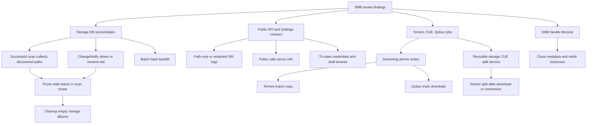

# fix: Close SMB storage review follow-ups

## Summary

This plan fixes the remaining P1/P2 findings from the latest SMB storage review. The work hardens storage reconciliation, public API exposure, Settings draft behavior, torrent/CUE post-processing, large-file writes, hash backfill, and SMB handle lifecycle without changing the migration direction: library content still flows through `LibraryStorage`, DB paths stay library-relative, and no `/data` temp bridge is introduced.

---

## Problem Frame

The previous SMB migration tasks are marked complete, but code review found second-order failure modes around stale DB state, query-token logging, unauthenticated storage disclosure, post-download CUE split, and unbounded memory/task allocation. These are not new product features; they are correctness and operational fixes needed before the SMB storage cutover can be considered ready.

---

## Requirements

- R1. A successful full or scoped storage scan must reconcile DB tracks against the active backend and remove stale rows only inside the scanned scope.
- R2. Track pruning from scans and ChangeNotify delete/rename events must remove empty storage albums or hide them from album listing without deleting metadata-only albums that are not storage-backed.
- R3. Track path prefix helpers used by prune/list operations must avoid `substr(path, ...)` predicates that bypass the path index.
- R4. Hash backfill after storage scans must process missing hashes in bounded batches and keep both row allocation and task count bounded.
- R5. HTTP request logging must never record `access_token` query values accepted by the admin middleware for events or stream routes.
- R6. Public `GET /api/v1/server/info` must not expose SMB host/share/path/username/workgroup or local absolute library paths to unauthenticated clients.
- R7. Settings storage patch must support explicit clearing of SMB username, workgroup, and stored password while preserving current values when fields are omitted.
- R8. Settings storage browse must operate against the draft location being edited, or the UI must make saved-only browsing explicit and prevent composing paths from stale backend state.
- R9. Torrent post-download `split_after_download` and `split_after_conversion` must execute the storage-native CUE split path instead of returning a deferred `bad_request`.
- R10. Torrent import and Qobuz downloads must write large files through bounded streaming atomic writes rather than buffering complete media files in memory.
- R11. Torrent import and post-processing must observe job cancellation during long SMB copy, scan wait, conversion wait, and split work.
- R12. SMB backend operations that open `File` or `Directory` resources for metadata and directory creation must close those handles on success and error paths.
- R13. API/OpenAPI tests must cover real SMB error statuses for storage test/share discovery endpoints, or the OpenAPI contract must document why those statuses are intentionally collapsed.

---

## Key Technical Decisions

- KTD1. **Prune only after successful discovery:** Storage scans should collect discovered audio paths and prune absent DB rows only after discovery and indexing complete without cancellation or fatal listing errors. Failed/cancelled scans must not delete existing library rows.
- KTD2. **Treat album cleanup as storage-scoped:** Empty album cleanup should target albums that are storage-backed and inside the pruned scope. Qobuz favorites or metadata-only albums must not disappear just because no local/SMB tracks remain.
- KTD3. **Use indexable path ranges:** Replace prefix predicates that wrap `tracks.path` with range predicates such as exact match plus `path >= prefix` and `path < upper_bound(prefix)`. Add tests that protect sibling paths like `Artist/AlbumX`.
- KTD4. **Redact URI logging at the router edge:** TraceLayer should log path-only or a centrally redacted URI string. This keeps query-token compatibility for EventSource/audio clients while closing the password-in-logs leak.
- KTD5. **Split public and admin storage visibility:** Keep `/api/v1/server/info` public for bootstrap data, but expose detailed `library_storage` only through authenticated Settings/admin APIs. If old clients need `library_path`, add a deprecated safe compatibility field separately from sensitive storage details.
- KTD6. **Represent credential patch intent explicitly:** Omitted means preserve; explicit clear means delete; non-empty value means set. Use a tri-state request type or clear flags instead of `Option<String>` fallback semantics.
- KTD7. **Add a streaming atomic write primitive:** Keep `atomic_write(Bytes)` for small generated artifacts, but add a bounded writer/copy API that writes to a sibling `.euterpe-part`, flushes, and renames. Use it for torrent import first and Qobuz downloads next.
- KTD8. **Reuse the manual storage-native CUE split implementation:** Extract the route-owned split body into a service helper so torrent post-processing and manual API split share validation, `StorageSplitIo`, atomic output writes, source-delete policy, and follow-up scans.
- KTD9. **Prefer explicit SMB close helpers:** Because the SMB backend already explicitly closes many resources, metadata and mkdir should follow the same convention with helpers or RAII guards that close before returning.

---

## Execution Posture

Use test-driven execution for every implementation unit: first add a failing regression, contract, or characterization test that demonstrates the review finding, then make the smallest production change that passes it, then run the targeted verification for that unit. For existing cross-layer behavior such as scan reconciliation, torrent orchestration, Settings patch semantics, and server-info responses, start with characterization coverage before changing behavior so the intended migration contract is visible in tests.

---

## High-Level Technical Design

---

## Implementation Units

### U1. Reconcile storage scans and cleanup empty albums

- **Goal:** Remove stale tracks and storage-backed empty albums after successful storage scans.
- **Requirements:** R1, R2
- **Dependencies:** None
- **Files:** `crates/euterpe-server/src/services/library_scan.rs`; `crates/euterpe-server/src/db/tracks.rs`; `crates/euterpe-server/src/db/albums.rs`; tests in `crates/euterpe-server/src/services/library_scan.rs`
- **Approach:** During `run_storage_scan`, record discovered audio paths for the active scan scope. After successful indexing and before `finish_success`, delete DB tracks under the scan root that are absent from that discovered set. For full scans, scope is the storage root. For scoped scans, prune only under `scan_root`. Run storage-backed empty album cleanup after track deletion. Do not prune on cancellation, listing timeout, invalid path errors, or partial scan failures.
- **Patterns to follow:** Current `StoragePath` scope handling in `library_scan.rs`; existing DB path helpers in `db/tracks.rs`; album list/count behavior in `db/albums.rs`.
- **Test scenarios:**
  - Full storage scan after switching from local to SMB removes tracks whose relative paths are absent from the active backend.
  - Scoped scan under `Artist/Album` removes stale rows below that subtree and preserves stale rows outside it.
  - Failed or cancelled scan does not prune any existing rows.
  - Removing the last track in a storage-backed album removes or hides that empty album.
  - Metadata-only or non-storage albums are not deleted by storage prune cleanup.
- **Verification:** After a successful scan, list/detail/stream/tag operations no longer surface rows from a previous backend or removed subtree.

### U2. Make watch pruning DB-complete and index-friendly

- **Goal:** Ensure SMB delete/rename notifications prune tracks and albums efficiently.
- **Requirements:** R2, R3
- **Dependencies:** U1
- **Files:** `crates/euterpe-server/src/services/storage_watch.rs`; `crates/euterpe-server/src/db/tracks.rs`; `crates/euterpe-server/src/db/albums.rs`; tests in `crates/euterpe-server/src/services/storage_watch.rs` and `crates/euterpe-server/src/db/tracks.rs`
- **Approach:** Rewrite `tracks::delete_by_path_or_prefix` with an indexable exact-or-range predicate. Audit sibling helpers such as `list_by_album_or_path_prefix` for the same `substr` pattern and replace them if they serve storage pruning/listing. After `prune_removed_watch_path`, cleanup empty storage albums for the pruned scope and emit any library refresh event already used by scan/index changes.
- **Patterns to follow:** Existing ChangeNotify `PendingWatchChange::Prune` flow in `storage_watch.rs`.
- **Test scenarios:**
  - File prune deletes `Artist/Album/01.flac` and keeps `Artist/Album/02.flac`.
  - Directory prune deletes all rows under `Artist/Album/` and keeps sibling `Artist/AlbumX/01.flac`.
  - Prune of the last track removes or hides the now-empty storage album.
  - Prune-only debounce batch does not start a scan unless a scan-worthy event is also present.
  - Query-plan or SQL-shape test protects the path prefix helper from reintroducing `substr(path`.
- **Verification:** SMB directory delete bursts do not repeatedly full-scan `tracks`, and the UI does not show empty stale albums after delete/rename-old events.

### U3. Bound storage hash backfill

- **Goal:** Prevent large SMB libraries from allocating every missing-hash row and one Tokio task per row.
- **Requirements:** R4
- **Dependencies:** None
- **Files:** `crates/euterpe-server/src/services/library_scan.rs`; `crates/euterpe-server/src/db/tracks.rs`; tests in `crates/euterpe-server/src/services/library_scan.rs` and `crates/euterpe-server/src/db/tracks.rs`
- **Approach:** Replace `list_needing_file_hash(pool)` with a batch API such as `list_needing_file_hash_batch(pool, after_id, limit)`. Process batches in a loop with a bounded `JoinSet` or `FuturesUnordered`, advancing by stable track id so skipped invalid paths cannot cause an infinite loop. Keep the existing SMB I/O semaphore, but make task allocation bounded independently from I/O concurrency.
- **Patterns to follow:** Current file-hash validation and skip logic in `run_storage_hash_backfill`.
- **Test scenarios:**
  - More rows than the batch size are eventually hashed across multiple batches.
  - Invalid path, missing size, zero size, and oversized rows are skipped while later ids still process.
  - A test hook or fake storage confirms no more than the configured bounded number of hash tasks run at once.
  - Backfill exits cleanly when no rows remain.
- **Verification:** Backfill memory and task count stay bounded for a large table with many `file_hash IS NULL` rows.

### U4. Redact request logging and public server info

- **Goal:** Remove query-token and storage-detail disclosure from unauthenticated/log surfaces.
- **Requirements:** R5, R6
- **Dependencies:** None
- **Files:** `crates/euterpe-server/src/app.rs`; `crates/euterpe-server/src/api/server.rs`; `crates/euterpe-server/src/middleware.rs`; `openapi/openapi.yaml`; `frontend/src/api/schema.d.ts`; tests in `crates/euterpe-server/tests/api_server_info.rs` or `crates/euterpe-server/tests/api_storage_settings.rs`
- **Approach:** Add a small redaction helper that TraceLayer uses for both span fields and `on_request` events. Prefer logging `req.uri().path()` unless non-sensitive query logging is required. Change `ServerInfoResponse` so unauthenticated responses omit detailed `library_storage`; either expose a safe summary (`configured`, `kind`, capabilities without host/path/account data) or move the detailed shape behind the authenticated Settings endpoint. Update OpenAPI and generated TypeScript accordingly. Decide separately whether to add a deprecated `library_path` compatibility alias that is `null` or only present for authenticated local-storage views.
- **Patterns to follow:** Existing admin auth split in `app.rs`; `StorageSettingsView` redaction behavior in Settings APIs.
- **Test scenarios:**
  - Request to `/api/v1/events?access_token=secret` does not write `secret` into TraceLayer span/event fields.
  - Request to a track stream route with `access_token=secret` does not log the secret.
  - Public server info with SMB configured omits host, share, username, workgroup, remote path, and password status.
  - Public server info with local storage configured omits absolute local library path.
  - Authenticated Settings storage response still returns the admin storage view needed by the UI.
- **Verification:** Logs and unauthenticated server info cannot be used to recover admin tokens or internal storage topology.

### U5. Fix Settings credential clearing and draft browse

- **Goal:** Make Settings edits reflect user intent for draft browsing and clearing SMB credentials.
- **Requirements:** R7, R8, R13
- **Dependencies:** U4 for any response schema changes that affect shared frontend types
- **Files:** `crates/euterpe-server/src/routes/settings_ext.rs`; `crates/euterpe-server/src/api/settings.rs`; `openapi/openapi.yaml`; `frontend/src/api/client.ts`; `frontend/src/api/schema.d.ts`; `frontend/src/features/settings/StorageSettingsSection.tsx`; `frontend/src/features/settings/storageLocation.ts`; tests in `crates/euterpe-server/tests/api_storage_settings.rs`, `frontend/src/features/settings/StorageSettingsSection.test.tsx`, and `frontend/src/features/settings/storageLocation.test.ts`
- **Approach:** Replace ambiguous `Option<String>` patch semantics for SMB username/workgroup/password with tri-state fields or explicit clear flags. Preserve-on-omission remains backward-compatible; explicit null/empty clear deletes the stored value. Add a draft browse API shape, likely a POST accepting the draft `StorageLocationPatch` plus browse path, so the server can list the backend currently being edited without saving it. If draft browse is deferred, the UI must disable browsing until saved and must not compose selected paths from a stale saved backend. Document all real SMB error statuses for browse/test/share discovery or intentionally collapse them through one documented error shape.
- **Patterns to follow:** Current `test_storage_settings` path for validating unsaved storage locations; existing `storageLocation.ts` parser/formatter helpers.
- **Test scenarios:**
  - Saving `username: null` or explicit clear removes a previously saved SMB username.
  - Saving `workgroup: null` or explicit clear removes a previously saved workgroup.
  - Saving explicit password clear removes encrypted password and sets `password_configured` false.
  - Omitting credential fields preserves existing credentials for the same SMB identity.
  - Editing host/share/path and browsing lists the draft backend, not the last saved backend.
  - Settings refetch with the same saved identity does not wipe unsaved form edits.
  - OpenAPI documents SMB auth denied, permission denied, not found, timeout, unsupported, and disconnected statuses for storage test/share discovery if those statuses can be returned.
- **Verification:** Users can switch to anonymous/guest SMB access and browse unsaved SMB locations without accidentally using stale saved settings.

### U6. Add streaming atomic writes to LibraryStorage

- **Goal:** Provide one bounded write path for large media files across local and SMB backends.
- **Requirements:** R10
- **Dependencies:** None
- **Files:** `crates/euterpe-server/src/library/storage.rs`; `crates/euterpe-smb/src/lib.rs`; tests in `crates/euterpe-server/src/library/storage.rs` and `crates/euterpe-smb/src/lib.rs`
- **Approach:** Extend `LibraryStorage` with a streaming atomic write method or a writer abstraction that writes bounded chunks to a sibling `.euterpe-part`, flushes, and renames/replaces the destination. Local backend should use `tokio::io::copy` or chunked writes into the temp file. SMB backend should open a remote temp object and call SMB `write_block` per chunk, then flush and remote rename. Keep `atomic_write(Bytes)` as a convenience wrapper over the streaming primitive for small in-memory artifacts.
- **Patterns to follow:** Existing local/SMB `atomic_write` temp sibling naming and SMB `write_all`/`rename` flow.
- **Test scenarios:**
  - Local streaming atomic write produces the same final bytes and removes temp file on success.
  - SMB dry-run or mock write receives multiple bounded chunks for a large input.
  - Mid-stream error leaves no final destination and cleans or marks the temp path for retry-safe cleanup.
  - Existing `atomic_write(Bytes)` tests still pass through the compatibility wrapper.
- **Verification:** Callers can copy/download large media without materializing full file contents in process memory.

### U7. Stream torrent import and honor cancellation

- **Goal:** Make torrent import into configured storage bounded and cancellable.
- **Requirements:** R10, R11
- **Dependencies:** U6
- **Files:** `crates/euterpe-server/src/services/torrent_import.rs`; `crates/euterpe-server/src/services/download/torrent_job.rs`; tests in `crates/euterpe-server/src/services/torrent_import.rs` and `crates/euterpe-server/src/services/download/torrent_job.rs`
- **Approach:** Replace `fs::read` in `copy_local_tree_to_storage` with the streaming atomic write primitive. Thread a cancellation callback or token through recursive copy, scan wait, and any post-processing waits. When cancellation fires during copy, stop before the next file/chunk and avoid publishing partial final files. Preserve destination naming and local torrent incoming cleanup behavior.
- **Patterns to follow:** Existing torrent job stopped checks and `unique_library_dest_storage` conflict behavior.
- **Test scenarios:**
  - Large local file copy uses streaming chunks and does not call `atomic_write(Bytes)` for file bodies.
  - Nested torrent tree copies directories and files to the expected relative storage paths.
  - Duplicate destination names still append ` (n)`.
  - Cancellation during copy stops later files from being copied and marks the job stopped/failed consistently.
  - Cancellation during scan wait or conversion wait stops before post-processing.
- **Verification:** Importing a large torrent into SMB applies backpressure through storage I/O and responds to user cancellation.

### U8. Execute torrent-triggered CUE split through storage

- **Goal:** Replace the current torrent split `bad_request` branch with real storage-native split work.
- **Requirements:** R9, R11
- **Dependencies:** U7
- **Files:** `crates/euterpe-server/src/services/download/torrent_job.rs`; `crates/euterpe-server/src/routes/library.rs`; `crates/euterpe-server/src/library/cue.rs`; `crates/euterpe-server/src/db/cue_jobs.rs`; tests in `crates/euterpe-server/src/services/download/torrent_job.rs` and `crates/euterpe-server/tests/api_cue.rs`
- **Approach:** Extract the core of `run_cue_split_job` into a service helper that accepts state/storage, album or root relative path, CUE relative path, source policy, and cancellation. For `split_after_download`, import, scan, resolve the imported album/CUE, run split, and rescan the album subtree. For `split_after_conversion`, require conversion, wait for conversion success, resolve the converted CUE/audio target, run split, and rescan. Persist cue job state where manual CUE split already does so, or document a torrent-owned progress state if separate.
- **Patterns to follow:** Existing `StorageSplitIo` and CUE split route implementation from `routes/library.rs`.
- **Test scenarios:**
  - Torrent with `split_after_download` and valid `cue_path` creates split output through `LibraryStorage`.
  - Torrent with `split_after_conversion` waits for conversion success before split.
  - Missing, escaping, or non-CUE `cue_path` fails with a clear validation error before split work.
  - Conversion failure prevents split and records the torrent job error.
  - Cancellation before split prevents output writes.
- **Verification:** Requested torrent CUE split behavior works for SMB without local path requirements.

### U9. Stream Qobuz track downloads into storage

- **Goal:** Remove complete-track buffering from the download worker.
- **Requirements:** R10
- **Dependencies:** U6
- **Files:** `crates/euterpe-server/src/services/download/worker.rs`; tests in `crates/euterpe-server/src/services/download/worker.rs` or `crates/euterpe-server/tests/api_downloads.rs`
- **Approach:** Replace `download_url_to_bytes` plus `storage.atomic_write` for track bodies with HTTP response streaming into the storage streaming atomic writer. Count bytes while streaming to preserve empty-body validation, file-size persistence, progress/speed calculation, and retry behavior. Keep small metadata/tag/cover writes on existing in-memory paths unless they already have streaming support.
- **Patterns to follow:** Existing retry loop and skip-if-existing-size logic in `download_track`.
- **Test scenarios:**
  - Successful Qobuz download streams multiple chunks and records final file size.
  - Empty response body fails and does not publish a final file.
  - Mid-stream failure retries through the existing retry policy and leaves no corrupt final file.
  - Existing file with matching size still skips download.
- **Verification:** Slow SMB writes apply backpressure instead of turning concurrent hi-res downloads into process memory pressure.

### U10. Close SMB resource handles consistently

- **Goal:** Prevent metadata and mkdir operations from leaking server-side SMB handles.
- **Requirements:** R12
- **Dependencies:** None
- **Files:** `crates/euterpe-smb/src/lib.rs`; tests in `crates/euterpe-smb/src/lib.rs`
- **Approach:** Add a helper or RAII guard that queries metadata and closes the opened `Resource` before returning. Apply it to `metadata` and each `create_dir_all` step. Handle `ResourceType` errors by closing the resource before returning the error. Keep dry-run/test-hook open/close counters accurate.
- **Patterns to follow:** Existing explicit `close()` calls in `list_directory`, `write_all`, `delete`, and `rename`.
- **Test scenarios:**
  - `metadata` on a file increments open and close counters equally.
  - `metadata` on a directory increments open and close counters equally.
  - `create_dir_all` over multiple path components closes every opened directory resource.
  - Resource type mismatch closes the resource before returning `ResourceType`.
- **Verification:** Repeated scans, metadata checks, and destination allocation do not accumulate open SMB handles.

---

## Scope Boundaries

### In Scope

- All latest P1/P2 findings from `20260606-065157-local` code review that affect SMB storage readiness.
- Adjacent reliability items from the same review artifacts when the same streaming/cancellation primitive closes them.
- OpenAPI/frontend schema updates required by changed Settings or server-info contracts.

### Deferred

- Broad million-file scan memory optimization beyond the hash backfill and prune/index fixes.
- Full live NAS fault-injection automation beyond existing ignored `EUTERPE_TEST_SMB_*` integration tests.
- A public API version bump. This plan prefers safe redaction/splitting within the current version unless product compatibility requires a separate versioning decision.
- Non-WAV converter native adapters that are already represented as explicit unsupported errors.

---

## System-Wide Impact

- **End users:** SMB storage switches and file deletions stop showing stale albums/tracks. Settings can clear SMB credentials and browse draft locations predictably.
- **Operators:** Logs no longer leak admin query tokens. Public server info no longer exposes internal SMB topology.
- **Background jobs:** Torrent and Qobuz downloads become bounded by I/O backpressure instead of full-file memory buffers.
- **Reviewers:** The acceptance bar moves from "SMB feature exists" to "SMB feature survives backend switch, delete, cancellation, and large-file paths."

---

## Risks & Dependencies

- Streaming atomic writes may require a small SMB client API addition if the current backend cannot expose remote temp writes cleanly.
- Scan pruning must avoid deleting rows after partial failures. The implementation should bias toward leaving stale rows rather than deleting valid rows when scan completeness is uncertain.
- `split_after_conversion` can become a long orchestration. If waiting for conversion inside the torrent worker is too coupled, introduce a queued continuation job instead of busy waiting.
- Public server-info redaction may require frontend bootstrap adjustments if the UI currently expects detailed storage status before authentication.
- Tri-state patch schema changes must be reflected in OpenAPI and generated TypeScript in the same unit to avoid frontend/server drift.

---

## Acceptance Examples

- AE1. Given local storage had `Old/Album/01.flac` in DB and the configured library switches to SMB without that path, when a full storage scan completes successfully, then `Old/Album/01.flac` and its empty storage album are absent from library APIs.
- AE2. Given a stream request uses `/api/v1/library/tracks/1/stream?access_token=secret`, when HTTP tracing logs the request, then the log contains no `secret` value.
- AE3. Given SMB storage is configured with host `nas.local`, share `music`, and username `alice`, when an unauthenticated client calls `/api/v1/server/info`, then the response does not include `nas.local`, `music`, or `alice`.
- AE4. Given an SMB password is saved, when the Settings client sends an explicit password clear, then a later Settings view reports `password_configured: false`.
- AE5. Given a torrent imports a large CUE image to SMB with `split_after_download`, when import finishes, then split output is written through storage and the server never reads the entire image into memory for the import copy.
- AE6. Given repeated SMB metadata checks during scan, when `metadata` returns success or `ResourceType`, then the SMB open/close test counters remain balanced.

---

## Sources & Research

- `docs/plans/2026-06-05-001-fix-smb-storage-review-findings-plan.md`
- `docs/smb/README.md`
- `docs/smb/change-notify-watcher.md`
- `docs/smb/torrent-import-copy.md`
- `docs/smb/cue-split.md`
- `docs/smb/converter-worker.md`
- Compound Engineering code-review run `20260606-065157-local`: security, correctness, reliability, performance, API-contract, and testing reviewer outputs.
