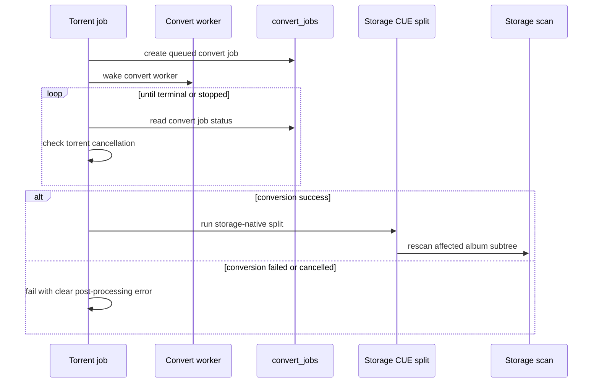

# fix: Close SMB review residuals

## Summary

This plan closes the remaining code-review blockers after the SMB storage follow-up work: torrent `split_after_conversion` must run the storage-native CUE split after conversion succeeds, and the accidental root-level generated `report.md` artifact must not ship.

---

## Problem Frame

The SMB storage follow-up implementation addressed most review requirements, but the latest review found one unmet behavioral requirement and one scope hygiene issue. `split_after_download` now uses storage-native CUE split, while `split_after_conversion` still returns a user-facing `bad_request`. The repository also contains an untracked root `report.md` generated artifact that could be accidentally included in the PR.

---

## Requirements

- R1. Torrent jobs with `convert_after_download` and `split_after_conversion` must queue conversion, wait for conversion success, then run the storage-native CUE split path instead of returning `bad_request`.
- R2. Torrent cancellation must be observed while waiting for conversion completion and before starting split output writes.
- R3. Conversion failure or cancellation must prevent CUE split and record a clear torrent job error.
- R4. The implementation must add regression coverage for successful split-after-conversion and failure/cancellation paths.
- R5. The root-level generated `report.md` artifact must be removed or moved into an intentional durable location before shipping.

---

## Key Technical Decisions

- **KTD1. Treat split-after-conversion as torrent-owned orchestration:** The torrent job remains responsible for the post-download sequence because it owns user-visible job status, cancellation, and post-processing options.
- **KTD2. Reuse convert job rows as the completion contract:** The plan should wait on `convert_jobs` status for the queued conversion instead of introducing a parallel completion channel. This keeps the worker coupling database-backed and resilient to process boundaries.
- **KTD3. Reuse the existing storage CUE split helper:** The split stage should call the same service path as `split_after_download`, preserving validation, atomic storage writes, source-file policy, and follow-up scan behavior.
- **KTD4. Keep generated review artifacts out of repo root:** A one-off review report should not be shipped as source. If any content is worth preserving, it belongs in a named docs artifact with a deliberate owner and purpose.

---

## High-Level Technical Design

---

## Implementation Units

### U1. Add conversion wait orchestration

- **Goal:** Let torrent post-processing wait for the conversion job it queued.
- **Requirements:** R1, R2, R3
- **Dependencies:** None
- **Files:** `crates/euterpe-server/src/services/download/torrent_job.rs`; `crates/euterpe-server/src/db/convert_jobs.rs`; tests in `crates/euterpe-server/src/services/download/torrent_job.rs`
- **Approach:** Add a torrent-owned helper that polls the queued conversion job until it reaches a terminal status or the torrent job is stopped. Keep the wait bounded by periodic sleeps and reuse existing `download_jobs::is_stopped` checks. Return success only for conversion status `success`; return clear errors for `failed`, `cancelled`, missing rows, or unsupported terminal states.
- **Execution note:** Start with failing tests for success, failure, and cancellation while waiting.
- **Patterns to follow:** `wait_scan_finished_or_stopped` in `crates/euterpe-server/src/services/download/torrent_job.rs`; `convert_jobs::get_by_id` and terminal status handling in `crates/euterpe-server/src/db/convert_jobs.rs`.
- **Test scenarios:**
  - A queued conversion row marked `success` lets the wait helper return success.
  - A queued conversion row marked `failed` returns an error containing the conversion error message.
  - Cancelling the torrent job while conversion status is still running returns a stopped result and does not proceed to split.
  - A missing conversion row returns a clear post-processing error rather than looping forever.
- **Verification:** Torrent post-processing has a deterministic completion contract for the conversion phase.

### U2. Run storage CUE split after conversion success

- **Goal:** Replace the `split_after_conversion` placeholder branch with real storage-native split execution.
- **Requirements:** R1, R2, R3, R4
- **Dependencies:** U1
- **Files:** `crates/euterpe-server/src/services/download/torrent_job.rs`; `crates/euterpe-server/src/library/cue.rs`; tests in `crates/euterpe-server/src/services/download/torrent_job.rs`
- **Approach:** After `start_album_convert` returns a conversion job id, wait for that job to succeed when `split_after_conversion` is requested. Then call the same CUE split service path used by `split_after_download`, using the imported album path, `cue_path`, and `source_file_policy` from torrent post-processing options. Preserve pre-split cancellation checks so no output files are written after user cancellation.
- **Execution note:** Add the success regression test first: a torrent CUE album with `convert_after_download` and `split_after_conversion` should create split outputs through `LibraryStorage`.
- **Patterns to follow:** `run_torrent_cue_split_after_download` in `crates/euterpe-server/src/services/download/torrent_job.rs`; `cue::run_storage_cue_split_job` in `crates/euterpe-server/src/library/cue.rs`.
- **Test scenarios:**
  - `convert_after_download=true` and `split_after_conversion=true` waits for conversion success, then creates expected split track files.
  - Conversion failure prevents split output writes and records a clear torrent job failure.
  - Torrent cancellation after conversion success but before split prevents output writes.
  - Missing, escaping, or non-CUE `cue_path` still fails with the existing validation errors.
- **Verification:** The old `"split_after_conversion is waiting for conversion-worker completion support"` string is absent from production code and the planned torrent post-processing path succeeds under storage-backed tests.

### U3. Remove accidental generated report artifact

- **Goal:** Keep untracked generated review output out of the shipping diff.
- **Requirements:** R5
- **Dependencies:** None
- **Files:** `report.md`; optionally `.gitignore` if the repo wants to ignore this exact generated artifact class
- **Approach:** Delete `report.md` from the workspace unless a human chooses to preserve its contents. If similar root-level generated review reports are expected to recur, add a narrow ignore rule for `report.md` or for the specific generator output path, avoiding broad ignores that could hide intentional documentation.
- **Execution note:** Treat this as cleanup, not feature work; no behavioral tests are needed.
- **Patterns to follow:** Existing repository practice of storing durable plans under `docs/plans/` and SMB notes under `docs/smb/`.
- **Test scenarios:** Test expectation: none -- removing an untracked generated artifact has no runtime behavior.
- **Verification:** `git status --short` no longer shows root `report.md` as an untracked file.

---

## Scope Boundaries

- The plan does not redesign the converter worker or introduce a new async event bus.
- The plan does not implement additional CUE split UI behavior.
- The plan does not revisit already-passing SMB scan, watch, Qobuz streaming, Settings, or OpenAPI follow-ups except where tests need shared fixtures.

---

## Risks & Dependencies

- **Conversion wait can hang if terminal states are incomplete:** The wait helper must treat unknown or missing conversion rows as errors and keep checking torrent cancellation.
- **Split-after-conversion semantics depend on converted outputs:** If the converter changes album paths or CUE/audio references, the implementation must resolve the correct post-conversion CUE/audio target before split. If current converter behavior does not produce a CUE-compatible target, document the blocker in the error and tests rather than silently splitting the pre-conversion source.
- **Polling adds latency:** Reuse the scan wait pattern with a modest interval so the worker remains simple without creating busy loops.

---

## Sources & Research

- Latest review result: manual `ce-code-review` fallback on 2026-06-12, covering tracked and explicitly included untracked files.
- Existing review follow-up plan: `docs/plans/2026-06-06-001-fix-smb-storage-review-followups-plan.md`
- Existing split-after-download implementation: `crates/euterpe-server/src/services/download/torrent_job.rs`
- Existing storage CUE split helper: `crates/euterpe-server/src/library/cue.rs`
- Existing conversion job lifecycle: `crates/euterpe-server/src/services/convert/worker.rs` and `crates/euterpe-server/src/db/convert_jobs.rs`
