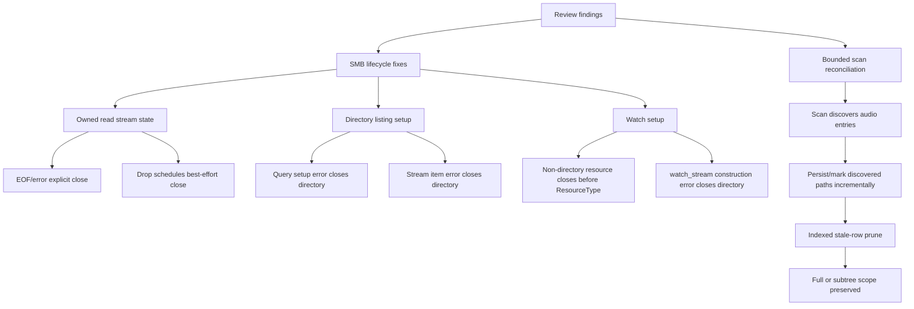

# fix: Close SMB resources and bound storage scan reconciliation

## Summary

This plan addresses the remaining SMB storage review findings from the current branch: early-dropped read streams must close remote file handles, directory/watch setup errors must close already opened resources, and full-library scan reconciliation must stop accumulating all discovered paths and building one giant `NOT IN` query.

---

## Problem Frame

The SMB storage migration moved media operations behind Library Storage, but the current implementation still has remote lifecycle and scale hazards. `SmbReadFile::byte_stream` closes the file only when the stream is polled to EOF, empty read, or error; a dropped HTTP stream can leave the file handle open. `list_directory` and `watch_directory` also have setup-error paths that return after opening an SMB resource without closing it. Full storage scans materialize all audio entries and all discovered paths, then pass them into stale cleanup as one SQL `NOT IN` list, which can exceed memory or SQLite parameter limits on large libraries.

---

## Requirements

### SMB Resource Lifecycle

- R1. SMB read streams must close their file handle when consumed normally, when read fails, and when the stream is dropped before EOF.
- R2. SMB directory listing must close an opened directory if query setup fails or if the query stream later returns an error.
- R3. SMB ChangeNotify watch setup must close any opened non-directory resource and any opened directory when watch stream construction fails.
- R4. Resource lifecycle fixes must have tests that prove open/close balance through existing dry-run or test-hook instrumentation.

### Scan Reconciliation

- R5. Full-library storage scans must not hold a complete discovered path list solely to prune stale tracks.
- R6. Stale track pruning must avoid a single SQL statement with one placeholder per discovered file.
- R7. Scoped storage scans must preserve subtree-only stale cleanup semantics.
- R8. Cancelled or failed scans must not run stale cleanup with partial discovery data.

### Execution Quality

- R9. Implementation must follow TDD: each unit starts with failing characterization or regression tests, then the minimal code change, then refactor if needed.
- R10. The final verification must include targeted SMB crate tests and storage scan tests that exercise the new failure paths and scale guard.

---

## Key Technical Decisions

- **KTD1. Use an owned stream wrapper for SMB reads:** `futures_util::stream::unfold` cannot run async cleanup on early drop. The fix should wrap the read state in an owned stream type whose `Drop` can schedule a best-effort close through the runtime while normal EOF/error paths still close explicitly.
- **KTD2. Make setup cleanup explicit instead of relying on resource drop:** SMB resources use async close semantics. Every path that opens a resource and then fails before returning a usable operation must call the same close helper used by successful paths.
- **KTD3. Preserve watch lifetime safety while closing setup failures:** The existing watch stream lifetime detach is separate from setup cleanup. This plan does not redesign ChangeNotify streaming; it fixes only resource leaks before a stream is successfully returned.
- **KTD4. Replace path-list pruning with bounded reconciliation:** The scan should persist or mark discovered paths incrementally and then delete stale rows through an indexed anti-join or bounded chunks, rather than holding the entire discovered set in memory and SQL text.
- **KTD5. Keep scan correctness before performance tuning:** The new reconciliation must preserve full-scan and scoped-scan semantics before optimizing worker parallelism, album-cover passes, or SMB operation serialization.

---

## High-Level Technical Design

---

## Implementation Units

### U1. Close SMB read streams on early drop

- **Goal:** Ensure `SmbReadFile::byte_stream` closes the SMB file handle even when the caller drops the stream before EOF.
- **Requirements:** R1, R4, R9, R10
- **Dependencies:** None
- **Files:** `crates/euterpe-smb/src/lib.rs`; tests in `crates/euterpe-smb/src/lib.rs`
- **Approach:** Replace the current `unfold` stream with an owned stream state that holds the `SmbReadFile`, cursor, optional remaining length, and a closed flag. Normal poll paths close explicitly on EOF, zero remaining length, and read error. `Drop` schedules a best-effort async close only when the file is still open. The dry-run/test-hook close counter should record the early-drop close exactly once.
- **Execution note:** Start with failing tests for early stream drop, fully consumed stream, and read-error stream cleanup before changing the stream implementation.
- **Patterns to follow:** Existing `SmbReadFile::close`, `SmbReadFile::read_block`, and test-hook close resource counters in `crates/euterpe-smb/src/lib.rs`.
- **Test scenarios:**
  - Creating a dry-run byte stream, polling one chunk, and dropping it records one close.
  - Consuming a byte stream to EOF records one close and does not double-close on stream drop.
  - A simulated read error records one close before returning the error.
  - A zero-length stream closes without attempting a read.
- **Verification:** Open/close counters stay balanced for dropped, exhausted, zero-length, and erroring SMB read streams.

### U2. Close SMB directory listing and watch setup failures

- **Goal:** Close opened SMB resources when directory listing or watch setup fails before returning a completed operation to the caller.
- **Requirements:** R2, R3, R4, R9, R10
- **Dependencies:** None
- **Files:** `crates/euterpe-smb/src/lib.rs`; tests in `crates/euterpe-smb/src/lib.rs`
- **Approach:** Refactor directory listing setup so an opened directory can be closed if `Directory::query` construction fails despite the query API borrowing the directory. A small close guard or helper should own the close path until the stream setup succeeds. Apply the same pattern to `watch_directory`: close non-directory resources before returning `ResourceType`, and close the directory when `watch_stream` construction returns an error.
- **Execution note:** Add failing dry-run/test-hook tests for query setup failure, listing stream item failure, non-directory watch resource, and watch stream construction failure before changing cleanup logic.
- **Patterns to follow:** `close_resource_with_session` and existing list-directory stream item error cleanup in `crates/euterpe-smb/src/lib.rs`.
- **Test scenarios:**
  - `list_directory` closes the directory when query setup fails.
  - `list_directory` closes the directory when the query stream returns an item error.
  - `watch_directory` closes a file or pipe resource before returning a resource-type error.
  - `watch_directory` closes the directory when watch stream construction fails.
  - Successful listing and successful watch setup still do not close resources prematurely.
- **Verification:** Test hooks prove all setup-error paths close exactly the resources they opened.

### U3. Replace unbounded storage scan stale reconciliation

- **Goal:** Make full and scoped storage scans prune stale tracks without retaining every discovered path in memory or generating unbounded SQL.
- **Requirements:** R5, R6, R7, R8, R9, R10
- **Dependencies:** None
- **Files:** `crates/euterpe-server/src/services/library_scan.rs`; `crates/euterpe-server/src/db/tracks.rs`; tests in `crates/euterpe-server/src/services/library_scan.rs` and `crates/euterpe-server/tests/api_library.rs`
- **Approach:** Introduce a bounded discovery record for each scan. The preferred shape is a per-scan temporary or persistent table keyed by scan id and normalized storage path, written incrementally as audio entries are discovered or successfully indexed. Stale cleanup then deletes tracks in the scan scope where no matching discovery row exists. If a temp table is impractical with the existing SQLite pool, use bounded chunks with a documented maximum parameter count and no full in-memory `discovered_paths` vector.
- **Execution note:** Add characterization tests for current full-scan and scoped-scan stale cleanup before replacing the reconciliation mechanism. Then add a scale-shaped regression test that fails if pruning builds one placeholder per discovered file.
- **Patterns to follow:** Existing storage scan cancellation checks in `crates/euterpe-server/src/services/library_scan.rs`; path scope helpers and `path_prefix_bounds` in `crates/euterpe-server/src/db/tracks.rs`.
- **Test scenarios:**
  - A full scan keeps discovered tracks and deletes stale tracks outside the discovered set.
  - A scoped scan deletes stale tracks only under the requested subtree.
  - A cancelled scan exits before stale cleanup runs.
  - A scan with more discovered files than SQLite's conservative parameter limit still prunes correctly.
  - Discovery data is cleaned after the scan finishes or fails.
- **Verification:** Scan stale cleanup has bounded memory/SQL behavior and preserves existing full-scan and subtree semantics.

### U4. Run focused verification and document residual risks

- **Goal:** Confirm the review findings are fixed and leave explicit notes for any remaining upstream limitation.
- **Requirements:** R9, R10
- **Dependencies:** U1, U2, U3
- **Files:** `docs/solutions/integration-issues/smb-storage-review-fixes.md`; optional updates to `docs/smb/README.md`
- **Approach:** Run the targeted crate tests for SMB lifecycle and storage scan reconciliation. Update the existing institutional learning if the final implementation changes the residual-risk story, especially around watch stream lifetime detachment or upstream SMB query/watch APIs.
- **Execution note:** Treat verification failures as new tests first, not as reasons to weaken the lifecycle guarantees.
- **Patterns to follow:** Existing review-fix learning under `docs/solutions/integration-issues/smb-storage-review-fixes.md`.
- **Test scenarios:** Test expectation: none -- this unit verifies and documents the behavior implemented by U1-U3 rather than adding new feature behavior.
- **Verification:** The review can be rerun against the same findings and should no longer report the four resource lifecycle and scan reconciliation issues.

---

## Scope Boundaries

- This plan targets only the current review findings about SMB resource cleanup and storage scan reconciliation.
- It does not reopen tag write, cover embed, converter worker, torrent import, integrations/apply, or ChangeNotify watcher feature plans unless their tests expose a direct dependency on these fixes.
- It does not replace the `smb` crate or redesign the SMB session pool.
- It does not add a disk temp bridge for library operations.

### Deferred to Follow-Up Work

- Broader SMB operation concurrency tuning remains separate from the handle-leak fixes.
- A larger scan indexing redesign can follow if the bounded reconciliation work reveals deeper structural limits.
- Live SMB integration coverage beyond the targeted lifecycle tests remains under the SMB integration smoke-test plan.

---

## System-Wide Impact

The lifecycle fixes protect SMB servers from leaked file and directory handles during streaming, directory listing, and watch setup. The scan reconciliation change affects large-library correctness and performance, so it must preserve existing DB path semantics and cancellation behavior. Both areas are core infrastructure for SMB libraries and should be reviewed before additional storage-native write flows are marked complete.

---

## Risks & Dependencies

- **Async close on `Drop` is best-effort:** Rust destructors cannot await. The stream wrapper should schedule cleanup through the runtime and keep explicit async close on normal EOF/error paths.
- **Borrowed SMB query APIs can complicate close guards:** If `Directory::query` holds a borrow across the failed setup result, the implementation may need an owned setup helper or a wrapper that closes only after the borrow is released.
- **SQLite temp-table lifetime can conflict with pooled connections:** If reconciliation uses temp tables, the implementation must keep create/insert/delete on the same connection or choose a persistent per-scan table instead.
- **Scoped stale cleanup is easy to over-delete:** Tests must cover root scans and subtree scans before changing delete logic.

---

## Sources & Research

- Latest `ce-code-review` run from 2026-06-13, summarized in the conversation, identified the four findings this plan targets.
- Institutional learning: `docs/solutions/integration-issues/smb-storage-review-fixes.md`.
- Relevant code: `crates/euterpe-smb/src/lib.rs`, `crates/euterpe-server/src/services/library_scan.rs`, `crates/euterpe-server/src/db/tracks.rs`.
- Relevant concepts: Library Storage, Storage Backend, Storage Path, Atomic Write, and Storage Watch in `CONCEPTS.md`.
