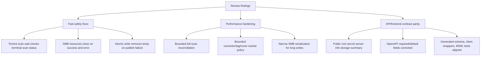

# fix: Resolve SMB review findings

## Summary

This plan addresses the confirmed review findings from the SMB storage migration work. It focuses on runtime correctness first: torrent import must fail when the required scan fails, SMB file and directory handles must close on all paths, and API/frontend contracts must match the server. Performance and test hardening follow in separate units so the quick safety fixes do not get blocked by larger scan/converter design work.

---

## Problem Frame

The current SMB migration diff is broad and includes tracked and untracked files. Review found several issues that can affect normal usage: failed library scans can be treated as successful torrent imports, SMB read/list paths can leak remote handles, temporary write files can survive publish failures, and generated/frontend API contracts drift from the Rust/OpenAPI intent. The same review also found performance risks in full-library scan reconciliation and full-file converter/tag/cover rewrites.

---

## Requirements

### Runtime Correctness

- R1. Torrent post-import orchestration must treat scan `failed`, `cancelled`, missing, and unknown terminal states as job failures unless the torrent job itself was stopped.
- R2. SMB read, stream, directory listing, metadata, rename, delete, and write paths must close remote resources on every success and error path that opens a resource.
- R3. Local and SMB atomic writes must clean sibling `.euterpe-part` files after publish/rename failures.
- R4. Server info must return a deliberate, non-secret `library_storage` contract instead of silently returning `null` for configured storage.

### Contract Parity

- R5. Rust API structs, OpenAPI, generated TypeScript, client wrappers, hooks, MSW fixtures, and frontend tests must agree on storage settings, browse, SMB shares, and server-info response shapes.
- R6. Server-defaulted request fields must remain optional for frontend callers wherever Rust `serde(default)` or API behavior supplies defaults.

### Performance And Operational Safety

- R7. Full-library scans must avoid unbounded path accumulation and one giant stale-row `NOT IN` query.
- R8. Converter, tag-write, and cover-embed storage flows must avoid multiplying full-media buffers beyond a documented bounded rewrite policy.
- R9. SMB long writes must not unnecessarily block unrelated reads, listing, metadata, or watch operations for the whole duration of a large stream.

### Verification

- R10. Tests must cover the new failure paths, cleanup behavior, API contract parity, and SMB-like storage semantics with test-first execution.
- R11. The ignored SMB integration placeholder must become a real env-gated smoke test or be replaced by documented manual coverage outside the automated test suite.

---

## Key Technical Decisions

- **KTD1. Split fast safety fixes from larger performance redesigns:** Scan status handling, SMB handle cleanup, temp cleanup, and API parity are localized and should land before scan/converter memory redesign work.
- **KTD2. Treat scan terminal state as part of torrent success:** Torrent import asks for indexing as a required post-copy step, so a failed scan is not a successful import.
- **KTD3. Prefer explicit async close over implicit drop:** SMB resources require async close semantics; wrappers should expose close/finalization paths and tests should assert open/close counters.
- **KTD4. Keep server-info public but non-secret:** The endpoint can report backend kind, configured relative/root path, capabilities, and watch status without exposing encrypted or plaintext SMB credentials.
- **KTD5. Make generated contracts follow OpenAPI rather than frontend workarounds:** Required/optional field drift should be fixed in OpenAPI/schema generation and then consumed by `frontend/src/api/schema.d.ts`.
- **KTD6. Use bounded persistence for large scan reconciliation:** Stale-row cleanup should use a temporary table, per-scan marker, or equivalent indexed reconciliation instead of accumulating all discovered paths in memory.

---

## High-Level Technical Design

---

## Implementation Units

### U1. Fail torrent imports when required scans fail

- **Goal:** Make torrent import/post-processing success depend on the required library scan succeeding.
- **Requirements:** R1, R10
- **Dependencies:** None
- **Files:** `crates/euterpe-server/src/services/download/torrent_job.rs`; tests in `crates/euterpe-server/src/services/download/torrent_job.rs`
- **Approach:** Change `wait_scan_finished_or_stopped` to inspect the scan row terminal status. Return stopped only when `download_jobs::is_stopped` is true. Return success only for scan status `success`; return clear errors for `failed` with `error_message`, `cancelled`, missing rows, and unknown states.
- **Execution note:** Start with failing tests for scan `failed`, `cancelled`, missing row, unknown status, and torrent cancellation while scan is still running.
- **Patterns to follow:** `wait_convert_finished_or_stopped` in `crates/euterpe-server/src/services/download/torrent_job.rs`; conversion status handling in `crates/euterpe-server/src/db/convert_jobs.rs`.
- **Test scenarios:**
  - A scan row finishing `success` lets torrent post-copy proceed.
  - A scan row finishing `failed` returns an error containing the scan error message.
  - A scan row finishing `cancelled` returns a clear torrent post-import error.
  - A missing scan row returns a clear error instead of treating the import as complete.
  - Cancelling the torrent job while scan status is `running` returns stopped and does not fail the torrent.
- **Verification:** A torrent job cannot finish successfully after a required import scan fails.

### U2. Close SMB resources and clean atomic-write temps

- **Goal:** Remove SMB resource leaks and stale temp files from read/list/write failure paths.
- **Requirements:** R2, R3, R10
- **Dependencies:** None
- **Files:** `crates/euterpe-smb/src/lib.rs`; `crates/euterpe-server/src/library/storage.rs`
- **Approach:** Add explicit close/finalization support for `SmbReadFile` and ensure `read_at` closes after a one-shot read. Make streaming close the file when the stream ends, is dropped, or returns an error; if async drop cannot be made reliable, introduce an owned stream wrapper that closes before yielding `None` and document the cancellation limitation. Ensure `list_directory` closes the directory on query setup failure and stream item errors. Clean temp siblings after failed SMB and local rename/publish attempts.
- **Execution note:** Start with dry-run open/close counter tests and rename-failure temp cleanup tests before changing the implementation.
- **Patterns to follow:** `close_resource_with_session` in `crates/euterpe-smb/src/lib.rs`; local `atomic_write_stream` cleanup-on-write-error behavior in `crates/euterpe-server/src/library/storage.rs`.
- **Test scenarios:**
  - `SmbStorageClient::read_at` increments both open and close counters once.
  - A fully consumed `SmbReadFile::byte_stream` closes its resource.
  - A stream read error closes the resource before surfacing the error.
  - `list_directory` closes its directory after `Directory::query` failure and after a stream item error.
  - SMB atomic write deletes the temp sibling when rename fails after a successful temp write.
  - Local atomic write deletes the temp sibling when rename fails after a successful temp write.
- **Verification:** SMB dry-run counters prove open/close balance for one-shot reads, streams, listing errors, and write cleanup.

### U3. Restore server-info and frontend API contract parity

- **Goal:** Make server-info, storage settings, browse, and SMB share APIs consistent across Rust, OpenAPI, generated TypeScript, MSW, and frontend client wrappers.
- **Requirements:** R4, R5, R6, R10
- **Dependencies:** None
- **Files:** `crates/euterpe-server/src/api/server.rs`; `crates/euterpe-server/src/app.rs`; `crates/euterpe-server/src/api/settings.rs`; `openapi/openapi.yaml`; `frontend/src/api/client.ts`; `frontend/src/api/hooks.ts`; `frontend/src/api/schema.d.ts`; `frontend/src/test/msw/handlers.ts`; tests in `crates/euterpe-server/tests/api_server_info.rs`, `crates/euterpe-server/tests/api_storage_settings.rs`, and frontend API/settings tests
- **Approach:** Define the public `library_storage` summary intentionally: backend kind, redacted path/share identity, capabilities, and watch status, with no password or encrypted secret fields. Correct OpenAPI `required` lists so `SmbStorageLocationPatch.port`, `SmbStorageLocationPatch.path`, `StorageBrowseRequest.path`, and `SmbSharesRequest.port` are optional when the server defaults them. Keep separate client wrappers for saved-library GET browse and draft-location POST browse. Update MSW fixtures to match the chosen server-info shape.
- **Execution note:** Start with failing API and type-level frontend tests for minimal SMB patch bodies, draft browse without `path`, share listing with default port, and server-info redaction.
- **Patterns to follow:** `StorageSettingsView::from_with_watch_status` in `crates/euterpe-server/src/api/settings.rs`; existing generated schema update flow reflected in `frontend/src/api/schema.d.ts`.
- **Test scenarios:**
  - `/api/v1/server/info` returns configured local storage as a non-secret summary.
  - `/api/v1/server/info` returns configured SMB storage without plaintext or encrypted password fields.
  - TypeScript accepts `{ kind: "smb", host, share }` for storage patch/test bodies.
  - TypeScript accepts draft browse and SMB share-list requests with omitted defaulted fields.
  - `frontend/src/api/client.ts` exposes both saved-library browse and draft-location browse wrappers.
  - MSW `/api/v1/server/info` fixture matches the OpenAPI/server response shape.
- **Verification:** Rust API tests and frontend type/tests agree with OpenAPI for changed storage contracts.

### U4. Bound full-library scan reconciliation

- **Goal:** Remove the full-scan memory and SQL-size cliff from stale track cleanup.
- **Requirements:** R7, R10
- **Dependencies:** U1
- **Files:** `crates/euterpe-server/src/services/library_scan.rs`; `crates/euterpe-server/src/db/tracks.rs`; tests in `crates/euterpe-server/src/services/library_scan.rs` and `crates/euterpe-server/tests/api_library.rs`
- **Approach:** Replace `audio_entries` plus `discovered_paths` accumulation with bounded processing. Use a temporary discovered-path table, per-scan marker column/table, or equivalent indexed anti-join so stale cleanup can delete rows outside the discovered set without generating one large `NOT IN` statement. Preserve partial scan semantics so scoped scans only reconcile the target subtree.
- **Execution note:** Add characterization tests for current stale cleanup behavior before changing reconciliation, then add a stress-shaped test that proves query size and memory do not grow with one placeholder per discovered file.
- **Patterns to follow:** Existing `tracks::delete_by_path_or_prefix` and album cleanup helpers; current scan progress counters in `crates/euterpe-server/src/services/library_scan.rs`.
- **Test scenarios:**
  - Full scan keeps discovered tracks and removes stale tracks outside the discovered set.
  - Scoped scan only reconciles stale rows under the scan root.
  - Large discovered-path sets do not produce a single unbounded placeholder query.
  - Cancelled scans do not run stale cleanup.
- **Verification:** Scan reconciliation remains correct while using bounded memory and bounded SQL statement size.

### U5. Bound converter, tag, and cover storage rewrites

- **Goal:** Prevent storage-native media rewrites from multiplying large full-file buffers beyond an explicit policy.
- **Requirements:** R8, R10
- **Dependencies:** U2
- **Files:** `crates/euterpe-server/src/services/convert/worker.rs`; `crates/euterpe-server/src/library/tags.rs`; `crates/euterpe-server/src/library/covers.rs`; `crates/euterpe-converter/src/lib.rs`; `crates/euterpe-converter/src/convert.rs`; tests in the same crates
- **Approach:** Decide the bounded rewrite policy per flow. For converter, prefer streaming/spooling through the converter API if available; otherwise enforce a pre-read size cap and process one file per task without cloning buffers unnecessarily. For tag and cover rewrites, lower or document the cap and avoid duplicate `to_vec` copies where `Bytes` ownership can be moved. Preserve remote atomic write semantics through storage temp objects.
- **Execution note:** Start with failing tests for oversized storage inputs and failed storage writes preserving DB track state.
- **Patterns to follow:** `write_tags_storage` and `embed_cover_in_track_storage` max-byte checks; converter worker per-file status persistence.
- **Test scenarios:**
  - Converter rejects or spools an oversized storage object before reading it into unbounded memory.
  - Converter read failure marks the file/job failed without changing DB track paths.
  - Converter atomic-write failure leaves the original source track metadata intact.
  - Tag write returns `STORAGE_TAG_REWRITE_TOO_LARGE` before reading objects over the configured cap.
  - Cover embed returns `STORAGE_COVER_EMBED_TOO_LARGE` before reading objects over the configured cap.
  - Successful tag and cover rewrites still publish through `LibraryStorage::atomic_write`.
- **Verification:** Storage rewrite flows have explicit bounded behavior and preserve atomicity on remote backends.

### U6. Reduce SMB operation serialization for long writes

- **Goal:** Avoid blocking unrelated SMB operations for the full duration of large imports, downloads, and rewrites.
- **Requirements:** R9, R10
- **Dependencies:** U2
- **Files:** `crates/euterpe-smb/src/lib.rs`; `crates/euterpe-server/src/library/storage.rs`; tests in `crates/euterpe-smb/src/lib.rs`
- **Approach:** Revisit `op_serial` so it protects known non-reentrant operations without holding a global session lock across the entire incoming write stream. If the underlying SMB client cannot safely interleave file operations, use separate sessions for long writes or a write-specific gate that does not block reads on independent handles.
- **Execution note:** Add a concurrency test with a controlled slow write and concurrent read/list attempt before changing locking.
- **Patterns to follow:** Existing `connect_gate` separation from `op_serial`; dry-run counters in `crates/euterpe-smb/src/lib.rs`.
- **Test scenarios:**
  - A slow streaming write does not block a metadata/read/list operation longer than the operation's own SMB work.
  - Concurrent writes to the same target still serialize or fail safely.
  - Share connection reuse remains stable after lock narrowing or session splitting.
- **Verification:** Long writes no longer monopolize all SMB operations on the client while same-file safety remains intact.

### U7. Replace SMB integration placeholder with real coverage

- **Goal:** Make the ignored SMB integration suite a real env-gated smoke test or remove it from automated tests and document the manual gate.
- **Requirements:** R11
- **Dependencies:** U2, U3
- **Files:** `crates/euterpe-smb/src/lib.rs`; optional integration tests under `crates/euterpe-smb/tests/`; `docs/smb/README.md`
- **Approach:** Prefer moving live SMB tests into a dedicated ignored integration test that reads `EUTERPE_TEST_SMB_HOST`, `EUTERPE_TEST_SMB_SHARE`, `EUTERPE_TEST_SMB_USERNAME`, `EUTERPE_TEST_SMB_PASSWORD`, and optional workgroup/path. Exercise create/list/read/stream/rename/delete and ChangeNotify when the environment is complete. If live ChangeNotify cannot be deterministic, keep it as a separate ignored smoke with explicit operator instructions.
- **Execution note:** Start by turning the placeholder assertion into a failing expectation when env is present, then implement the real smoke test.
- **Patterns to follow:** Existing env-gated test naming in `crates/euterpe-smb/src/lib.rs`; SMB docs under `docs/smb/`.
- **Test scenarios:**
  - With incomplete env, the ignored test exits as skipped with a clear message.
  - With complete env, the test creates a temp directory, writes a file, reads ranges/stream, renames it, deletes it, and verifies cleanup.
  - Watch smoke receives at least one create or modify event when ChangeNotify is enabled.
- **Verification:** The ignored suite is no longer a placeholder and can prove real SMB behavior when credentials are supplied.

---

## Scope Boundaries

- This plan fixes review findings in the current SMB migration branch; it does not reopen the broader storage migration roadmap.
- This plan does not change `/data`, `DATABASE_URL`, or torrent incoming env/docker ownership.
- This plan does not introduce a disk temp bridge for library operations. Any spooling considered in U5 must be explicitly bounded and must not become the default SMB media path without a separate decision.

### Deferred to Follow-Up Work

- Full UI polish for storage status display beyond contract parity remains outside this fix plan.
- Live NAS compatibility matrices across vendors are deferred after the env-gated smoke tests exist.
- A full converter API redesign is deferred unless U5 proves bounded behavior cannot be achieved with the current API.

---

## System-Wide Impact

These fixes affect public API contracts, generated frontend types, background job terminal states, SMB resource lifecycle, and large-library performance posture. The implementation should be reviewed as a cross-interface change: backend API tests, generated frontend tests, worker tests, and SMB crate tests all need to pass together.

---

## Risks & Dependencies

- **Async close on stream drop may be hard to guarantee:** If Rust stream drop cannot await close, the implementation must close on normal exhaustion and document cancellation behavior, then add a follow-up if the SMB crate exposes cancellable close support.
- **Scan reconciliation can regress scoped scan behavior:** U4 must preserve subtree cleanup semantics and avoid deleting tracks outside the scan root.
- **Server-info compatibility needs a product decision:** Returning `null` avoids secrets but breaks the stated structured-storage contract. The replacement summary must be non-secret and stable.
- **Performance fixes can get large:** U4, U5, and U6 should not block U1-U3; land the correctness fixes first.

---

## Sources & Research

- Review artifacts from the latest `ce-code-review` run covered tracked and untracked files in the current SMB worktree.
- Prior plans: `docs/plans/2026-06-05-001-fix-smb-storage-review-findings-plan.md`, `docs/plans/2026-06-06-001-fix-smb-storage-review-followups-plan.md`, and `docs/plans/2026-06-12-001-fix-smb-review-residuals-plan.md`.
- Relevant docs: `docs/smb/README.md`, `docs/smb/converter-worker.md`, `docs/smb/torrent-import-copy.md`, `docs/smb/change-notify-watcher.md`, `docs/smb/tag-write.md`, and `docs/smb/cover-upload-embed.md`.
- Core code references: `crates/euterpe-smb/src/lib.rs`, `crates/euterpe-server/src/services/download/torrent_job.rs`, `crates/euterpe-server/src/services/library_scan.rs`, `crates/euterpe-server/src/services/convert/worker.rs`, `crates/euterpe-server/src/library/tags.rs`, `crates/euterpe-server/src/library/covers.rs`, `crates/euterpe-server/src/api/server.rs`, and `openapi/openapi.yaml`.
