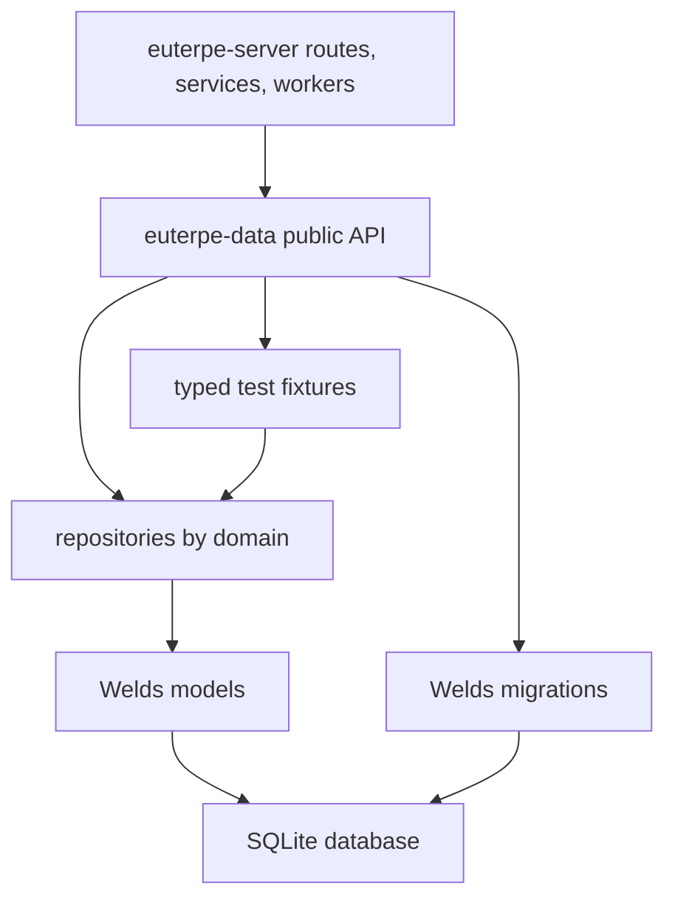
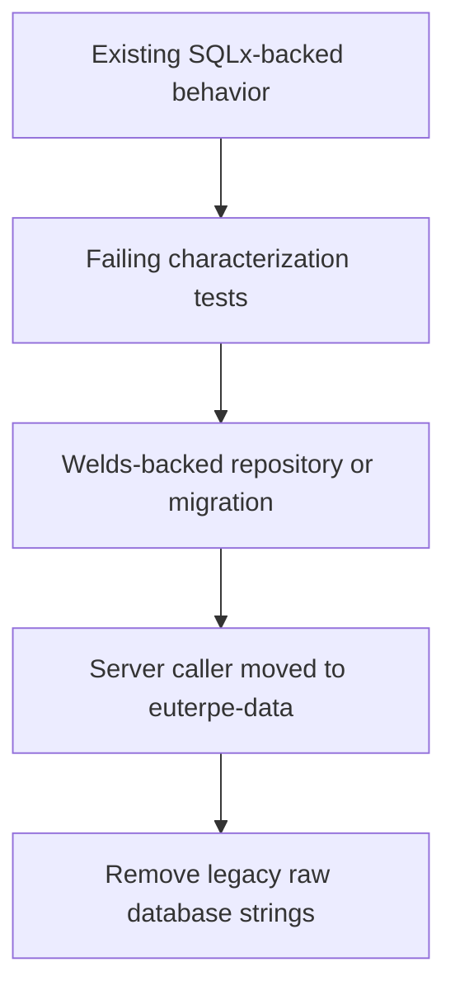

# refactor: Move persistence to Welds data layer

## Summary

Create `euterpe-data` as the first-party persistence boundary and migrate server database access to Welds-backed models, repositories, migrations, and typed fixtures. Preserve existing SQLite database compatibility while removing raw database strings from project-owned runtime code, migrations, tests, and seed helpers. Do not add a CI guard for raw-SQL detection.

---

## Problem Frame

Persistence is currently split between SQLx modules in `crates/euterpe-server/src/db`, direct database setup in `crates/euterpe-server/src/app.rs`, and first-party tests that still create or assert database state through SQL-shaped helpers. That makes persistence invariants easy to bypass and makes the SMB/storage work harder to reason about because media workflows can reach database details from many layers.

The origin document requires a stricter boundary: the server keeps orchestration, but database behavior moves behind a typed data crate. This is a compatibility migration, not a schema redesign or DB reset.

---

## Requirements

**Data crate boundary**

- R1. Add `euterpe-data` as the only first-party owner of database connection setup, migrations, models, repositories, and typed fixtures.
- R2. Move server callers from `crates/euterpe-server/src/db` APIs to `euterpe-data` APIs while preserving current route, worker, and service behavior.
- R3. Keep business orchestration in `euterpe-server`; persistence decisions stay in `euterpe-data`.

**Welds migration**

- R4. Runtime CRUD, lookup, list, queue, and lifecycle operations use Welds-backed models or repositories.
- R5. Project-owned schema evolution uses Welds migration APIs.
- R6. Tests and seed helpers create state through typed fixtures or repository APIs.
- R7. Do not add an automated raw-SQL scanner or CI guard.

**Compatibility and exclusions**

- R8. Existing SQLite databases migrate forward without destructive reset.
- R9. Preserve current table semantics, identifiers, uniqueness behavior, nullable fields, and queue/lifecycle transitions.
- R10. Preserve server API behavior while the persistence boundary changes.
- R11. Treat first-party source, tests, migrations, and fixtures as in scope for the no-raw-SQL migration.
- R12. Leave `docs/references` and `docs/dumps` unchanged.
- R13. Do not change storage, SMB, media-path, torrent-import, converter, CUE, or library-watch behavior except for persistence call sites.

---

## Key Technical Decisions

- **Create a dedicated data crate:** `euterpe-data` gives server code one dependency boundary for persistence and prevents new storage work from coupling to SQLx-era modules.
- **Use phased compatibility, not a big bang:** keep temporary SQLx access only while a domain is under migration, then remove the compatibility surface after callers move.
- **Model current schema before changing callers:** start with schema characterization and Welds model verification so the plan protects existing SQLite databases before replacing repository code.
- **Treat migrations as the risk center:** if a current migration cannot be represented with Welds migration APIs, record an explicit exception or blocker before implementing a hidden raw fallback.
- **Use TDD throughout:** every feature-bearing unit starts with failing characterization, contract, or migration tests before the Welds-backed implementation.
- **No CI raw-SQL guard:** enforcement stays in review expectations and typed APIs, matching the origin scope.

---

## High-Level Technical Design





The first diagram defines ownership. The second diagram defines execution posture: characterize current behavior first, replace behind a typed boundary second, then move callers.

---

## Output Structure

Expected new crate shape:

```text
crates/euterpe-data/
  Cargo.toml
  src/
    lib.rs
    connection.rs
    error.rs
    migrations/
    models/
    repositories/
    fixtures/
    tests/
```

The exact module split can adjust during implementation, but the public API should make connection, migration, repository, and fixture ownership clear.

---

## Implementation Units

### U1. Scaffold `euterpe-data` and compatibility harness

- **Goal:** Create the data crate, expose a database handle, and prove it can connect to the same SQLite URLs the server uses today.
- **Requirements:** R1, R2, R3, R8, R10
- **Dependencies:** None
- **Files:** `Cargo.toml`, `crates/euterpe-data/Cargo.toml`, `crates/euterpe-data/src/lib.rs`, `crates/euterpe-data/src/connection.rs`, `crates/euterpe-data/src/error.rs`, `crates/euterpe-data/tests/connection.rs`, `crates/euterpe-server/Cargo.toml`
- **Approach:** Introduce `euterpe-data` with Welds SQLite, migration, detect, and check features. Provide a typed handle that can be cloned by server state and workers. Keep `euterpe-server` compiling during transition by adding the dependency without removing old `db` modules yet.
- **Execution note:** Start test-first with connection URL cases equivalent to current `db::connect` behavior, including memory databases and file URLs with parent-directory creation.
- **Patterns to follow:** `crates/euterpe-server/src/db/mod.rs` for current SQLite URL handling and pool options; existing workspace crate layout in `Cargo.toml`.
- **Test scenarios:**
  - Given `sqlite::memory:`, when the new data handle connects, then it opens an in-memory SQLite database without creating filesystem paths.
  - Given a file-backed SQLite URL with a missing parent directory, when the new connector opens it, then the parent directory is created and the handle is usable.
  - Given a malformed SQLite URL, when the connector runs, then it returns the same category of configuration error expected by server startup.
- **Verification:** The new crate builds independently, and server still builds with the new dependency added but unused.

### U2. Characterize current schema and migrate with Welds

- **Goal:** Replace SQL migration ownership with Welds migration steps that preserve current schema behavior.
- **Requirements:** R5, R8, R9, R11
- **Dependencies:** U1
- **Files:** `crates/euterpe-data/src/migrations/mod.rs`, `crates/euterpe-data/tests/migrations.rs`, `migrations`, `crates/euterpe-server/src/db/mod.rs`
- **Approach:** Write tests that compare the expected current table, column, index, and seed state against a database migrated through the new crate. Recreate the 17 existing migration steps through Welds migration APIs, including current rebuild-style migrations for download job shape changes. Keep old `.sql` files as reference inputs until the Welds chain passes compatibility tests, then remove them from first-party migration execution.
- **Execution note:** Characterization first: tests should fail against the empty Welds migration chain before any migration implementation is added.
- **Patterns to follow:** Existing migration order under `migrations`; Welds migration docs for `create_table`, `change_table`, indexes, and migration `up` behavior.
- **Test scenarios:**
  - Covers AE2. Given a fresh in-memory database, when the Welds migration runner executes, then all current tables and indexes exist.
  - Covers AE2. Given a database migrated by the existing SQLx migration chain before the change, when the new migration runner starts, then it does not drop or reset user data.
  - Given the current download job lifecycle schema, when the Welds migration chain runs, then torrent fields, pause status, and queue-position indexes match current behavior.
  - Given app settings seed expectations, when migrations run, then default settings exist through typed reads rather than seed-query assertions.
  - Given a migration API gap in Welds, when implementation reaches that step, then the work records a blocker or explicit exception before using any raw fallback.
- **Verification:** Migration tests establish schema parity without querying through raw SQL strings in first-party test code.

### U3. Port core catalog repositories

- **Goal:** Move artists, albums, tracks, scan runs, and settings into Welds-backed repositories.
- **Requirements:** R1, R2, R4, R6, R9, R10, R13
- **Dependencies:** U1, U2
- **Files:** `crates/euterpe-data/src/models`, `crates/euterpe-data/src/repositories/catalog.rs`, `crates/euterpe-data/src/repositories/settings.rs`, `crates/euterpe-data/src/fixtures/catalog.rs`, `crates/euterpe-data/tests/catalog.rs`, `crates/euterpe-server/src/db/artists.rs`, `crates/euterpe-server/src/db/albums.rs`, `crates/euterpe-server/src/db/tracks.rs`, `crates/euterpe-server/src/db/library_scan_runs.rs`, `crates/euterpe-server/src/db/settings.rs`
- **Approach:** Define Welds models matching the current catalog tables and build repository functions equivalent to the current SQLx modules. Move typed row structs and upsert inputs into `euterpe-data` or expose server-facing DTOs from there.
- **Execution note:** Add repository characterization tests before porting each table group. Use the old modules only as a temporary reference while the new tests are red.
- **Patterns to follow:** Current public APIs in `crates/euterpe-server/src/db/albums.rs`, `crates/euterpe-server/src/db/tracks.rs`, `crates/euterpe-server/src/db/library_scan_runs.rs`, and `crates/euterpe-server/src/db/settings.rs`.
- **Test scenarios:**
  - Covers AE1. Given artist, album, and track metadata, when repository upserts run twice, then identifiers and uniqueness behavior match current SQLx behavior.
  - Covers AE2. Given existing rows with nullable tag fields and file sizes, when Welds models read them, then optional values round-trip without defaults changing meaning.
  - Given a library scan records keep paths, when absent paths are pruned through the repository, then only rows outside the keep set are deleted.
  - Given settings are inserted, updated, and deleted, when typed settings repository calls run, then reads reflect current key/value behavior.
  - Given a path prefix cleanup from storage watch, when repository cleanup runs, then tracks and empty storage albums are removed with current scope behavior.
- **Verification:** Catalog and settings tests pass through `euterpe-data`, and the old server `db` modules can delegate to the new repository during transition.

### U4. Port job repositories

- **Goal:** Move download, convert, and CUE job persistence to Welds-backed repositories.
- **Requirements:** R1, R2, R4, R6, R9, R10, R13
- **Dependencies:** U1, U2
- **Files:** `crates/euterpe-data/src/models`, `crates/euterpe-data/src/repositories/download_jobs.rs`, `crates/euterpe-data/src/repositories/convert_jobs.rs`, `crates/euterpe-data/src/repositories/cue_jobs.rs`, `crates/euterpe-data/src/fixtures/jobs.rs`, `crates/euterpe-data/tests/jobs.rs`, `crates/euterpe-server/src/db/download_jobs.rs`, `crates/euterpe-server/src/db/convert_jobs.rs`, `crates/euterpe-server/src/db/cue_jobs.rs`
- **Approach:** Port lifecycle transitions, queue ordering, payload storage, progress updates, terminal-state handling, and active-job checks behind typed repositories. Preserve current enum string values because existing rows depend on them.
- **Execution note:** Start with failing lifecycle and queue-order tests for current behavior, then implement Welds repositories.
- **Patterns to follow:** Current transition helpers and queue logic in `crates/euterpe-server/src/db/download_jobs.rs`, `crates/euterpe-server/src/db/convert_jobs.rs`, and `crates/euterpe-server/src/db/cue_jobs.rs`.
- **Test scenarios:**
  - Given multiple queued download jobs, when priorities are adjusted, then queue positions and next-queued selection match current behavior.
  - Given a paused, cancelled, failed, and succeeded download job, when transition helpers run, then allowed and disallowed transitions match current behavior.
  - Given a torrent payload update, when typed payload APIs read and write, then JSON payload data round-trips without shape changes.
  - Given active convert and CUE jobs for an album, when enqueue checks run, then duplicate active jobs are rejected as they are today.
  - Given progress updates, when a job finishes success or failure, then status, progress, timestamps, and error fields match current semantics.
- **Verification:** Job repositories pass behavior tests without first-party raw database strings.

### U5. Port Qobuz, integrations, and sync repositories

- **Goal:** Move Qobuz accounts, OAuth state, favorites, sync runs, and integrations into Welds-backed repositories.
- **Requirements:** R1, R2, R4, R6, R9, R10
- **Dependencies:** U1, U2
- **Files:** `crates/euterpe-data/src/repositories/qobuz.rs`, `crates/euterpe-data/src/repositories/favorites.rs`, `crates/euterpe-data/src/repositories/integrations.rs`, `crates/euterpe-data/src/fixtures/qobuz.rs`, `crates/euterpe-data/tests/qobuz.rs`, `crates/euterpe-data/tests/integrations.rs`, `crates/euterpe-server/src/db/qobuz_accounts.rs`, `crates/euterpe-server/src/db/favorites.rs`, `crates/euterpe-server/src/db/sync_runs.rs`, `crates/euterpe-server/src/db/integrations.rs`
- **Approach:** Preserve account lookup, encrypted secret storage boundaries, favorites pagination, removed-marker behavior, sync-run status records, and integration sort-order behavior through typed APIs.
- **Execution note:** Write failing tests against repository contracts before moving service callers.
- **Patterns to follow:** Current repository modules in `crates/euterpe-server/src/db/qobuz_accounts.rs`, `crates/euterpe-server/src/db/favorites.rs`, `crates/euterpe-server/src/db/sync_runs.rs`, and `crates/euterpe-server/src/db/integrations.rs`.
- **Test scenarios:**
  - Given OAuth state rows with expiration, when purge and consume operations run, then expired rows are removed and valid rows are consumed once.
  - Given Qobuz account upsert after OAuth, when the same user signs in twice, then the existing account row updates rather than duplicating.
  - Given favorite albums with active and removed rows, when sync reconciliation runs, then removed markers and active listing match current behavior.
  - Given integration inserts and updates, when sort order and enabled filters are applied, then list order and catalog behavior match current API expectations.
  - Given account credentials are stored through server services, when data APIs are used, then plaintext logging or accidental exposure is not introduced.
- **Verification:** Qobuz and integration API tests can be migrated to typed fixtures and remain behaviorally stable.

### U6. Move server state and runtime callers to `euterpe-data`

- **Goal:** Replace server-owned `SqlitePool` flow with the new data handle across app state, routes, services, workers, and library helpers.
- **Requirements:** R2, R3, R4, R10, R13
- **Dependencies:** U3, U4, U5
- **Files:** `crates/euterpe-server/src/app.rs`, `crates/euterpe-server/src/state.rs`, `crates/euterpe-server/src/routes`, `crates/euterpe-server/src/services`, `crates/euterpe-server/src/library`, `crates/euterpe-server/src/integrations`, `crates/euterpe-server/tests`
- **Approach:** Change `AppState` and worker dependency structs to carry the `euterpe-data` handle. Move route and service imports from `crate::db::*` to data crate repositories or service-facing data APIs. Keep storage abstractions unchanged.
- **Execution note:** Move callers with characterization API tests already in place. Each migrated route or worker should fail first when pointed at the not-yet-wired data handle.
- **Patterns to follow:** Current `AppState` construction in `crates/euterpe-server/src/app.rs`; current worker dependency wiring for downloads and converter; current API test coverage in `crates/euterpe-server/tests`.
- **Test scenarios:**
  - Covers F1. Given a route needs persisted data, when it handles a request, then it reaches persistence through the data handle rather than server `db` modules.
  - Given download and converter workers claim queued jobs, when workers start, then they use the shared data handle and preserve current lifecycle behavior.
  - Given library scan and storage watch update catalog state, when they run, then storage behavior is unchanged and only persistence calls move.
  - Given credential and settings services load runtime config, when server info and settings routes run, then responses remain stable.
  - Given integration apply updates album and track metadata, when the apply route runs, then metadata persistence behavior matches current tests.
- **Verification:** Existing server API and worker tests pass after caller migration, with storage/SMB tests unchanged except for fixture setup.

### U7. Replace first-party tests and fixtures with typed data fixtures

- **Goal:** Remove raw database strings from first-party test setup and assertions by using `euterpe-data` fixtures.
- **Requirements:** R6, R7, R10, R11, R12
- **Dependencies:** U3, U4, U5, U6
- **Files:** `crates/euterpe-data/src/fixtures`, `crates/euterpe-server/tests/support`, `crates/euterpe-server/tests/api_library.rs`, `crates/euterpe-server/tests/api_downloads.rs`, `crates/euterpe-server/tests/api_storage_settings.rs`, `crates/euterpe-server/tests/api_integrations.rs`, `crates/euterpe-server/tests/api_qobuz_oauth.rs`, `crates/euterpe-server/tests/api_server_info.rs`
- **Approach:** Centralize test DB setup and seed data behind typed fixture builders. Replace direct SQL-shaped assertions with repository reads, API assertions, or fixture-level helpers. Do not add a scanner.
- **Execution note:** For each test module, first add the fixture/helper API that represents the test's intent, then migrate the test to that helper.
- **Patterns to follow:** Existing `crates/euterpe-server/tests/support` helpers and current API test setup.
- **Test scenarios:**
  - Covers AE3. Given first-party tests run, when they create DB state, then they use typed fixtures and not raw database strings.
  - Given API tests assert persisted side effects, when assertions run, then they inspect data through typed helpers or public API responses.
  - Given storage settings tests need app settings, when setup runs, then fixture helpers seed settings through the data crate.
  - Given references under `docs/references` contain SQL-like text, when the test fixture migration is complete, then those snapshots are not modified or treated as failures.
- **Verification:** First-party tests compile without imports of `sqlx` query helpers or server `db` modules for setup.

### U8. Remove legacy SQLx data modules and finalize docs

- **Goal:** Complete the cutover by deleting first-party raw database access paths and updating documentation to reflect the Welds data boundary.
- **Requirements:** R1, R2, R7, R11, R12
- **Dependencies:** U2, U6, U7
- **Files:** `crates/euterpe-server/src/db`, `crates/euterpe-server/Cargo.toml`, `crates/euterpe-data/Cargo.toml`, `docs/02-backend/migrations.ru.md`, `docs/02-backend/sqlite-schema.ru.md`, `docs/README.ru.md`, `README.md`, `CONCEPTS.md`
- **Approach:** Remove obsolete server `db` modules after all callers move. Remove SQLx migration execution from server. Update docs that describe backend schema and migrations so future work starts from `euterpe-data`. Keep external-reference snapshots untouched.
- **Execution note:** Start with a failing compile or targeted import test that proves no server code still depends on `crate::db`, then remove legacy modules.
- **Patterns to follow:** Current backend docs for schema and migration descriptions; updated glossary entries in `CONCEPTS.md`.
- **Test scenarios:**
  - Given server code compiles, when imports are checked by the compiler, then `crates/euterpe-server/src/db` is no longer required.
  - Given docs describe database migrations, when they are updated, then they name `euterpe-data` and Welds as the first-party path.
  - Given no CI raw-SQL guard exists, when review checks the final diff, then enforcement is through code ownership and typed APIs, not a new scanner.
- **Verification:** Workspace builds with `euterpe-data`; server no longer owns first-party SQLx query modules; docs point contributors to the new data layer.

---

## Scope Boundaries

- CI guard or automated raw-SQL scanner is not part of this plan.
- Vendored/reference material under `docs/references` and captured dumps under `docs/dumps` stay unchanged.
- Storage backend behavior, SMB I/O, torrent import semantics, converter behavior, CUE split behavior, and library watch behavior stay functionally unchanged.
- SQLite remains the application database.
- Exact internal helper names are implementation-time choices as long as the public boundary and tests satisfy this plan.

### Deferred to Follow-Up Work

- A later enforcement pass may add a lint or scanner if the team decides review-only enforcement is insufficient.
- A later cleanup may split `euterpe-data` repository APIs further if implementation shows a clearer domain boundary.

---

## System-Wide Impact

The migration affects every server path that reads or writes application state: library catalog, settings, Qobuz, downloads, torrent import, conversion, CUE jobs, integrations, credentials, and storage watch bookkeeping. It should not affect frontend API contracts or media storage behavior.

Persistent data compatibility is the highest-risk impact. The plan must protect existing SQLite files before removing SQLx-era migrations.

---

## Risks & Dependencies

- **Welds migration API gaps:** current rebuild-style SQLite migrations may need functionality not directly exposed by Welds. Treat this as a blocker or explicit exception request.
- **Behavior drift in queue logic:** download, convert, and CUE job transitions depend on string status values and ordering. Characterization tests must pin those values before replacement.
- **Schema parity blind spots:** using only model-level reads may miss index or nullable-field mismatches. Migration tests need schema-shape checks through typed inspection helpers.
- **Long-lived compatibility layer:** leaving old `db` modules as delegates too long can create two persistence APIs. Each domain unit should remove or seal its legacy surface once callers move.
- **External dependency:** Welds 0.5.0 docs describe SQLite support, migrations, schema detection, and model checking; implementation should verify exact crate features during dependency integration.

---

## Documentation / Operational Notes

- Update backend documentation after the data crate is the active boundary, not before, to avoid documenting an intermediate compatibility layer as final architecture.
- Keep Docker and `DATABASE_URL` behavior unchanged.
- Reviewers should treat first-party raw database strings as out of scope for new code even though this plan does not add an automated guard.

---

## Sources / Research

- Origin requirements: `docs/brainstorms/2026-06-25-welds-data-layer-requirements.md`
- Current SQLx modules: `crates/euterpe-server/src/db`
- Current migration history: `migrations`
- Server connection and migration entrypoint: `crates/euterpe-server/src/db/mod.rs`
- Server startup and worker wiring: `crates/euterpe-server/src/app.rs`
- Current direct caller surface: `crates/euterpe-server/src/services`, `crates/euterpe-server/src/routes`, `crates/euterpe-server/src/library`, `crates/euterpe-server/tests`
- Welds docs: async ORM support for SQLite, `WeldsModel`, migrations, transactions, schema detection, and model checking.
- Institutional note: `docs/solutions/integration-issues/smb-storage-review-fixes.md` reinforces keeping storage behavior explicit and not hiding degraded or compatibility states.
