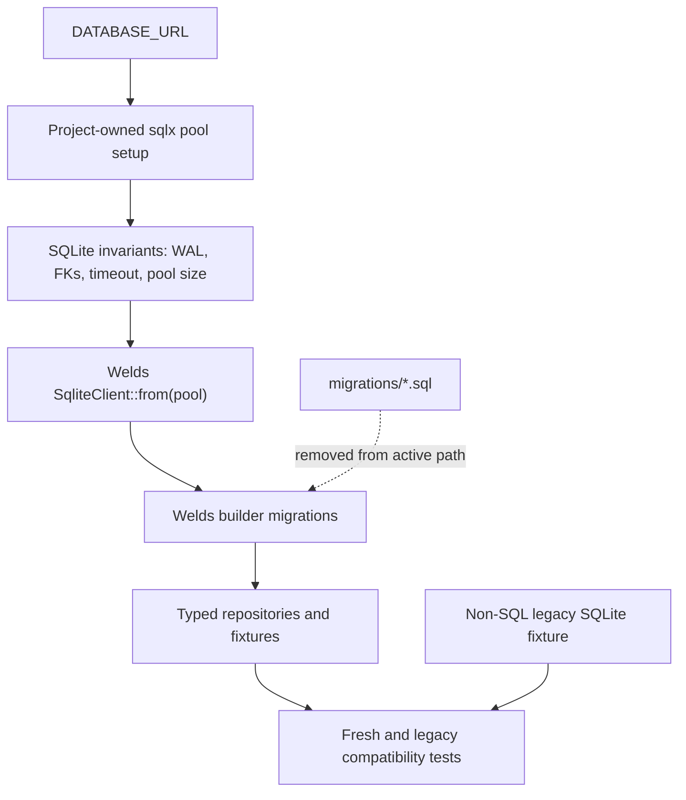

# refactor: Move migrations fully to Welds builders

## Summary

Upgrade the persistence dependencies to `welds 0.5.*` and `sqlx 0.9.*`, then replace first-party raw SQL migration execution with Welds migration builders. The final data-layer migration path should run without `Manual` migrations, `.sql` includes, `sqlx::migrate!`, or first-party raw SQL fixtures.

---

## Problem Frame

The Welds data-layer cutover made `euterpe-data` the application persistence boundary, but migration implementation still delegates to the historical SQLx migration files through Welds `Manual` wrappers. That keeps the schema source of truth split between `euterpe-data` and root-level SQL files.

This plan closes that gap while preserving SQLite compatibility. Existing databases created by the historical SQLx chain must continue forward, but the proof must come from typed detection, repositories, and controlled non-SQL fixtures rather than keeping raw SQL as an active first-party dependency.

---

## Requirements

**Dependency baseline**

- R1. Upgrade `welds` to the current `0.5.*` line and `sqlx` to the current `0.9.*` line before rewriting migrations.
- R2. Preserve Euterpe's SQLite connection invariants during the dependency upgrade.

**Welds migration ownership**

- R3. Express first-party schema creation and schema changes through Welds migration builders.
- R4. Remove runtime dependence on `Manual` migration wrappers, embedded SQL strings, and `.sql` migration includes.
- R5. Remove first-party dependence on root `migrations/*.sql` for build, test, and runtime behavior.

**Compatibility and verification**

- R6. Fresh SQLite databases must migrate to the current schema shape through the Welds builder path.
- R7. Existing SQLx-era SQLite databases must be adopted without destructive reset or data loss.
- R8. Migration compatibility tests must cover tables, columns, indexes, default settings, and queue/job lifecycle expectations without first-party raw SQL.
- R9. If Welds builder APIs cannot represent a required schema feature, implementation must stop and document the blocker or approved exception before adding a manual SQL fallback.

**Scope boundaries**

- R10. Do not change storage, SMB, media-path, torrent-import, converter, CUE split, or library-watch behavior.
- R11. Do not add a CI raw-SQL scanner.
- R12. Do not refactor repositories beyond what migration verification requires.

---

## Key Technical Decisions

- **Keep custom SQLite pool construction:** `welds::connections::connect` only calls `SqlitePool::connect(url)` in both the current and target Welds lines. Euterpe should continue creating a configured `sqlx::SqlitePool` and wrap it with `SqliteClient::from(pool)` so parent-directory creation, WAL, foreign keys, busy timeout, `create_if_missing`, and memory-DB pool sizing remain under project control.
- **Upgrade dependencies before rewriting migrations:** The migration builder work should target `welds 0.5.*` and `sqlx 0.9.*`, avoiding a rewrite against APIs that will be immediately replaced.
- **Use builders for DDL and typed APIs for data effects:** Table/index/column structure belongs in Welds migration builders; settings seeds and queue-position compatibility checks should be proven through typed repositories or fixtures rather than raw SQL.
- **Use a non-SQL legacy fixture for adoption tests:** Legacy compatibility should use a controlled SQLite database fixture that represents the SQLx-era schema and data. The test should not call `sqlx::migrate!` or read `migrations/*.sql`.
- **Treat partial index support as the likely blocker:** Welds builders cover table creation, column changes, foreign keys, ordinary indexes, and unique indexes, but partial unique indexes are not clearly exposed by the builder API. The active convert-job uniqueness rule must be tested and either represented without manual SQL or surfaced as an explicit exception.

---

## High-Level Technical Design

The connection boundary stays project-owned. The migration boundary moves to Welds builders, while data assertions and seed verification go through typed APIs.

---

## Implementation Units

### U1. Upgrade Welds and SQLx Baseline

- **Goal:** Move the data stack to `welds 0.5.*` and `sqlx 0.9.*` while preserving current connection behavior.
- **Requirements:** R1, R2
- **Dependencies:** None
- **Files:**
  - `crates/euterpe-data/Cargo.toml`
  - `crates/euterpe-server/Cargo.toml`
  - `Cargo.lock`
  - `crates/euterpe-data/src/connection.rs`
  - `crates/euterpe-data/tests/connection.rs`
- **Approach:** Update dependency versions, adapt compiler fallout, and keep `DataHandle::connect` on explicit `SqliteConnectOptions` plus `SqliteClient::from(pool)`. Do not replace it with `welds::connections::connect` because that would drop current SQLite options.
- **Execution note:** Characterization-first. Keep or add tests that prove connection behavior before changing dependency versions.
- **Patterns to follow:** Existing `DataHandle::connect` in `crates/euterpe-data/src/connection.rs`; current connection tests in `crates/euterpe-data/tests/connection.rs`.
- **Test scenarios:**
  - Given `sqlite::memory:`, when `connect_database` runs, then the handle is usable and uses the single-connection memory-safe pool behavior.
  - Given a file-backed SQLite URL with a missing parent directory, when `connect_database` runs, then the parent directory is created and the database opens.
  - Given an empty SQLite URL, when `connect_database` runs, then it returns the current configuration error category.
  - Given the upgraded dependencies, when server tests request `DataHandle::sqlx_pool`, then existing test compatibility code still compiles.
- **Verification:** Data and server crates compile with upgraded dependencies, and connection tests pass.

### U2. Verify Builder-Migration Scope Without Contract Tests

- **Goal:** Keep the no-raw-SQL migration scope explicit without adding a dedicated contract-test target.
- **Requirements:** R3, R4, R5, R6, R8
- **Dependencies:** U1
- **Files:**
  - `crates/euterpe-data/tests/migrations.rs`
  - `crates/euterpe-data/src/migrations/mod.rs`
- **Approach:** Verify through migration behavior tests and source review that the migration module no longer uses `Manual`, `include_str!`, `sqlx::migrate!`, or the root SQL migration directory as an active input. Do not add CI guard machinery or a dedicated contract-test file.
- **Execution note:** Characterization-first. Keep migration behavior tests as the executable safety net.
- **Patterns to follow:** Existing migration tests in `crates/euterpe-data/tests/migrations.rs`; repository tests that inspect behavior through typed APIs.
- **Test scenarios:**
  - Covers AE1. Given the migration source file, when the contract test scans it, then it rejects `Manual` migration wrappers and `.sql` includes.
  - Covers AE3. Given migration tests, when the contract test scans them, then it rejects `sqlx::migrate!`.
  - Given the active workspace, when the contract test checks migration fixture usage, then root SQL migration files are not required by the data crate tests.
- **Verification:** Migration tests pass after the migration rewrite and SQL artifact cleanup; source review confirms no active raw-SQL migration inputs.

### U3. Rewrite Fresh Schema Migrations with Welds Builders

- **Goal:** Replace the root SQL chain with Welds builder steps for current fresh-database schema creation.
- **Requirements:** R3, R4, R6, R8, R9
- **Dependencies:** U1, U2
- **Files:**
  - `crates/euterpe-data/src/migrations/mod.rs`
  - `crates/euterpe-data/tests/migrations.rs`
  - `crates/euterpe-data/tests/catalog.rs`
  - `crates/euterpe-data/tests/jobs.rs`
  - `crates/euterpe-data/tests/integrations.rs`
  - `crates/euterpe-data/tests/qobuz.rs`
- **Approach:** Replace each `Manual` step with Welds builder calls. Prefer creating the current final table shapes directly for fresh databases instead of replaying every historical rebuild step. Use `create_table`, `change_table`, `create_index`, column nullability, unique indexes, and foreign-key builders where supported.
- **Execution note:** Keep the existing fresh-schema tests red while converting the first table group, then bring table groups green incrementally.
- **Patterns to follow:** Welds migration examples under the installed `welds` crate; current schema expectations in `crates/euterpe-data/tests/migrations.rs`; repository behavior tests under `crates/euterpe-data/tests`.
- **Test scenarios:**
  - Covers AE1, AE2. Given a fresh database, when migrations run, then all current tables and expected columns exist.
  - Covers AE2. Given the current schema, when detection inspects indexes, then catalog, favorite, job, scan, and integration indexes expected by current behavior exist.
  - Covers AE4. Given repository tests run against a freshly migrated database, then download, convert, CUE, Qobuz, integrations, catalog, and scan behavior remains compatible.
  - Covers AE5. Given active convert jobs require one active job per album, when the builder API cannot express the current partial unique index, then implementation records a blocker or approved exception instead of silently weakening uniqueness.
- **Verification:** Fresh migration tests and all `euterpe-data` repository tests pass without runtime `Manual` migration steps.

### U4. Move Seeds and Backfill Semantics to Typed APIs

- **Goal:** Replace data-changing SQL migration behavior with typed repository or fixture-owned behavior.
- **Requirements:** R6, R8, R12
- **Dependencies:** U3
- **Files:**
  - `crates/euterpe-data/src/migrations/mod.rs`
  - `crates/euterpe-data/src/repositories/settings.rs`
  - `crates/euterpe-data/src/repositories/download_jobs.rs`
  - `crates/euterpe-data/tests/migrations.rs`
  - `crates/euterpe-data/tests/jobs.rs`
  - `crates/euterpe-data/tests/settings.rs`
- **Approach:** Preserve default application settings through typed settings repository calls after structural migration. Preserve queue-position semantics through repository-level behavior tests rather than an SQL backfill script. Keep data effects idempotent.
- **Execution note:** Test-first for idempotency and preservation. Existing user settings must not be overwritten by seed logic.
- **Patterns to follow:** `settings::set` and settings tests; download job queue tests in `crates/euterpe-data/tests/jobs.rs`.
- **Test scenarios:**
  - Given a fresh database, when migrations finish, then default settings exist and are readable through the typed settings repository.
  - Given a database with user-modified settings, when migrations run again, then existing values are preserved.
  - Given queued download jobs in a legacy-compatible database, when adoption runs, then queue order remains stable through typed job reads.
  - Given migrations run twice, when settings and jobs are read, then no duplicate seed or queue side effect appears.
- **Verification:** Seed and job lifecycle tests pass without SQL setup or SQL assertions.

### U5. Replace SQLx-Migrated Compatibility Test with Non-SQL Fixture

- **Goal:** Prove legacy database adoption without `sqlx::migrate!` or first-party raw SQL fixtures.
- **Requirements:** R5, R7, R8
- **Dependencies:** U3, U4
- **Files:**
  - `crates/euterpe-data/tests/migrations.rs`
  - `crates/euterpe-data/tests/fixtures/legacy-sqlx-v18.sqlite`
  - `crates/euterpe-data/tests/fixtures/README.md`
- **Approach:** Add a minimal SQLite fixture representing a database created by the old SQLx migration chain, including representative settings, catalog/job rows, and the absence or historical state of Welds migration metadata. The test copies the fixture to a temp file, opens it through `connect_database`, runs Welds migrations, and verifies preservation through typed repositories. Document the fixture provenance, expected schema version, representative rows, and checksum in the fixture README so the binary artifact is auditable without becoming a schema source of truth.
- **Execution note:** Characterization-first. The fixture should be small, deterministic, and documented as a binary compatibility artifact, not a source of schema truth.
- **Patterns to follow:** Existing temp database tests in `crates/euterpe-data/tests/migrations.rs`; typed fixture style under `crates/euterpe-data/src/fixtures`.
- **Test scenarios:**
  - Covers AE3. Given the legacy SQLite fixture, when Welds migrations run, then existing settings, catalog rows, and job rows remain readable.
  - Given the legacy SQLite fixture README, when maintainers inspect it, then the fixture provenance, schema version, representative contents, and checksum are documented without embedding raw SQL.
  - Covers AE3. Given the fixture lacks current Welds migration metadata, when adoption runs, then migrations do not attempt to recreate existing tables destructively.
  - Given the fixture has representative queued jobs, when jobs are read through typed repositories after migration, then status, queue position, payload, and timestamps survive.
  - Given migration tests are scanned by the contract test, when the fixture test is present, then it does not call `sqlx::migrate!`.
- **Verification:** Legacy adoption tests pass without root SQL migration files.

### U6. Remove Active SQL Migration Artifacts and Update Docs

- **Goal:** Remove first-party raw SQL migration files from active build/test/runtime paths and update documentation to the final Welds-builder architecture.
- **Requirements:** R4, R5, R10, R11
- **Dependencies:** U2, U3, U4, U5
- **Files:**
  - `migrations`
  - `docs/02-backend/migrations.ru.md`
  - `docs/02-backend/sqlite-schema.ru.md`
  - `docs/README.ru.md`
  - `README.md`
  - `CONCEPTS.md`
- **Approach:** Delete the active root SQL migration files or move any retained historical material outside active build/test/runtime usage. Update backend docs so future contributors start from Welds builder migrations and typed data fixtures.
- **Execution note:** Keep external reference snapshots out of scope. Do not add a CI scanner.
- **Patterns to follow:** Existing backend docs updated during the Welds data-layer cutover.
- **Test scenarios:**
  - Given the repository no longer has active SQL migration files, when data and server tests run, then no test requires them.
  - Given docs mention migrations, when read by a contributor, then they point to Welds builder migration ownership in `euterpe-data`.
  - Given the raw-SQL contract tests run, then they pass without adding a CI guard.
- **Verification:** Code search shows active first-party migration paths no longer depend on root SQL files, and documentation points to `euterpe-data` builder migrations.

---

## Scope Boundaries

- Storage, SMB, torrent import, converter, CUE split, and storage watch behavior stay unchanged.
- Repository refactors are limited to migration seed/adoption verification needs.
- No CI raw-SQL scanner is added.
- `docs/references` and `docs/dumps` remain out of scope.

### Deferred to Follow-Up Work

- Broader repository API cleanup after the migration rewrite.
- A future raw-SQL lint or scanner if review-only enforcement proves insufficient.

---

## System-Wide Impact

This plan affects application startup, test database setup, and all persisted application state because migrations create the schema used by every server route and worker. The connection behavior must remain stable because `DATABASE_URL`, Docker-managed SQLite files, in-memory tests, and Welds repository access all depend on `DataHandle`.

---

## Risks & Dependencies

- **Dependency upgrade fallout:** `sqlx 0.9` and `welds 0.5` may require type or API adjustments before migration work can begin.
- **Partial unique index support:** The current active convert-job uniqueness rule may not be expressible with Welds builders. This is the most likely exception candidate.
- **Legacy fixture drift:** A binary SQLite fixture can become stale if the expected old schema is not documented. Keep it minimal, record provenance/checksum in the fixture README, and verify it through typed reads.
- **Seed semantics drift:** Moving seed behavior out of raw SQL can accidentally overwrite user settings unless idempotency is tested.

---

## Documentation / Operational Notes

- Backend migration docs should describe Welds builder migrations as the active schema path.
- Historical SQL migration files, if retained, must be documented as historical reference only and must not be read by runtime or tests.
- The plan intentionally keeps the existing project-owned SQLite pool setup rather than using Welds default connection helpers.

---

## Sources / Research

- Origin requirements: `docs/brainstorms/2026-06-27-welds-migrations-no-raw-sql-requirements.md`
- Current migration implementation: `crates/euterpe-data/src/migrations/mod.rs`
- Current migration tests: `crates/euterpe-data/tests/migrations.rs`
- Current connection boundary: `crates/euterpe-data/src/connection.rs`
- Current historical SQL chain: `migrations`
- Welds migration documentation: `https://book.weldsorm.com/migration.html`
- Welds 0.4.22 and 0.5.0 source inspection confirmed `sqlite::connect` uses default `SqlitePool::connect`, while `SqliteClient::from(sqlx::SqlitePool)` remains available.
