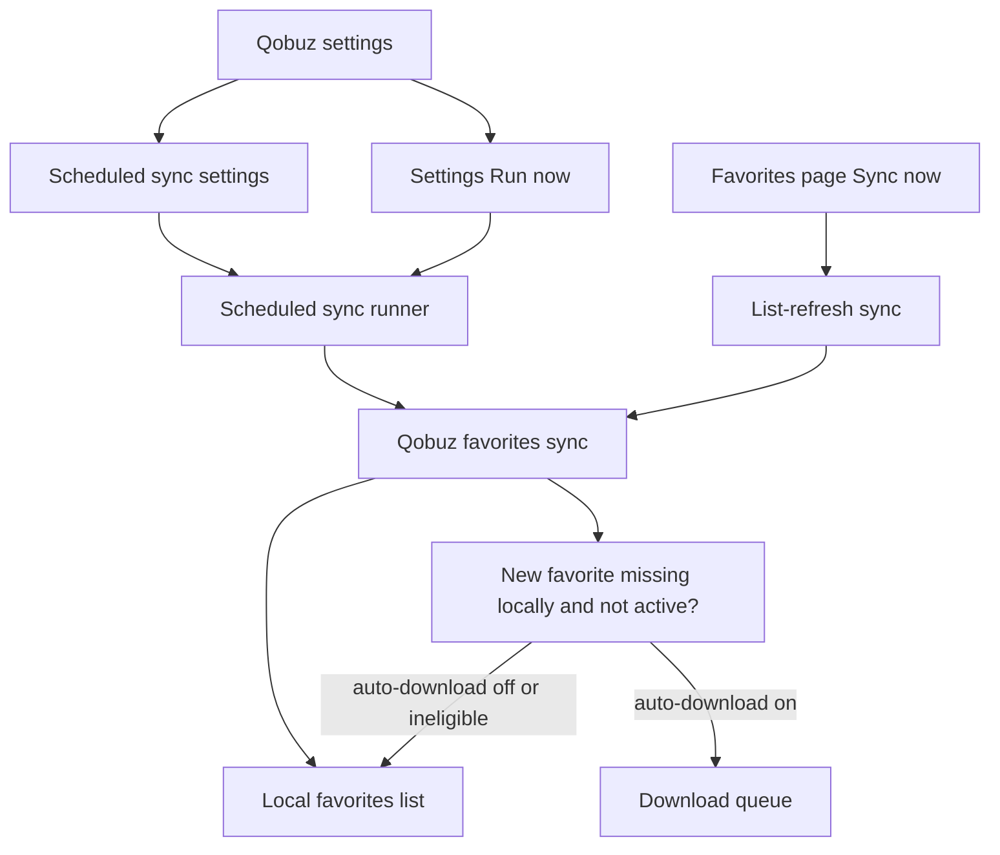
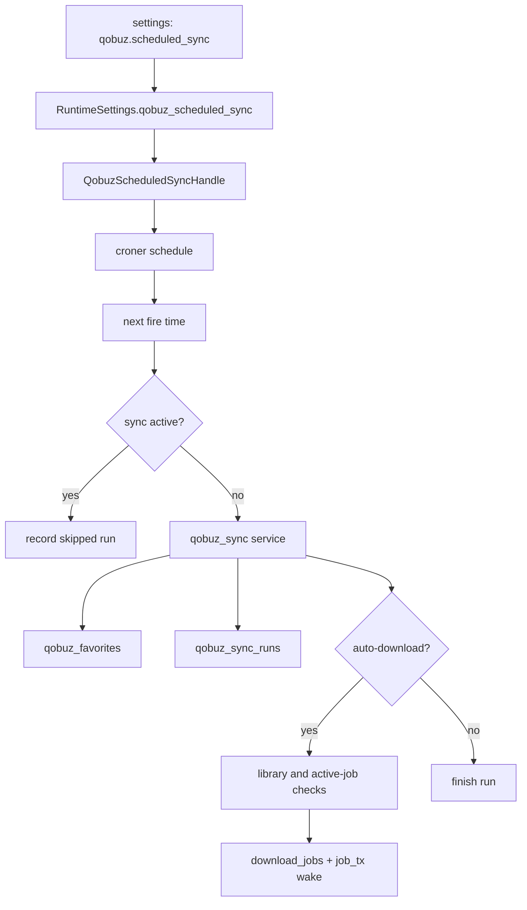
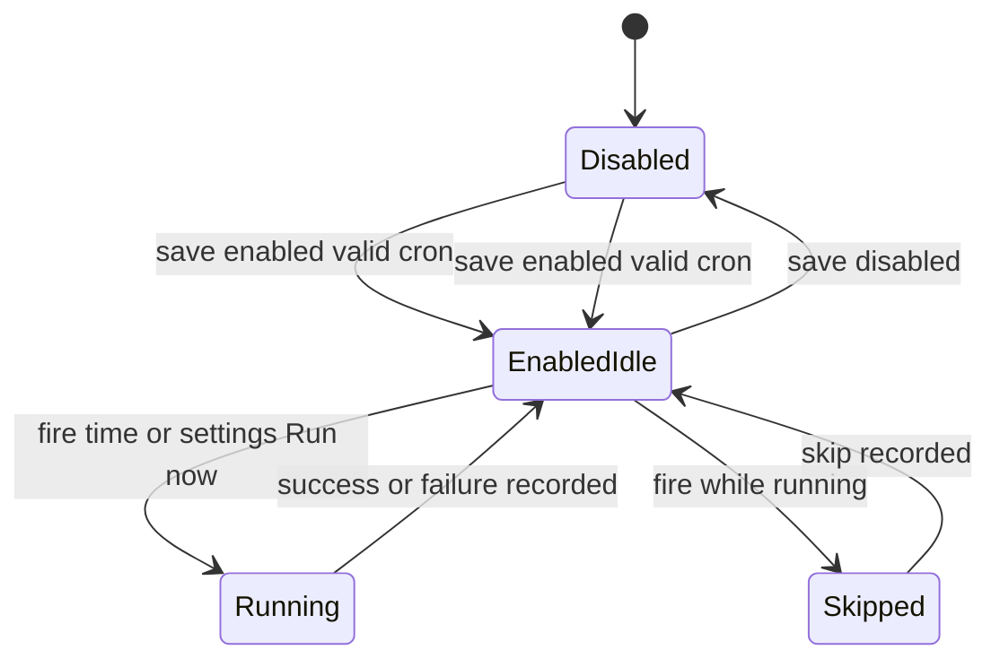

# Qobuz Favorites Scheduled Sync - Plan

## Goal Capsule

- **Objective:** Add a user-configured cron schedule that periodically synchronizes Qobuz favorites into Euterpe and can optionally queue newly discovered favorites for download.
- **Product authority:** Qobuz settings owns scheduled-sync configuration and operational visibility; the existing Favorites page sync button remains a list-refresh action.
- **Implementation authority:** Use an OpenAPI-first and TDD workflow while extending the existing Qobuz sync, app settings, download queue, and settings UI patterns before introducing any general app scheduler abstraction.
- **Stop conditions:** Stop before implementation if the chosen cron engine cannot validate and compute next run times in server-local time, or if auto-download cannot be made idempotent against library presence and active download work.
- **Execution profile:** Standard code plan across `euterpe-data`, `euterpe-server`, OpenAPI, and frontend settings.
- **Tail ownership:** The executor owns code, tests, generated API types, and cleanup of dead-end scheduler experiments; the plan file is not updated during implementation.

---

## Product Contract

### Summary

Euterpe will support scheduled Qobuz favorites synchronization from a user-provided cron expression interpreted in the server's local timezone.
By default, scheduled sync only refreshes the local favorites list.
Users can opt into automatic downloads for newly discovered favorites that are not already present in the library or active download queue.

### Problem Frame

Qobuz favorites already represent a user's desired album backlog, but today the local favorites view depends on manual synchronization.
That creates stale state when favorites are added outside Euterpe and makes the Favorites page less useful as a reliable acquisition queue.
The first scheduled-work capability should solve this concrete Qobuz use case before the application grows a general scheduler for every background job.

### Key Decisions

- **Start with Qobuz favorites, not a general scheduler.** The first release should schedule the existing Qobuz sync behavior and avoid introducing a broad job automation surface before there is demand for other job types.
- **Use full cron syntax.** The target user can express advanced self-hosted schedules, including night windows, without waiting for UI presets.
- **Interpret cron in the server's local timezone.** This matches self-hosted expectations and avoids a timezone picker in the first release.
- **Do not accumulate missed runs.** If a scheduled fire time arrives while another sync is active, or if Qobuz is unavailable, the scheduler records the outcome and waits for the next cron fire time.
- **Keep list refresh as the safe default.** Automatic downloads are opt-in and should only apply to favorites that are not already in the local library or already queued by normal app behavior.
- **Keep the Favorites page sync conservative.** The new settings Run now action uses the scheduled-sync auto-download setting; the existing Favorites page Sync now button remains list-refresh only.

### Actors

- A1. **Server operator:** Configures Qobuz credentials, schedule, and automatic download behavior.
- A2. **Scheduled sync runner:** Evaluates the cron expression and starts eligible Qobuz sync runs.
- A3. **Qobuz account:** Source of truth for the user's remote favorites.
- A4. **Download queue:** Receives auto-download requests when the setting is enabled and a new favorite is not in the library.

### Requirements

**Schedule Configuration**

- R1. The Qobuz settings area must let the user enable or disable scheduled favorites sync.
- R2. The Qobuz settings area must accept a cron expression for the scheduled sync cadence.
- R3. The product must validate the cron expression before saving it.
- R4. The cron expression must be interpreted using the server's local timezone.
- R5. The settings area must make the server-local timezone behavior visible enough that users understand host or container timezone changes affect future run times.

**Sync Behavior**

- R6. Each scheduled run must refresh the local Qobuz favorites list using the same semantic result as the manual Qobuz sync path.
- R7. The default scheduled behavior must not queue downloads.
- R8. When automatic download is enabled, the scheduled run must queue newly discovered favorite albums only when they are not already in the library.
- R9. A scheduled run must not create duplicate download work for the same album when the album is already in the library or already queued by normal app behavior.
- R10. If a scheduled fire time arrives while a Qobuz sync is already running, the scheduler must skip that fire time rather than queue a backlog run.
- R11. If a scheduled run cannot reach or authenticate with Qobuz, the scheduler must record the failed run outcome and wait for the next cron fire time.
- R12. The existing Favorites page Sync now action must continue to refresh favorites without applying the auto-download setting.

**Operational Visibility**

- R13. Qobuz settings must show whether scheduled sync is enabled.
- R14. Qobuz settings must show the next scheduled run time when the saved schedule is valid and enabled.
- R15. Qobuz settings must show the last run status, including the latest error when the last scheduled or manual run failed.
- R16. Qobuz settings must include a Run now action that uses the same sync behavior and auto-download setting as scheduled sync.

### Key Flows

- F1. **Scheduled list refresh**
  - **Trigger:** The saved cron expression fires while scheduled sync is enabled.
  - **Actors:** A2, A3
  - **Steps:** The runner checks that no sync is active, fetches Qobuz favorites, updates local favorites, marks removed favorites, and records the run result.
  - **Outcome:** The local favorites list reflects Qobuz without adding download jobs.
  - **Covered by:** R1, R2, R4, R6, R7, R10, R11

- F2. **Scheduled sync with auto-download**
  - **Trigger:** The saved cron expression fires while scheduled sync and auto-download are enabled.
  - **Actors:** A2, A3, A4
  - **Steps:** The runner refreshes favorites, identifies newly discovered favorites that are not in the library or active download queue, and queues eligible albums for download.
  - **Outcome:** New remote favorites begin downloading only when they are missing locally and not already queued.
  - **Covered by:** R6, R8, R9, R10, R11

- F3. **Settings Run now**
  - **Trigger:** The user selects Run now in Qobuz settings.
  - **Actors:** A1, A3, A4
  - **Steps:** The app starts the same execution path used by the scheduler and applies the current auto-download setting.
  - **Outcome:** The user can immediately exercise the configured scheduled-sync behavior and see the resulting status.
  - **Covered by:** R15, R16

- F4. **Favorites page sync**
  - **Trigger:** The user selects Sync now on the Favorites page.
  - **Actors:** A1, A3
  - **Steps:** The app runs the list-refresh sync path without reading or applying the auto-download setting.
  - **Outcome:** The existing Favorites page behavior remains safe and predictable.
  - **Covered by:** R6, R12

### Acceptance Examples

- AE1. **Covers R6, R7.** Given scheduled sync is enabled and auto-download is off, when the cron expression fires, then local favorites are updated and no download jobs are queued.
- AE2. **Covers R8, R9.** Given auto-download is on and Qobuz returns a favorite album that is not in the library or active download queue, when the scheduled sync sees it for the first time, then the album is queued for download once.
- AE3. **Covers R8, R9.** Given auto-download is on and Qobuz returns a favorite album that already maps to a local library album, when the scheduled sync runs, then no new download is queued for that album.
- AE4. **Covers R10.** Given a Qobuz sync is already running, when the cron expression fires, then that fire time is skipped and no pending backlog sync is created.
- AE5. **Covers R11, R15.** Given Qobuz is unavailable or authentication fails, when a scheduled sync attempts to run, then the run is recorded as failed and Qobuz settings show the latest error.
- AE6. **Covers R14.** Given a valid cron expression is saved and scheduled sync is enabled, when the user opens Qobuz settings, then the next run time is visible.
- AE7. **Covers R12.** Given auto-download is enabled in Qobuz settings, when the user clicks Sync now on the Favorites page, then the local favorites list refreshes and no automatic downloads are queued by that action.

### Success Criteria

- The local favorites list can remain current without manual user action.
- The default configuration cannot unexpectedly start downloading albums.
- Users can understand when the next sync will run and what happened most recently.
- The requirements are narrow enough for implementation to extend the existing Qobuz sync path before designing a general-purpose scheduler.

### Scope Boundaries

- General scheduling for library scans, maintenance, imports, conversion, or arbitrary app jobs is deferred.
- A detailed history view for all scheduled runs is deferred.
- User-selectable timezones are deferred; first release uses server-local time.
- Retry with backoff and catch-up backlog behavior are out of scope for the first release.
- Favorites page configuration controls are out of scope; Qobuz settings owns configuration.
- Reworking all Qobuz routes into a new route module is out of scope unless needed to keep the new endpoints coherent.

### Dependencies / Assumptions

- The application has a working Qobuz account connection before scheduled sync can run successfully.
- The current manual Qobuz sync behavior is the product baseline for scheduled list refresh.
- The application can determine whether a Qobuz favorite is already represented in the local library before auto-download queues work.
- The download queue can accept the same album-download intent used elsewhere in the app.

### Sources / Research

- `crates/euterpe-server/src/services/qobuz_sync.rs` defines the current manual Qobuz favorites sync behavior and has mock-Qobuz unit tests.
- `crates/euterpe-data/src/repositories/qobuz.rs` records Qobuz sync run summaries in `qobuz_sync_runs`.
- `crates/euterpe-server/src/routes/downloads.rs` contains `queue_album_download`, the existing server path for album download enqueueing.
- `crates/euterpe-data/src/repositories/download_jobs.rs` stores queued/running album jobs and currently deduplicates only running album downloads.
- `crates/euterpe-server/src/services/app_settings.rs` stores runtime settings as typed JSON through the first-party settings repository.
- `frontend/src/api/client.ts` and `frontend/src/api/hooks.ts` expose existing Qobuz sync, sync status, settings, and download queue APIs.
- `frontend/src/features/settings/SettingsPage.tsx` owns Qobuz account settings; `frontend/src/features/favorites/FavoritesPage.tsx` owns the existing conservative sync button.

---

## Planning Contract

### Key Technical Decisions

- KTD1. **Use `croner` behind an internal schedule boundary.** Add `croner` to `euterpe-server` for cron parsing and next-fire evaluation, and keep it behind a small server-owned schedule type so a future migration to `tokio-cron-scheduler` changes scheduler infrastructure rather than Qobuz sync business logic.
- KTD2. **Own the Tokio loop instead of adopting a general scheduler now.** The first release needs one Qobuz job with explicit skip/no-backlog/status semantics, so a `tokio::select!` loop plus cancellation is simpler and easier to test than a reusable multi-job scheduler.
- KTD3. **Persist scheduled-sync configuration in app settings JSON.** Add a typed Qobuz scheduled-sync settings object to `RuntimeSettings` and the `settings` repository path rather than creating a configuration table.
- KTD4. **Extend sync-run metadata for trigger and skipped outcomes.** Add data-layer support for manual, scheduled, and settings-run-now triggers plus a skipped terminal outcome so operational visibility can distinguish normal list refresh, scheduled runs, and overlap skips.
- KTD5. **Make Qobuz sync return newly discovered album identities.** Extend the service result enough for auto-download orchestration to use the same diff that sync already computes, avoiding a second pass that could drift from favorites persistence.
- KTD6. **Extract an internal album-download enqueue helper.** Move the reusable enqueue-by-Qobuz-album behavior out of route-only code so scheduled sync can queue downloads without fabricating HTTP requests or URLs.
- KTD7. **Deduplicate against active album work, not only running work.** Treat queued, paused, and running album jobs as active for auto-download eligibility, and also skip albums that are already in the local library.
- KTD8. **Work OpenAPI-first for every API-visible change.** Update `openapi/openapi.yaml` before server route/DTO/frontend implementation, regenerate `frontend/src/api/schema.d.ts`, and use the schema as the contract tests and frontend client source consume.
- KTD9. **Use TDD at each implementation boundary.** Add or update the failing data, service/API, scheduler, and frontend tests that describe the next behavior before writing the matching production code.

### High-Level Technical Design

The implementation adds a Qobuz scheduled-sync service that owns cron evaluation, runtime reconfiguration, skip/no-backlog behavior, and status reporting.
The service uses existing app state dependencies: `DataHandle`, Qobuz client, runtime settings, and download queue sender.
Settings PATCH updates persist JSON, update `RuntimeSettings`, and restart or reconfigure the scheduled-sync handle.

### Implementation Constraints

- Do not hold `RuntimeSettingsHandle` locks or Qobuz client locks across unrelated awaits.
- Use `tokio_util::sync::CancellationToken` or equivalent restart signaling for the scheduler loop; do not introduce an app-wide graceful-shutdown framework for this release.
- Keep scheduler tests deterministic by testing cron evaluation and trigger methods directly; use paused time only where it proves loop behavior without sleeps.
- Keep first-party persistence in `euterpe-data`; server services and routes should not own raw SQL for app data.
- Keep the new service scoped to Qobuz favorites; avoid naming, API shape, or UI that implies arbitrary scheduled jobs.
- When adding status strings, update OpenAPI enums, frontend display handling, and tests in the same unit.
- Register new settings endpoints under the existing admin-protected router and keep schedule/status responses free of Qobuz credentials or tokens.

### Risks & Dependencies

- **Cron timezone semantics:** Server-local time must be tested through the schedule boundary, because host timezone behavior can surprise container users.
- **Duplicate downloads:** Current `has_running_album` is too narrow for auto-download, so the implementation must add or replace it with an active-job check before auto-download ships.
- **Route ownership drift:** Qobuz sync routes currently live in `app.rs` while account routes live in `routes/qobuz.rs`; keep route movement minimal and test behavior rather than doing a broad route refactor.
- **Scheduler lifecycle:** A leaked old loop after settings changes would duplicate runs, so restart and cancellation behavior needs service tests.
- **OpenAPI drift:** The server embeds `openapi/openapi.yaml`, and frontend types are generated from it; schema updates must not be hand-waved.

### Sequencing

Build from the contract and test boundaries outward.
For API-visible work, update OpenAPI first, regenerate frontend schema, then write failing server/frontend tests against that contract before implementation.
For internal data and scheduler work, write the targeted failing repository/service test before production code.
After the contract and tests are in place, add settings/run metadata and reusable enqueue/dedup helpers, extend sync orchestration, add scheduler lifecycle, expose routes, and build the settings UI.

---

## Implementation Units

### U1. Data Layer Settings and Sync-Run Metadata

- **Goal:** Add first-party persistence support for scheduled-sync settings defaults and richer Qobuz sync-run status.
- **Requirements:** R1, R2, R3, R10, R11, R13, R15
- **Files:**
  - `crates/euterpe-data/src/migrations/029_extend_qobuz_sync_runs_for_scheduler.rs`
  - `crates/euterpe-data/src/migrations/mod.rs`
  - `crates/euterpe-data/src/repositories/qobuz.rs`
  - `crates/euterpe-data/tests/qobuz.rs`
  - `crates/euterpe-data/tests/migrations.rs`
  - `crates/euterpe-data/tests/settings.rs`
- **Approach:** Add nullable sync-run columns for trigger/source and skip reason, plus repository methods for starting triggered runs, finishing success/failure, and inserting or finishing skipped runs.
Start by adding failing migration/repository tests for seeded scheduled-sync settings, trigger metadata, and skipped status.
Then add nullable sync-run columns for trigger/source and skip reason, plus repository methods for starting triggered runs, finishing success/failure, and inserting or finishing skipped runs.
Seed `qobuz.scheduled_sync.settings` through the existing settings seeding path with disabled, empty cron, and auto-download off.
Keep defaults backward compatible for existing databases and legacy fixture adoption.
- **Test Scenarios:** Fresh migration exposes the new sync-run columns and seeded setting; repeated migrations preserve user-edited scheduled-sync settings; sync-run lifecycle reports scheduled/manual trigger and skipped status; legacy fixture migration still adopts without reset.
- **Verification:** `cargo test -p euterpe-data --test qobuz`, `cargo test -p euterpe-data --test migrations`, and `cargo test -p euterpe-data --test settings`.

### U2. Server Runtime Settings and API Contract

- **Goal:** Add typed scheduled-sync settings, validation, status response, patch endpoint, and OpenAPI/frontend schema contract.
- **Requirements:** R1, R2, R3, R4, R5, R13, R14, R15, R16
- **Files:**
  - `crates/euterpe-server/src/services/app_settings.rs`
  - `crates/euterpe-server/src/api/qobuz.rs`
  - `crates/euterpe-server/src/api/settings.rs`
  - `crates/euterpe-server/src/routes/settings_ext.rs`
  - `crates/euterpe-server/src/app.rs`
  - `openapi/openapi.yaml`
  - `frontend/src/api/schema.d.ts`
  - `frontend/src/api/client.ts`
  - `frontend/src/api/hooks.ts`
  - `frontend/src/test/msw/handlers.ts`
- **Approach:** Start by updating `openapi/openapi.yaml` with scheduled-sync settings schemas and routes, regenerate `frontend/src/api/schema.d.ts`, and add failing API contract tests for defaults, validation, status, and Run now.
Add a `QobuzScheduledSyncSettings` type to runtime settings with enabled, cron expression, and auto-download fields.
Validate cron with the new schedule boundary before saving when enabled.
Expose `GET /api/v1/settings/qobuz-scheduled-sync`, `PATCH /api/v1/settings/qobuz-scheduled-sync`, and `POST /api/v1/settings/qobuz-scheduled-sync/run` under the existing protected settings route group.
Return the same scheduled-sync status shape from settings reads, settings writes, and settings Run now.
Include next-run time, server timezone label, last status, and latest error in the settings response.
Keep Rust DTOs, route handlers, frontend client, hooks, and MSW handlers aligned to the OpenAPI contract.
- **Test Scenarios:** GET returns disabled defaults and last-run/null status; PATCH rejects invalid cron; PATCH accepts a valid cron and returns next-run; settings Run now applies auto-download mode; OpenAPI schema validates new responses.
- **Verification:** `cargo test -p euterpe-server --test api_qobuz`, `cargo test -p euterpe-server --test openapi_contract`, `npm --prefix frontend run generate:api`, and `npm --prefix openapi run lint`.

### U3. Qobuz Sync Service and Auto-Download Orchestration

- **Goal:** Extend sync execution so scheduled and settings-run-now paths can optionally queue eligible new favorites for download.
- **Requirements:** R6, R7, R8, R9, R11, R12, R16
- **Files:**
  - `crates/euterpe-server/src/services/qobuz_sync.rs`
  - `crates/euterpe-server/src/services/download/mod.rs`
  - `crates/euterpe-server/src/routes/downloads.rs`
  - `crates/euterpe-data/src/repositories/favorites.rs`
  - `crates/euterpe-data/src/repositories/download_jobs.rs`
  - `crates/euterpe-server/tests/api_qobuz.rs`
  - `crates/euterpe-server/tests/api_downloads.rs`
  - `crates/euterpe-data/tests/jobs.rs`
- **Approach:** Start with failing service/API tests for list-refresh-only behavior, auto-download eligibility, duplicate active jobs, library-present skips, and failure recording.
Introduce a sync options/result type that carries trigger, auto-download mode, and newly added album IDs while preserving the existing list-refresh route behavior.
Extract album-download queueing into a service helper that accepts album API id, Qobuz catalog id, display title, quality, and dedup policy.
Add an active-album-job repository check covering queued, paused, and running album jobs by Qobuz id and payload album API id.
Use the user's default quality for auto-download unless a future setting is added; do not add a second quality picker in this release.
- **Test Scenarios:** List-refresh sync returns the existing counts and queues no jobs; auto-download queues only newly added missing favorites; albums already in library are skipped; queued/running/paused duplicate album jobs are skipped; Qobuz failure records a failed run and queues nothing.
- **Verification:** `cargo test -p euterpe-server qobuz_sync --lib`, `cargo test -p euterpe-server --test api_qobuz`, `cargo test -p euterpe-server --test api_downloads`, and `cargo test -p euterpe-data --test jobs`.

### U4. Scheduled Sync Lifecycle

- **Goal:** Add a server-owned scheduler handle that starts at boot, reconfigures on settings changes, computes next run, skips overlaps, and cancels old loops on restart.
- **Requirements:** R1, R4, R10, R11, R13, R14
- **Files:**
  - `crates/euterpe-server/Cargo.toml`
  - `crates/euterpe-server/src/services/qobuz_scheduled_sync.rs`
  - `crates/euterpe-server/src/services/mod.rs`
  - `crates/euterpe-server/src/state.rs`
  - `crates/euterpe-server/src/app.rs`
  - `crates/euterpe-server/tests/api_qobuz.rs`
- **Approach:** Start with failing scheduler tests for disabled settings, next-run computation, invalid cron rejection, overlap skip, and restart cancellation.
Add `croner` as the parser/evaluator dependency and hide it behind a small `CronSchedule` or `ScheduleEngine` type.
Create `QobuzScheduledSyncHandle` with restart/status methods, restart cancellation, and a single active-run guard.
Start the handle in server startup after state creation and restart it after scheduled-sync settings changes.
Record a skipped run when a fire time arrives while another Qobuz sync is active.
Keep the handle absent or inert in tests unless tests explicitly start it.
- **Test Scenarios:** Disabled settings do not schedule a run; valid cron computes a next run in server-local time; invalid cron is rejected before restart; overlapping triggers record skipped and do not enqueue backlog; restarting settings cancels the old loop and leaves one active scheduler.
- **Verification:** `cargo test -p euterpe-server qobuz_scheduled_sync --lib` and `cargo test -p euterpe-server --test api_qobuz`.

### U5. Settings UI

- **Goal:** Add the Qobuz scheduled-sync controls and visibility in Settings without moving configuration to the Favorites page.
- **Requirements:** R1, R2, R3, R5, R12, R13, R14, R15, R16
- **Files:**
  - `frontend/src/features/settings/SettingsPage.tsx`
  - `frontend/src/features/settings/QobuzScheduledSyncSection.tsx`
  - `frontend/src/features/settings/SettingsPage.test.tsx`
  - `frontend/src/api/client.ts`
  - `frontend/src/api/hooks.ts`
  - `frontend/src/i18n/locales/en.ts`
  - `frontend/src/i18n/locales/ru.ts`
  - `frontend/src/test/msw/handlers.ts`
- **Approach:** Start with failing SettingsPage and FavoritesPage tests for rendering, save validation, auto-download toggle persistence, Run now invalidation, and conservative Favorites page sync behavior.
Add a compact Qobuz scheduled-sync section under the existing Qobuz account area.
Use a checkbox or switch for enabled, an input for cron expression, a checkbox for auto-download new favorites, status rows for server timezone, next run, and last result, and a Run now button.
Show validation errors from the API near the cron input.
Keep UI text practical and avoid adding a tutorial or landing-style explanation.
- **Test Scenarios:** Disconnected Qobuz still shows connection flow and disabled or unavailable schedule controls; valid schedule can be saved; invalid cron surfaces an error; auto-download toggle persists; Run now invalidates favorites, downloads, and sync status queries; Favorites page Sync now still calls the list-refresh endpoint and does not use auto-download.
- **Verification:** `npm --prefix frontend run test -- SettingsPage`, `npm --prefix frontend run test -- FavoritesPage`, `npm --prefix frontend run lint`, and `npm --prefix frontend run build`.

### U6. End-to-End Contract Cleanup

- **Goal:** Ensure the feature is coherent across generated types, tests, docs vocabulary, and dependency boundaries.
- **Requirements:** R1-R16
- **Files:**
  - `Cargo.lock`
  - `openapi/openapi.yaml`
  - `frontend/src/api/schema.d.ts`
  - `CONCEPTS.md`
  - `docs/plans/2026-06-27-002-feature-qobuz-favorites-scheduled-sync-plan.md`
- **Approach:** Regenerate lockfile and frontend schema after dependency/API changes.
Check that `CONCEPTS.md` vocabulary still matches the implemented trigger/status terms.
Remove any abandoned scheduler abstraction or experimental test helpers that are not needed for the Qobuz-only release.
- **TDD Check:** Before closing each unit, confirm the initially failing tests for that unit failed for the expected reason before implementation and pass after implementation.
- **Test Scenarios:** Full targeted test set passes from a clean tree; generated schema diff reflects only the new contract; no unreferenced scheduler scaffolding remains.
- **Verification:** `cargo test -p euterpe-data`, `cargo test -p euterpe-server`, `npm --prefix frontend run test`, `npm --prefix frontend run build`, and `npm --prefix openapi run lint`.

---

## Verification Contract

| Gate | Command | Proves |
|---|---|---|
| Data persistence | `cargo test -p euterpe-data --test qobuz` | Sync-run trigger/status lifecycle and latest-run behavior. |
| Data migrations/settings | `cargo test -p euterpe-data --test migrations` and `cargo test -p euterpe-data --test settings` | New migration/default settings preserve existing users and typed settings roundtrip. |
| Download dedup | `cargo test -p euterpe-data --test jobs` | Active album-job checks cover queued, paused, and running work. |
| Qobuz service/API | `cargo test -p euterpe-server qobuz_sync --lib` and `cargo test -p euterpe-server --test api_qobuz` | List refresh, settings Run now, failures, skipped runs, and auto-download behavior. |
| Download API compatibility | `cargo test -p euterpe-server --test api_downloads` | Extracted enqueue helper preserves existing download route behavior. |
| OpenAPI contract | `cargo test -p euterpe-server --test openapi_contract` and `npm --prefix openapi run lint` | Embedded OpenAPI remains valid and schema-visible. |
| Frontend schema | `npm --prefix frontend run generate:api` | `schema.d.ts` is regenerated from the canonical OpenAPI file. |
| Frontend behavior | `npm --prefix frontend run test -- SettingsPage` and `npm --prefix frontend run test -- FavoritesPage` | Settings controls and conservative Favorites page sync behavior are covered. |
| Frontend quality | `npm --prefix frontend run lint` and `npm --prefix frontend run build` | TypeScript, lint, and production build remain clean. |
| Full confidence | `cargo test -p euterpe-data`, `cargo test -p euterpe-server`, and `npm --prefix frontend run test` | Targeted coverage still composes under full crate/app test runs. |

---

## Definition of Done

- D1. Qobuz scheduled-sync settings persist, reload at startup, validate cron before save, and expose server-local next-run information.
- D2. The scheduler starts when enabled, stays inactive when disabled, restarts on settings changes, and does not leave old loops running.
- D3. Scheduled runs and settings Run now use the same sync execution path and record success, failure, and skipped outcomes.
- D4. Default scheduled sync refreshes favorites only and queues no download jobs.
- D5. Auto-download queues only newly discovered favorites that are missing locally and not already active in download jobs.
- D6. Existing Favorites page Sync now remains list-refresh only even when auto-download is enabled.
- D7. Qobuz settings show enabled state, cron expression, auto-download state, server timezone note, next run, last status/error, and Run now.
- D8. OpenAPI, Rust DTOs, generated frontend schema, API client, hooks, MSW handlers, and i18n keys agree on the new contract.
- D9. OpenAPI changes land before API/frontend implementation, and generated schema changes are committed with the code that consumes them.
- D10. Each implementation unit starts from a failing or updated test that describes the next behavior, and the final verification shows those tests passing.
- D11. Targeted and full verification gates in the Verification Contract pass, or any skipped gate is explicitly justified with the blocking reason.
- D12. The final diff contains no abandoned generic scheduler framework, dead experiments, or unrelated route/UI refactors.

---

## Appendix

### Future Migration to `tokio-cron-scheduler`

The first release should not expose `croner` outside a small schedule boundary.
If a later release introduces many scheduled job types, the migration path is to replace the owned loop and schedule boundary with a `tokio-cron-scheduler` registry while keeping Qobuz sync execution behind the same service method.
At that point, multi-job concerns such as job IDs, per-job pause/resume, persistence of registered jobs, and scheduler-wide observability can become explicit product scope instead of leaking into this Qobuz-only release.
