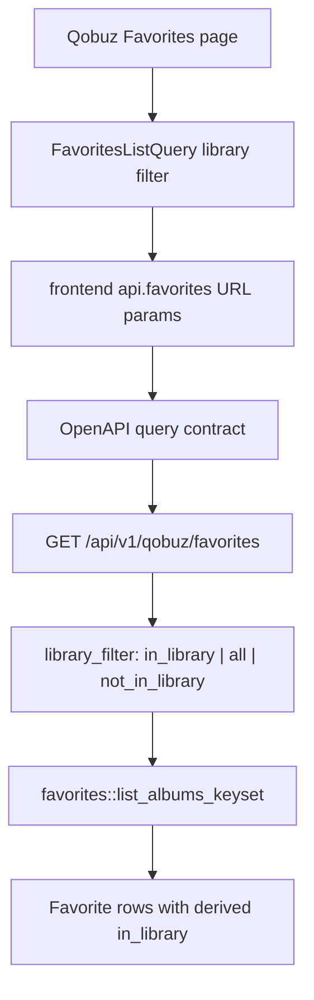

# Qobuz Favorites Library Default - Plan

## Goal Capsule

- **Objective:** Make the Qobuz Favorites page and its API contract default to the `In library` filter while preserving explicit `All` and `Not in library` views.
- **Authority:** User request requires a fullstack change; existing OpenAPI-first workflow, backend route tests, frontend React tests, and Welds-first data-layer rules define the implementation boundary.
- **Execution profile:** Standard fullstack behavior change with OpenAPI-first and TDD posture.
- **Stop conditions:** Stop if the change would require a database migration, new persistence path, raw SQL, or removal of existing explicit `All` / `Not in library` filtering.

---

## Product Contract

### Summary

Qobuz Favorites should open on the `In library` view by default. The backend API should share that default, and the UI must still let users intentionally switch to all favorites or favorites missing from the library.

### Problem Frame

The current page initializes the library filter as unset, which makes the initial list behave like `All`. The backend also treats a missing `in_library` query parameter as no filter, so a frontend-only default would leave API and UI semantics split.

### Requirements

**Default behavior**

- R1. The Qobuz Favorites page initially selects `In library` and renders only favorite albums already matched to local library albums.
- R2. `GET /api/v1/qobuz/favorites` defaults to the same `In library` behavior when no explicit library-membership filter is provided.
- R3. Cursor fingerprints and pagination use the effective library filter so cursors cannot be reused across `In library`, `All`, and `Not in library` views.

**Explicit filter control**

- R4. Users can still switch the page to `All` and see both in-library and not-in-library favorites.
- R5. Users can still switch the page to `Not in library` and see only favorites that are not matched to local albums.
- R6. The API exposes `library_filter=all` so the new default does not make the all-favorites view impossible to express.

**Contract and compatibility**

- R7. OpenAPI remains the source of truth for the new query contract, and generated frontend schema types are refreshed from `openapi/openapi.yaml`.
- R8. Existing boolean `in_library=true|false` query semantics remain accepted as a compatibility alias when `library_filter` is absent; requests supplying both parameters are rejected as ambiguous.
- R9. No raw SQL or migration is added; existing Welds repository behavior remains the source of favorite/library membership data.

### Acceptance Examples

- AE1. Given synced favorites include one local-library match and one remote-only favorite, when the API is called without a library filter, then the response includes only the local-library match.
- AE2. Given the same data, when the API is called with the explicit `All` filter, then both favorites are returned.
- AE3. Given the same data, when the API is called with the explicit `Not in library` filter, then only the remote-only favorite is returned.
- AE4. Given the Qobuz Favorites page first renders, then the `In library` filter is visually selected and the first request/list state reflects that filter.
- AE5. Given the page is on the default view, when the user chooses `All`, then the selected filter changes and the list can show both in-library and not-in-library rows.

### Scope Boundaries

- No changes to scheduled Qobuz Favorites sync, auto-download behavior, download queueing, or Qobuz login are in scope.
- No schema migration is in scope because `in_library` is derived from existing favorite rows joined with local album catalog data.
- No redesign of the favorites table, row actions, cover rendering, sorting, search, or bulk download is in scope except where filter state affects the query key.
- No removal of the existing boolean `in_library` API alias is in scope.

---

## Planning Contract

### Key Technical Decisions

- KTD1. Add `library_filter` as the explicit tri-state API filter instead of reusing absence as `All`: once absence means the new default, `All` needs a first-class representation in the query contract.
- KTD2. Keep `in_library` as a compatibility alias only when `library_filter` is absent: existing callers that send `in_library=true` or `in_library=false` continue to behave as before, while new frontend code uses `library_filter`.
- KTD3. Resolve the effective filter in the server route, not the data repository: `crates/euterpe-data/src/repositories/favorites.rs` already treats `None` as all rows and `Some(bool)` as membership filtering, so the new default belongs at the API boundary.
- KTD4. Preserve Welds-first data access: this change should not add raw SQL, migrations, or route-level persistence shortcuts.
- KTD5. Use TDD at each contract boundary: OpenAPI/schema expectations, backend route behavior, API client request shaping, and page default selection should fail before implementation changes.

### High-Level Technical Design

The frontend owns the selected UI state. The API contract names all three user-visible modes. The server maps the effective mode into the existing repository shape: `Some(true)` for `In library`, `None` for `All`, and `Some(false)` for `Not in library`.

### Sources & Research

- `frontend/src/features/favorites/FavoritesPage.tsx` currently initializes `inLibrary` as `undefined`, renders the three filter buttons, and passes `in_library` into `useFavoritesList`.
- `frontend/src/api/client.ts` currently sends `in_library` when present; `frontend/src/api/hooks.ts` includes it in `FavoritesListQuery` and query-key filtering.
- `openapi/openapi.yaml` currently defines `in_library` as an optional boolean on `GET /api/v1/qobuz/favorites`.
- `crates/euterpe-server/src/app.rs` parses `FavoritesQuery`, computes the favorites cursor fingerprint, and forwards `in_library` into `favorites::list_albums_keyset`.
- `crates/euterpe-data/src/repositories/favorites.rs` already derives `in_library` through local album presence and filters with `Option<bool>`.
- `docs/solutions/architecture-patterns/welds-first-party-data-layer.md` reinforces that application data access should stay inside `euterpe-data` Welds repositories.

---

## Implementation Units

### U1. Define The OpenAPI Filter Contract

- **Goal:** Make the API contract express the new default and the three explicit library filter modes.
- **Requirements:** R2, R6, R7, R8.
- **Dependencies:** None.
- **Files:** `openapi/openapi.yaml`, `frontend/src/api/schema.d.ts`.
- **Approach:** Add `library_filter` as a new optional tri-state query parameter with default `in_library` and values for `in_library`, `all`, and `not_in_library`. Keep the existing `in_library` boolean parameter documented as a deprecated compatibility alias. Regenerate the frontend schema from OpenAPI after the spec change.
- **Execution note:** Start with the OpenAPI edit and generated schema update before changing backend or frontend callers.
- **Patterns to follow:** Preserve existing operation ID, path, pagination parameters, and generated schema workflow used by `npm run generate:api`.
- **Test scenarios:**
  - Schema generation includes the new `library_filter` query parameter for `GET /api/v1/qobuz/favorites`.
  - The existing boolean `in_library` parameter remains present for compatibility.
  - The new parameter documents `in_library` as the default behavior and `all` as the explicit unfiltered behavior.
- **Verification:** The generated `frontend/src/api/schema.d.ts` matches `openapi/openapi.yaml`, and no unrelated schema sections change.

### U2. Implement Backend Effective Filter Semantics

- **Goal:** Make the backend default to in-library favorites while preserving explicit all and not-in-library API behavior.
- **Requirements:** R2, R3, R6, R8, R9, AE1, AE2, AE3.
- **Dependencies:** U1.
- **Files:** `crates/euterpe-server/src/app.rs`, `crates/euterpe-server/tests/api_qobuz.rs`.
- **Approach:** Add server-side parsing for `library_filter` and map it to the existing `favorites::FavoritesListParams.in_library` value. Use the effective filter for both repository parameters and cursor fingerprinting. Keep legacy `in_library=true|false` behavior when `library_filter` is absent, and reject requests that provide both parameters.
- **Execution note:** Add failing API route tests before changing `FavoritesQuery` and `list_favorites`.
- **Patterns to follow:** Keep HTTP request/response types in `euterpe-server`, keep persistence in `euterpe-data`, and reuse existing keyset cursor helpers in `crates/euterpe-server/src/app.rs`.
- **Test scenarios:**
  - Covers AE1. After syncing favorites and seeding one matching local album, `GET /api/v1/qobuz/favorites?type=album` returns only rows with `in_library: true`.
  - Covers AE2. The same fixture with the explicit `All` filter returns both the local-library and remote-only favorites.
  - Covers AE3. The same fixture with the explicit `Not in library` filter returns only rows with `in_library: false`.
  - A cursor produced for one effective filter is rejected or treated as mismatched when reused with another effective filter.
  - Legacy `in_library=false` still returns not-in-library rows when the new tri-state parameter is absent.
  - Requests containing both `library_filter` and legacy `in_library` return a bad-request response.
- **Verification:** Backend route tests prove the new default, all-view escape hatch, not-in-library view, cursor fingerprint isolation, and legacy boolean alias.

### U3. Update Frontend API Client And Query State

- **Goal:** Move frontend favorites queries to the explicit tri-state filter while preserving existing sort, search, and pagination behavior.
- **Requirements:** R1, R4, R5, R7, AE4, AE5.
- **Dependencies:** U1, U2.
- **Files:** `frontend/src/api/client.ts`, `frontend/src/api/hooks.ts`, `frontend/src/api/client.test.ts`, `frontend/src/test/msw/handlers.ts`.
- **Approach:** Replace the frontend-facing `in_library?: boolean` query state with a small library-filter union that mirrors the OpenAPI tri-state. Send the new explicit parameter from `api.favorites` when the page or caller supplies it. Include the new filter in the favorites query key and load-more requests so cached pages never mix filter modes.
- **Execution note:** Add API client tests for request URL shaping before changing the client helper.
- **Patterns to follow:** Keep the existing `appendKeysetParams`, `favoritesFilterKey`, `useFavoritesList`, and MSW handler style; do not introduce a new query abstraction for one endpoint.
- **Test scenarios:**
  - `api.favorites` sends `library_filter=all` when `All` is requested.
  - `api.favorites` sends `library_filter=not_in_library` when `Not in library` is requested.
  - `useFavoritesList` resets extra pages when the library filter changes.
  - MSW favorites handler can return different rows for `In library`, `All`, and `Not in library` requests so UI tests observe real filter effects.
- **Verification:** Frontend API/client tests show the new query parameter is used, and existing favorites pagination/search tests remain valid.

### U4. Make Qobuz Favorites Default To In Library In UI

- **Goal:** Make the page select and query `In library` on first render, while keeping `All` and `Not in library` controls functional.
- **Requirements:** R1, R4, R5, AE4, AE5.
- **Dependencies:** U3.
- **Files:** `frontend/src/features/favorites/FavoritesPage.tsx`, `frontend/src/features/favorites/FavoritesPage.test.tsx`.
- **Approach:** Initialize filter state to the new `In library` value instead of the unset/all state. Update filter button variants and click handlers to use the tri-state filter values. Keep sorting, search debounce, row selection, download actions, and table columns unchanged except for the query parameter shape.
- **Execution note:** Add or update focused React Testing Library assertions before changing the component state.
- **Patterns to follow:** Use existing button group styling, translation keys, `useFavoritesList` call shape, and accessibility-oriented test queries.
- **Test scenarios:**
  - Covers AE4. Initial render shows the `In library` filter button as selected and renders only in-library mock favorites.
  - Covers AE5. Clicking `All` changes the selected button and allows both in-library and not-in-library mock favorites to render.
  - Clicking `Not in library` changes the selected button and renders only not-in-library mock favorites.
  - Search and sort still include the current library filter in the request/query key.
  - Existing row actions still label in-library rows as re-downloadable and not-in-library rows as downloadable in the appropriate views.
- **Verification:** Focused Favorites page tests cover default filter selection, all-mode switching, not-in-library switching, and unchanged row action labels.

---

## Verification Contract

| Gate | Scope | Done Signal |
|---|---|---|
| `mise exec -- npm --prefix frontend run generate:api` | OpenAPI-first generated frontend schema | `frontend/src/api/schema.d.ts` is regenerated from `openapi/openapi.yaml` |
| `mise exec -- cargo test -p euterpe-server --test api_qobuz` | Backend API default, explicit filter modes, cursor fingerprint behavior | New and existing Qobuz API tests pass |
| `mise exec -- cargo test -p euterpe-data --test favorites` | Existing Welds favorites repository behavior | Passes without repository/raw-SQL changes |
| `mise exec -- npm --prefix frontend test -- src/api/client.test.ts src/features/favorites/FavoritesPage.test.tsx` | Frontend API client and Qobuz Favorites UI behavior | Tests pass with default `In library` and explicit filter modes |
| `mise exec -- npm --prefix frontend run lint` | Frontend static checks | Passes without new lint errors |

---

## Definition of Done

- Qobuz Favorites opens with `In library` selected by default.
- `All` and `Not in library` remain reachable from the page and produce distinct request/list behavior.
- `GET /api/v1/qobuz/favorites` defaults to in-library rows when no explicit library filter is provided.
- The API has an explicit contract for requesting all favorites despite the new default.
- OpenAPI and generated frontend schema are in sync.
- Backend route tests prove default, all, not-in-library, cursor isolation, and legacy boolean alias behavior.
- Frontend tests prove default selection and filter switching through user-visible behavior.
- No raw SQL, migration, scheduled sync, auto-download, or unrelated UI/table changes are included.
- Dead experimental code from implementation attempts is removed before completion.
