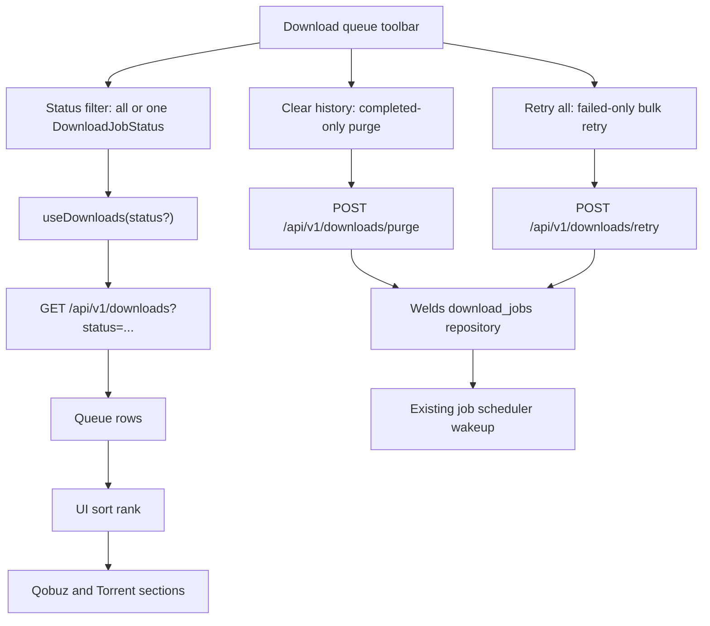

# Download Queue Controls - Plan

## Goal Capsule

- **Objective:** Make the Download queue page easier to operate by narrowing Clear history to completed jobs, adding status filtering, adding Retry all for failed jobs, and enforcing the requested queue status order.
- **Authority:** User request defines the behavior; existing OpenAPI-first, generated frontend types, Welds-first repository rules, and Queue page tests define implementation boundaries.
- **Execution profile:** Standard fullstack queue behavior change with OpenAPI-first and TDD posture.
- **Stop conditions:** Stop if the change requires a download status enum rename, a database migration, raw SQL, or a broad queue-worker redesign.

---

## Product Contract

### Summary

Download queue controls should distinguish successful history from failures that still need attention. Users should be able to filter jobs by status, retry all failed jobs in one action, clear only completed history, and see the queue sorted as active work first, then failures, then older history.

### Problem Frame

The current page treats completed, failed, and cancelled jobs as one terminal history bucket. That makes Clear history remove failed/cancelled rows the user may still need for retry or diagnosis, and the current sort helper groups all terminal jobs together instead of showing failed/cancelled before completed.

### Requirements

**History and retry behavior**

- R1. The Clear history button removes only jobs whose status is `completed`.
- R2. `failed` and `cancelled` jobs remain after Clear history and can still be deleted one by one through the existing row delete action.
- R3. The Clear history confirmation copy states that only completed jobs will be removed.
- R4. The page exposes a Retry all action that re-queues every currently failed download job.
- R5. Retry all does not retry completed, cancelled, paused, queued, or running jobs.
- R6. Retry all wakes the download scheduler once after failed jobs are re-queued.

**Filtering and ordering**

- R7. The queue page lets users filter by status: All, Running, Queued, Paused, Failed, Cancelled, Completed.
- R8. Filtering changes the visible list without changing the semantics of bulk actions: Clear history is still completed-only, and Retry all is still failed-only.
- R9. Queue ordering is `running`, `queued`, `paused`, `failed`, `cancelled`, `completed`.
- R10. Within active statuses (`running`, `queued`, `paused`), existing queue-position ordering is preserved.
- R11. Within `failed`, `cancelled`, and `completed`, newest jobs appear first.

**Contract and compatibility**

- R12. OpenAPI remains the source of truth for any changed or new download queue endpoints, and generated frontend schema types are refreshed from `openapi/openapi.yaml`.
- R13. No deprecated alias or duplicate API path is added for this internal-only API change.
- R14. The existing API/storage value remains `cancelled`; only UI copy may present the English label as "Canceled" if desired.

### Acceptance Examples

- AE1. Given one running job, one completed job, one failed job, and one cancelled job, when Clear history is confirmed, then only the completed job is deleted.
- AE2. Given failed jobs exist, when Retry all is clicked, then all failed jobs become queued and the scheduler is woken once.
- AE3. Given failed and completed jobs exist, when the status filter is Failed, then only failed jobs are shown and Retry all is still available.
- AE4. Given completed jobs exist, when the status filter is Completed, then only completed jobs are shown and Clear history removes those completed rows.
- AE5. Given jobs across all statuses, when the page renders with the All filter, then the visible order is running, queued, paused, failed, cancelled, completed.

### Scope Boundaries

- No status enum migration is in scope; `cancelled` remains the Rust/OpenAPI/data value.
- No queue-worker scheduling redesign is in scope beyond waking the existing scheduler after Retry all.
- No change to per-row retry, per-row delete, cancel, pause, resume, or priority controls is in scope except where they must coexist with filtering.
- No new persistence table, migration, or raw SQL is in scope.
- No redesign of Qobuz/Torrent source grouping is in scope; sections remain as they are today.

---

## Planning Contract

### Key Technical Decisions

- KTD1. Keep Clear history on the existing purge endpoint but change its contract to completed-only. The path already represents the page-level cleanup action; the OpenAPI summary, operation name, backend repository function, client wrapper, hook, copy, and tests should change together.
- KTD2. Add a collection-level Retry all endpoint instead of issuing N single-job retry requests from the frontend. Backend ownership keeps failed-only filtering, queue-position assignment, torrent session cleanup, and scheduler wakeup in one place.
- KTD3. Use the existing `status` query parameter for the status-filtered list. The API already accepts `DownloadJobStatus`; the UI should pass the selected status instead of inventing a frontend-only filter path.
- KTD4. Treat bulk actions as global queue actions, not current-filter actions. Clear history always purges completed jobs and Retry all always retries failed jobs, even when the visible list is filtered to another status.
- KTD5. Keep `paused` between `queued` and `failed`. The user-specified order did not mention paused, and paused jobs are still resumable work rather than terminal history.
- KTD6. Preserve Welds-first repository access. Completed-only purge and retry-all behavior belong in `euterpe-data` repository functions, not route-level raw SQL.
- KTD7. Keep the internal API single-shaped. Following `docs/solutions/conventions/internal-openapi-contracts-no-deprecated-shims.md`, update OpenAPI, backend, generated frontend schema, client, hooks, and tests directly.

### High-Level Technical Design

Status ranking is a display rule, not a database status migration:

| Rank | API status | Ordering within rank |
|---|---|---|
| 1 | `running` | queue position, then id |
| 2 | `queued` | queue position, then id |
| 3 | `paused` | queue position, then id |
| 4 | `failed` | newest first |
| 5 | `cancelled` | newest first |
| 6 | `completed` | newest first |

### Assumptions

- "complited" in the request means the existing status `completed`.
- "canceled" in the requested order maps to the existing API status `cancelled`; no API enum rename is intended.
- Retry all should target all failed jobs known to the backend, not only failed jobs currently visible under the active filter.

### Sources & Research

- `frontend/src/features/queue/QueuePage.tsx` owns the Download queue toolbar, source sections, row actions, and currently calls `useDownloads()` without a status filter.
- `frontend/src/api/hooks.ts` already exposes `useDownloads(status?: string)`, `useRetryDownload`, and `usePurgeFinishedDownloads`.
- `frontend/src/api/client.ts` already sends the `status` query parameter for downloads and exposes per-job retry plus the current purge call.
- `frontend/src/lib/download-queue-sort.ts` owns the UI sort rank and currently groups all terminal statuses together.
- `crates/euterpe-server/src/routes/downloads.rs` owns `list_downloads`, `purge_finished_downloads`, and per-job `retry_download`.
- `crates/euterpe-data/src/repositories/download_jobs.rs` owns Welds repository behavior for terminal purge and failed retry.
- `crates/euterpe-server/tests/api_downloads.rs`, `crates/euterpe-data/tests/jobs.rs`, `frontend/src/features/queue/QueuePage.test.tsx`, and `frontend/src/lib/download-queue-sort.test.ts` are the closest existing test surfaces.
- `docs/solutions/conventions/internal-openapi-contracts-no-deprecated-shims.md` applies because the download API is consumed by this repository's generated frontend client.

---

## Implementation Units

### U1. Update Download Queue API Contract

- **Goal:** Make OpenAPI describe completed-only purge and bulk retry-all behavior.
- **Requirements:** R1, R4, R5, R6, R12, R13.
- **Dependencies:** None.
- **Files:** `openapi/openapi.yaml`, `frontend/src/api/schema.d.ts`.
- **Approach:** Change the purge operation summary/operation naming from "finished" to completed-only semantics, keep `DownloadPurgeResponse { deleted }`, and keep the existing `/api/v1/downloads/purge` path. Add a collection-level `POST /api/v1/downloads/retry` operation with `operationId: retryFailedDownloads` for re-queueing failed jobs, returning `DownloadRetryResponse { retried }`. Regenerate frontend schema from OpenAPI.
- **Execution note:** Start OpenAPI-first; frontend and backend code should compile against the generated contract rather than local hand-written guesses.
- **Patterns to follow:** Follow the direct internal contract pattern in `docs/solutions/conventions/internal-openapi-contracts-no-deprecated-shims.md`; do not add a deprecated duplicate endpoint.
- **Test scenarios:**
  - OpenAPI generation exposes `retryFailedDownloads` in `frontend/src/api/schema.d.ts`.
  - The purge operation describes completed-only deletion, not failed/cancelled deletion.
  - `DownloadRetryResponse` validates a response containing `retried`.
- **Verification:** OpenAPI lint/build remains valid and generated schema changes are limited to download queue contract updates.

### U2. Implement Completed-Only Purge And Retry All In Backend

- **Goal:** Move the new queue mutations into the Welds data layer and expose them through server routes.
- **Requirements:** R1, R2, R4, R5, R6, R12.
- **Dependencies:** U1.
- **Files:** `crates/euterpe-data/src/repositories/download_jobs.rs`, `crates/euterpe-data/tests/jobs.rs`, `crates/euterpe-server/src/routes/downloads.rs`, `crates/euterpe-server/src/app.rs`, `crates/euterpe-server/src/api/downloads.rs`, `crates/euterpe-server/tests/api_downloads.rs`.
- **Approach:** Replace the broad terminal purge repository behavior with completed-only purge behavior for the page-level purge route. Keep per-row purge unchanged so failed and cancelled rows can still be manually deleted. Add repository/server support for retrying all failed jobs with the same state reset as per-job retry, including torrent session cleanup and queue-position assignment at the end of each job type group. Wake the scheduler once after the bulk retry completes and report the retried count.
- **Execution note:** Write repository and API tests before production changes; this is the highest-risk behavior change.
- **Patterns to follow:** Use existing Welds repository helpers, `retry_failed` semantics, `DownloadPurgeResponse` style, `state.job_tx.send(0)` wakeup pattern, and schema validation in `api_downloads.rs`.
- **Test scenarios:**
  - Given running, completed, failed, and cancelled jobs, page-level purge deletes only the completed row and returns `deleted: 1`.
  - Given completed torrent jobs, completed-only purge still runs the existing torrent incoming-dir cleanup for deleted torrent rows.
  - Given failed torrent and failed Qobuz jobs, retry all re-queues both, clears error/progress/session state according to existing retry semantics, and returns the retried count.
  - Given no failed jobs, retry all returns `retried: 0` and does not error.
  - Given queued/running/paused/completed/cancelled jobs, retry all leaves them unchanged.
  - The existing per-job retry still rejects non-failed jobs and still works for one failed job.
- **Verification:** Backend route tests prove API semantics, repository tests prove state transitions, and no raw SQL is introduced.

### U3. Update Frontend API Hooks And MSW

- **Goal:** Expose completed-only purge, status filtering, and retry-all through frontend API utilities and test handlers.
- **Requirements:** R4, R5, R7, R8, R12, R13.
- **Dependencies:** U1, U2.
- **Files:** `frontend/src/api/client.ts`, `frontend/src/api/hooks.ts`, `frontend/src/api/client.test.ts`, `frontend/src/test/msw/handlers.ts`.
- **Approach:** Rename the purge wrapper/hook to completed-oriented naming while keeping its route aligned with OpenAPI. Add a `retryFailedDownloads` client function and mutation hook. Keep `useDownloads(status?)` as the list-query boundary and ensure query invalidation covers all `downloads` variants after purge/retry-all. Update MSW downloads handler to respect `status` query values and add a retry-all handler returning a retried count.
- **Execution note:** Add client/MSW tests for URL shape and invalidation-facing behavior before changing QueuePage.
- **Patterns to follow:** Existing `api.downloads`, `useRetryDownload`, `usePurgeDownload`, mutation invalidation on `["downloads"]`, and typed generated operation parameters.
- **Test scenarios:**
  - `api.downloads({ status: "failed" })` sends `status=failed`.
  - Completed purge client calls the purge endpoint and expects the count response.
  - Retry-all client calls the new collection endpoint and expects the count response.
  - MSW returns only jobs matching the requested status filter.
  - Retry-all and completed purge mutations invalidate the downloads query family.
- **Verification:** Frontend API tests and affected QueuePage tests use the same generated types as production code.

### U4. Update Queue Page Controls And Sorting

- **Goal:** Deliver the requested UI behavior on the Download queue page.
- **Requirements:** R1, R2, R3, R4, R5, R7, R8, R9, R10, R11, R14.
- **Dependencies:** U3.
- **Files:** `frontend/src/features/queue/QueuePage.tsx`, `frontend/src/features/queue/QueuePage.test.tsx`, `frontend/src/lib/download-queue-sort.ts`, `frontend/src/lib/download-queue-sort.test.ts`, `frontend/src/i18n/locales/en.ts`, `frontend/src/i18n/locales/ru.ts`.
- **Approach:** Add a compact status filter control to the queue toolbar using the existing download status enum values. Keep Qobuz/Torrent sections, but feed them from the filtered query result and the updated sort helper. Update Clear history copy and behavior to completed-only purge. Add a Retry all button that calls the bulk retry mutation; backend count remains the source of truth for global retry outcome. Update sort rank to `running`, `queued`, `paused`, `failed`, `cancelled`, `completed`.
- **Execution note:** Start with `download-queue-sort.test.ts`, then QueuePage tests for controls and user-visible behavior.
- **Patterns to follow:** Existing toolbar button styling, lucide icons in action buttons, React Testing Library role-based queries, and `usePreferences` i18n.
- **Test scenarios:**
  - Sorting places statuses in the requested order with paused between queued and failed.
  - Sorting keeps queue-position order for active statuses and newest-first order inside failed/cancelled/completed.
  - The status filter initially shows All and the mixed queue list.
  - Selecting Failed shows failed jobs and hides running/completed jobs.
  - Selecting Completed shows completed jobs and keeps Clear history available.
  - Clear history confirmation text says only completed jobs are removed, and clicking it calls completed purge.
  - Retry all is available from the toolbar and calls the bulk retry endpoint.
  - Per-row Retry remains available only on failed rows.
  - The existing SSE progress update test still passes with the new toolbar controls.
- **Verification:** The page remains usable on desktop and mobile widths, controls do not overlap row actions, and existing source grouping still works.

---

## Verification Contract

| Gate | Command | Covers |
|---|---|---|
| OpenAPI schema generation | `mise exec -- npm --prefix frontend run generate:api` | U1, U3 |
| OpenAPI lint | `mise exec -- npm --prefix openapi run lint` | U1 |
| OpenAPI docs build | `mise exec -- npm --prefix openapi run build` | U1 |
| Data repository tests | `mise exec -- cargo test -p euterpe-data --test jobs` | U2 |
| Download API tests | `mise exec -- cargo test -p euterpe-server --test api_downloads` | U2 |
| Frontend focused tests | `mise exec -- npm --prefix frontend test -- src/api/client.test.ts src/lib/download-queue-sort.test.ts src/features/queue/QueuePage.test.tsx` | U3, U4 |
| Frontend lint | `mise exec -- npm --prefix frontend run lint` | U3, U4 |
| Rust lint | `mise exec -- cargo clippy --workspace --all-targets --locked -- -D warnings` | U2 |
| Diff hygiene | `git diff --check` | All units |

Existing Redocly warnings unrelated to the modified endpoints do not block this plan unless the implementation introduces new validation errors.

---

## Definition of Done

- `Clear history` deletes completed jobs only and leaves failed/cancelled rows intact.
- Retry all re-queues every failed job through one backend operation and reports the retried count.
- Status filtering works for all download statuses without breaking Qobuz/Torrent sections.
- The visible sort order is running, queued, paused, failed, cancelled, completed.
- OpenAPI, generated schema, backend handlers, frontend client/hooks, MSW handlers, and tests all describe the same single current contract.
- No raw SQL, database migration, deprecated compatibility endpoint, or duplicate API shape is added.
- Focused backend/frontend tests, lint gates, and diff hygiene checks pass.
