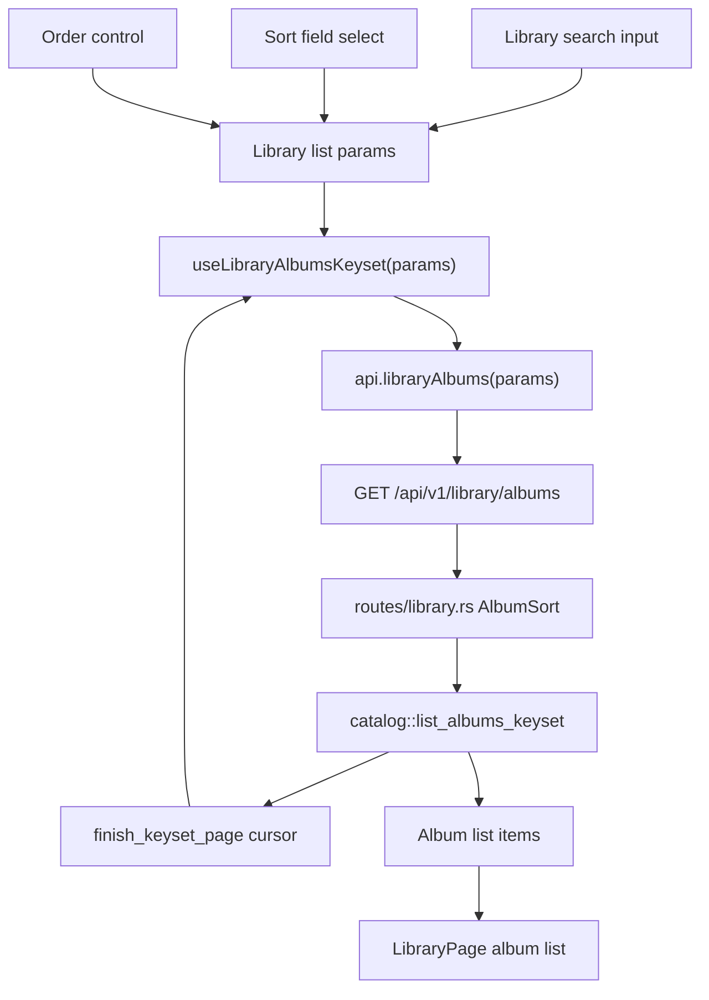

# Library Album Sorting - Plan

## Goal Capsule

- **Objective:** Add Library page album sorting by album date, date added, album title, and artist while preserving keyset pagination, search, and the current Library page layout.
- **Authority:** User request defines the sorting capabilities; existing OpenAPI-first workflow, generated frontend types, Welds-first data-layer rules, and Library page/API tests define implementation boundaries.
- **Execution profile:** Standard fullstack behavior change with OpenAPI-first and TDD posture.
- **Stop conditions:** Stop if the change would require raw SQL, an incompatible schema migration, a public/deprecated API alias, or a broad Library page redesign.

---

## Product Contract

### Summary

The Library page should let users choose how the album list is ordered. The available sort fields are album date, date added, album title, and artist. The selected sort should be applied by the backend list API so search, pagination, load-more behavior, and frontend display all agree on one order.

### Problem Frame

The current Library page always requests albums with `sort=title&order=asc`. The backend already has a keyset list path with limited sort support for title, artist, and year, but the UI exposes no control and the API has no date-added sort. A frontend-only sort would be wrong because the page is paginated: it would only reorder the albums already loaded, not the whole library result set.

### Requirements

**Sorting controls**

- R1. The Library page exposes a sort-field control with Album date, Date added, Album title, and Artist options.
- R2. The Library page exposes sort direction for the selected field using the existing `asc` / `desc` API order values.
- R3. The initial Library list keeps the current behavior: Album title ascending.
- R4. Changing sort field or direction resets the loaded album pages through the query key and fetches from the first page of the new ordering.
- R5. Changing sort field or direction does not mutate tags, scan state, playback state, or the selected album's persisted data.

**API and pagination**

- R6. `GET /api/v1/library/albums` accepts exactly one current sort enum containing `album_date`, `date_added`, `title`, and `artist`.
- R7. Album date sorting uses the catalog album date currently represented by `albums.year`; unknown album dates sort consistently after known dates in ascending user-facing order.
- R8. Date added sorting uses the persisted catalog insertion timestamp from `albums.created_at`.
- R9. Keyset cursors include the effective search query, sort field, order, primary sort key, and stable album-id tie breaker so cursors cannot be reused across different search/sort/order combinations.
- R10. Duplicate sort keys remain deterministic through the album id tie breaker.
- R11. Invalid sort or order values return a bad-request response rather than falling back silently.

**Contract and compatibility**

- R12. OpenAPI remains the source of truth for the list contract, and `frontend/src/api/schema.d.ts` is regenerated from `openapi/openapi.yaml`.
- R13. No deprecated `year` alias, duplicate sort parameter, or compatibility shim is added because the known API consumer is this repository's frontend.
- R14. No raw SQL is added for this change; sorting behavior stays inside the Welds-backed catalog repository and the server keyset boundary.

### Acceptance Examples

- AE1. Given albums named Beta and Alpha, when the page first opens, then Alpha appears before Beta.
- AE2. Given albums from two artists, when Artist ascending is selected, then the album list is ordered by album artist and ties are stable.
- AE3. Given albums with years 2020, 2024, and unknown, when Album date descending is selected, then 2024 appears before 2020 and the unknown-date album is placed consistently after known dates.
- AE4. Given albums added at different times, when Date added descending is selected, then the newest catalog entry appears first.
- AE5. Given a search query and a selected sort field, when Load more is used, then the second page continues the same search/sort/order sequence without duplicates or skipped rows.
- AE6. Given an existing cursor for Album title ascending, when the next request uses Artist ascending, then the request is rejected as an invalid cursor rather than mixing page boundaries.

### Scope Boundaries

- No Library page layout redesign is in scope beyond adding compact sort controls near the existing search/list controls.
- No storage scan, tag extraction, album metadata lookup, cover rendering, playback, conversion, or CUE behavior changes are in scope.
- No schema migration is planned because `albums.year` and `albums.created_at` already exist.
- No date precision expansion is in scope; Album date means the currently indexed album year. Full release-date precision can be planned separately if the catalog starts storing it.
- No database-performance refactor is in scope. The existing catalog list path already materializes albums, artist names, and track counts before sorting; index-backed pagination can be deferred if library scale requires it.
- No deprecated sort aliases are in scope.

---

## Planning Contract

### Key Technical Decisions

- KTD1. Use a single current sort enum in OpenAPI. Replace the API-facing `year` sort value with `album_date` and add `date_added`; do not keep `year` as an alias because this is an Internal API Contract.
- KTD2. Keep sorting backend-owned. The Library list uses keyset pagination, so sorting must happen before pagination in `euterpe-data` and `euterpe-server`, not in `LibraryPage` after pages are fetched.
- KTD3. Treat Album date as year-backed for this release. The catalog model has `year` but not full release date; the UI label can say Album date while the implementation sorts the known year value.
- KTD4. Use `albums.created_at` as Date added. It is already persisted by the Welds album model and migration, so no migration is needed.
- KTD5. Keep cursor validation strict. Sort changes should create a new query key and a new cursor sequence; stale cursors from another sort/order/search context should fail through the existing keyset validation.
- KTD6. Keep the UI control compact and operational. This is a work-focused Library page, so use existing `Select`/button primitives and i18n labels rather than a large toolbar redesign.
- KTD7. Preserve Welds-first data access. Extend `crates/euterpe-data/src/repositories/catalog.rs` and its tests; do not add route-level SQL or a second data-access path.

### High-Level Technical Design

Sort values map through one contract slice:

| User label | API sort value | Repository sort value | Primary key kind |
|---|---|---|---|
| Album title | `title` | `Title` | text |
| Artist | `artist` | `Artist` | text |
| Album date | `album_date` | `AlbumDate` | int |
| Date added | `date_added` | `DateAdded` | text timestamp |

### Assumptions

- "Дата альбома" means the album date currently stored in the local catalog. Today that is year precision.
- Date added means when the album row entered the local catalog, not filesystem mtime and not Qobuz release date.
- The default sort remains title ascending because the user asked to add sorting options, not to change the initial Library ordering.

### Sources & Research

- `frontend/src/features/library/LibraryPage.tsx` currently hardcodes `listParams` to `sort: "title"` and `order: "asc"`.
- `frontend/src/api/hooks.ts` defines `LibraryAlbumsListQuery` with `sort?: "title" | "artist" | "year"` and sends params through `useLibraryAlbumsKeyset`.
- `frontend/src/api/client.ts` serializes Library album list query parameters through `appendKeysetParams`.
- `openapi/openapi.yaml` currently documents `/api/v1/library/albums` sort enum as `[title, artist, year]`.
- `crates/euterpe-server/src/routes/library.rs` owns `AlbumSort`, query parsing, keyset cursor validation, and conversion to API list items.
- `crates/euterpe-data/src/repositories/catalog.rs` owns `AlbumListSort`, `AlbumListRow`, sort comparison, cursor comparison, and `list_albums_keyset`.
- `crates/euterpe-data/src/migrations/008_create_albums.rs` already creates `created_at` and `updated_at` columns.
- `crates/euterpe-data/tests/catalog.rs`, `crates/euterpe-server/tests/api_library.rs`, `frontend/src/api/client.test.ts`, and `frontend/src/features/library/LibraryPage.test.tsx` are the closest focused test surfaces.
- `docs/solutions/conventions/internal-openapi-contracts-no-deprecated-shims.md` and `docs/solutions/architecture-patterns/welds-first-party-data-layer.md` apply directly.

---

## Implementation Units

### U1. Update The Library Album OpenAPI Sort Contract

- **Goal:** Make the API contract expose the four requested sort fields as one current enum.
- **Requirements:** R6, R11, R12, R13.
- **Dependencies:** None.
- **Files:** `openapi/openapi.yaml`, `frontend/src/api/schema.d.ts`.
- **Approach:** Change `/api/v1/library/albums` sort enum to `title`, `artist`, `album_date`, and `date_added`, with `title` remaining the default. Regenerate the frontend schema from OpenAPI. Do not keep `year` in the contract.
- **Execution note:** Start OpenAPI-first so backend and frontend types follow the same single contract.
- **Patterns to follow:** Internal API contract convention in `docs/solutions/conventions/internal-openapi-contracts-no-deprecated-shims.md`.
- **Test scenarios:**
  - Schema generation exposes the new Library album sort enum in `frontend/src/api/schema.d.ts`.
  - OpenAPI no longer documents `year` as a sort value for `listLibraryAlbums`.
  - Existing limit, order, cursor, and search query parameters remain unchanged.
- **Verification:** OpenAPI lint/build and generated schema diff show only the intended Library list contract changes.

### U2. Extend Backend And Data-Layer Sorting

- **Goal:** Apply the four sort fields before keyset pagination and preserve cursor correctness.
- **Requirements:** R6, R7, R8, R9, R10, R11, R14, AE2, AE3, AE4, AE5, AE6.
- **Dependencies:** U1.
- **Files:** `crates/euterpe-data/src/repositories/catalog.rs`, `crates/euterpe-data/tests/catalog.rs`, `crates/euterpe-server/src/routes/library.rs`, `crates/euterpe-server/tests/api_library.rs`.
- **Approach:** Rename the current `Year` sort concept to `AlbumDate` at the API/data boundary and add `DateAdded`. Add `created_at` to the internal album list row so repository comparison and server cursor extraction can use it. Keep text sorts case-insensitive and keep album id as the tie breaker. Make the route parser accept only the new enum values and keep cursor fingerprints tied to the effective search query.
- **Execution note:** Add failing repository/API tests before changing sort parsing or comparison logic.
- **Patterns to follow:** Existing `AlbumSort`, `AlbumListSort`, `finish_keyset_page`, and `ensure_cursor_matches` flow; Welds repository behavior in `catalog.rs`; no raw SQL.
- **Test scenarios:**
  - Given title duplicates, title sorting is deterministic by id across pages.
  - Given artist duplicates, artist sorting is deterministic by id across pages.
  - Given known and unknown years, album-date ascending and descending place unknown years consistently and preserve cursor paging.
  - Given albums inserted in a known sequence, date-added ascending and descending use `created_at` and preserve cursor paging.
  - Given search `q` plus date-added sort, page 2 continues the filtered ordering without duplicates.
  - Given `sort=year`, the API returns bad request.
  - Given a cursor generated for one sort/order/search context, reusing it with a different sort/order/search returns invalid cursor.
- **Verification:** Data-layer tests prove ordering/cursor semantics; API tests prove HTTP parsing, response status, and cursor mismatch behavior.

### U3. Update Frontend API Types, Client, Hooks, And MSW

- **Goal:** Make frontend data access use the new generated sort contract.
- **Requirements:** R1, R2, R4, R6, R12, R13, AE5.
- **Dependencies:** U1, U2.
- **Files:** `frontend/src/api/client.ts`, `frontend/src/api/hooks.ts`, `frontend/src/api/client.test.ts`, `frontend/src/test/msw/handlers.ts`.
- **Approach:** Derive or mirror a typed Library album sort union from the generated schema so `LibraryAlbumsListQuery` accepts `title`, `artist`, `album_date`, and `date_added`. Keep `order?: SortOrder`, `q?: string`, and `limit?: number`. Update MSW to inspect `sort`, `order`, and `q` enough for Library page tests to observe different ordering. Add client tests for date-added and album-date URL serialization.
- **Execution note:** Add client tests for query serialization before updating page state.
- **Patterns to follow:** Existing `appendKeysetParams`, `queryKeys.libraryAlbums(params)`, `useKeysetList`, and MSW handler style.
- **Test scenarios:**
  - `api.libraryAlbums({ sort: "album_date", order: "desc" })` sends `sort=album_date&order=desc`.
  - `api.libraryAlbums({ sort: "date_added", order: "asc" })` sends `sort=date_added&order=asc`.
  - The query key changes when sort field or order changes so loaded pages reset.
  - MSW returns observably different album order for at least title, artist, and date-added sorting.
- **Verification:** Frontend API tests prove the new request shape and generated type usage; MSW supports page-level tests without implementation-only assertions.

### U4. Add Library Page Sort Controls

- **Goal:** Give users visible control over album list sorting without redesigning the Library page.
- **Requirements:** R1, R2, R3, R4, R5, AE1, AE2, AE3, AE4.
- **Dependencies:** U3.
- **Files:** `frontend/src/features/library/LibraryPage.tsx`, `frontend/src/features/library/LibraryPage.test.tsx`, `frontend/src/i18n/locales/en.ts`, `frontend/src/i18n/locales/ru.ts`.
- **Approach:** Add local state for `sort` and `order`, defaulting to `title` and `asc`. Place the sort field select and order toggle near the existing search input/list controls with responsive wrapping. Feed both values into `listParams`. Keep selected album behavior unchanged when the order changes, but rely on the changed query key to start the list from the first page for the new ordering. Add localized labels for the field options and direction.
- **Execution note:** Write React Testing Library tests around visible controls and requested API params before changing component behavior.
- **Patterns to follow:** Existing `Select` UI primitive, `Button` styling, lucide icons for compact actions, `usePreferences` i18n, and role/label-based test queries.
- **Test scenarios:**
  - Initial render requests title ascending and displays albums in title order.
  - Selecting Artist changes the request params and visible order.
  - Selecting Album date descending changes the request params and visible order.
  - Selecting Date added descending changes the request params and visible order.
  - Changing sort after loading additional pages resets to the first page of the new sort.
  - Search still sends the current sort and order.
  - The selected album detail remains visible if the same album stays selected after changing sort.
- **Verification:** Library page tests cover the observable controls, default state, request shape, and ordering behavior without depending on private React state.

---

## Verification Contract

| Gate | Command | Covers |
|---|---|---|
| OpenAPI schema generation | `mise exec -- npm --prefix frontend run generate:api` | U1, U3 |
| OpenAPI lint | `mise exec -- npm --prefix openapi run lint` | U1 |
| OpenAPI docs build | `mise exec -- npm --prefix openapi run build` | U1 |
| Data repository tests | `mise exec -- cargo test -p euterpe-data --test catalog` | U2 |
| Library API tests | `mise exec -- cargo test -p euterpe-server --test api_library` | U2 |
| Frontend focused tests | `mise exec -- npm --prefix frontend test -- src/api/client.test.ts src/features/library/LibraryPage.test.tsx` | U3, U4 |
| Frontend lint | `mise exec -- npm --prefix frontend run lint` | U3, U4 |
| Rust formatting | `mise exec -- cargo fmt --check` | U2 |
| Rust lint | `mise exec -- cargo clippy --workspace --all-targets --locked -- -D warnings` | U2 |
| Diff hygiene | `git diff --check` | All units |

---

## Definition of Done

- The Library page exposes Album title, Artist, Album date, and Date added sort options.
- The Library page exposes ascending and descending order for the selected sort field.
- The default Library ordering remains title ascending.
- Sorting is applied by `GET /api/v1/library/albums` before keyset pagination, not by reordering loaded pages in the frontend.
- Search, sort, order, cursor, and load-more behavior remain internally consistent.
- Album-date sorting uses the existing catalog year semantics; date-added sorting uses `albums.created_at`.
- OpenAPI, generated frontend schema, backend parser, data-layer sort enum, frontend client/hooks, MSW, and tests all use one current sort contract.
- No raw SQL, schema migration, deprecated sort alias, or unrelated Library page redesign is included.
- Focused backend/frontend tests, lint gates, and diff hygiene checks pass.
- Dead experimental code from implementation attempts is removed before completion.
