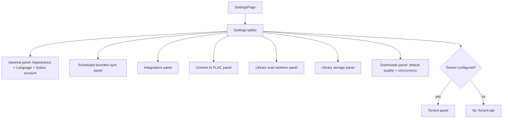

# Settings Page Tabs - Plan

## Goal Capsule

- **Objective:** Reorganize the Settings page into tabs, with Appearance, Language, and Qobuz account grouped under `General`, and every other settings area on its own tab.
- **Authority:** User request and confirmed `General` label define the scope; existing Settings section behavior and frontend tab accessibility patterns define implementation boundaries.
- **Execution profile:** Standard frontend-only UI restructuring with focused regression coverage.
- **Stop conditions:** Stop if the implementation requires changing backend settings APIs, OpenAPI contracts, persisted settings semantics, Qobuz OAuth behavior, or storage/download worker behavior.

---

## Product Contract

### Summary

The Settings page should become a tabbed settings workspace. The first and default tab is `General`, containing Appearance, Language, and Qobuz account. Scheduled favorites sync, Integrations, Convert to FLAC, Library scan workers, Library storage, Downloads, and Torrent settings each appear on their own tab, with Torrent still shown only when the server exposes torrent support.

### Problem Frame

The current Settings page renders all settings cards in a single vertical flow. As more settings have been added, unrelated controls sit in one long page, and the current subtitle still frames the page around Qobuz OAuth even though the page now covers storage, conversion, scans, downloads, integrations, and scheduled sync. Tabs should make the page scannable without changing what each setting does.

### Requirements

- R1. The Settings page renders a tablist whose first tab is `General`.
- R2. `General` is selected on first render and contains Appearance, Language, and Qobuz account controls.
- R3. Scheduled favorites sync, Integrations, Convert to FLAC, Library scan workers, Library storage, Downloads, and Torrent settings are each reachable from their own tab.
- R4. The Torrent tab remains conditional on the same server capability that currently controls whether torrent settings are shown.
- R5. Existing settings forms, mutations, toasts, Qobuz OAuth redirect handling, and server-info display behavior remain unchanged apart from being placed in tab panels.
- R6. Switching tabs does not discard unsaved edits in settings forms.
- R7. Tab labels and any adjusted Settings subtitle are localized in English and Russian.
- R8. Tabs use accessible `tablist`, `tab`, and `tabpanel` semantics with selected state aligned to the visible default.

### Scope Boundaries

- No backend, OpenAPI, data-layer, or settings persistence changes are in scope.
- No new settings categories are added.
- No redesign of individual forms is in scope beyond moving them into tab panels and removing now-unnecessary nesting.
- No URL query parameter for the active Settings tab is planned; tab state is local to the page unless implementation finds an existing local pattern that already supports URL-backed page tabs.

### Acceptance Examples

- AE1. Given the user opens Settings, when the page first renders, then the `General` tab is selected and the Qobuz account connect/sign-out area is visible with Appearance and Language controls.
- AE2. Given the user opens Settings, when they select `Scheduled favorites sync`, then the existing schedule form appears and `Save schedule` / `Run now` keep calling the same endpoints as before.
- AE3. Given the user starts editing a setting in a non-default tab, when they switch away and back before saving, then the unsaved edit is still present.
- AE4. Given torrent support is not configured on the server, when Settings renders, then the Torrent tab is not shown.

---

## Planning Contract

### Key Technical Decisions

- KTD1. Keep the work frontend-only. The requested change is page organization; existing hooks, generated API client calls, and backend endpoints remain the source of behavior.
- KTD2. Use the existing Sources-page tab pattern as the accessibility model, but implement the Settings tab metadata locally. Settings has different draft-state requirements, so copying the Sources unmount-on-select panel behavior would be risky.
- KTD3. Keep tab panels mounted and hide inactive panels. This preserves unsaved form edits and avoids changing the current eager data-fetch behavior, where all settings sections are already present on page load.
- KTD4. Split Library storage out of the current Downloads card into its own tab. Downloads keeps default quality and download concurrency, while Library storage owns the current storage summary and storage form.
- KTD5. Add only the localization needed for the tab shell and broaden the Settings subtitle. Existing section titles remain the source for most tab labels where they already describe the tab clearly.

### High-Level Technical Design

### Assumptions

- `General` is the English tab label; the Russian label should be a direct localized equivalent rather than reusing `Appearance`.
- Library storage is treated as its own settings area because it has its own section title and form, even though it currently sits inside the Downloads card.
- All settings panels may remain mounted after first render because this matches the current all-sections-visible page behavior and protects draft state.

### Sources & Research

- `frontend/src/features/settings/SettingsPage.tsx` owns the current page composition, Qobuz OAuth redirect handling, Appearance, Language, Qobuz account, default quality, and library storage summary.
- `frontend/src/features/settings/SettingsPage.test.tsx` already covers Qobuz account, scheduled sync save, and scheduled sync run-now behavior.
- `frontend/src/features/sources/SourcesPage.tsx` and `frontend/src/features/sources/SourcesPage.test.tsx` provide the local tab accessibility/testing pattern.
- `docs/solutions/best-practices/frontend-tab-order-default-selection.md` records the project convention that tab order, default selected tab, and `aria-selected` must be tested together.

---

## Implementation Units

### U1. Add Settings Tab Shell

- **Goal:** Introduce the Settings page tablist, typed active-tab state, tab button helper, localized tab labels, and `General` default selection.
- **Requirements:** R1, R2, R7, R8.
- **Dependencies:** None.
- **Files:** `frontend/src/features/settings/SettingsPage.tsx`, `frontend/src/i18n/locales/en.ts`, `frontend/src/i18n/locales/ru.ts`, `frontend/src/features/settings/SettingsPage.test.tsx`.
- **Approach:** Add a `SettingsTab` union and local tab metadata in `SettingsPage`. Render a responsive `role="tablist"` using the same visual/accessibility style as `SourcesPage`, with `General` first and selected by default. Add localization for the `General` tab and any needed Settings-wide subtitle update. Keep the tab shell local rather than adding a shared tab component unless implementation shows the shared shape is exact and simpler.
- **Patterns to follow:** `SourcesPage` `TabButton` role/ARIA/class pattern; `SourcesPage.test.tsx` assertions using `getAllByRole("tab")` and `aria-selected`.
- **Test scenarios:**
  - Initial render exposes Settings tabs in the expected DOM order, with `General` first.
  - The `General` tab has `aria-selected="true"` on first render.
  - Each tab has a stable `aria-controls` relationship to its tabpanel.
  - English and Russian locale objects include the new tab/subtitle keys without removing existing settings copy.
- **Verification:** The focused Settings page test proves the tablist order and default selected tab before any panel behavior changes are considered complete.

### U2. Move Existing Settings Areas Into Panels

- **Goal:** Place each existing settings area into the requested tab while preserving behavior and current conditional rendering.
- **Requirements:** R2, R3, R4, R5, R6.
- **Dependencies:** U1.
- **Files:** `frontend/src/features/settings/SettingsPage.tsx`, `frontend/src/features/settings/SettingsPage.test.tsx`.
- **Approach:** Extract or group small local panel renderers inside `SettingsPage` for `General`, `Scheduled favorites sync`, `Integrations`, `Converter`, `Library scan workers`, `Library storage`, `Downloads`, and conditional `Torrent`. Move existing JSX and imported sections into those panels without changing hook calls or mutation wiring. Keep inactive panels mounted with `hidden` so draft form state is not discarded on tab switches. Move the library storage summary and `StorageSettingsSection` into the Library storage tab; keep default quality and `DownloadsSettingsSection` in the Downloads tab.
- **Patterns to follow:** Existing Settings card styling (`rounded-lg border border-border bg-card p-4`), existing section component APIs, and current `info?.torrent_incoming_dir` condition for torrent settings.
- **Test scenarios:**
  - Covers AE1. Initial `General` panel shows Appearance, Language, and Qobuz account content.
  - Covers AE2. Selecting `Scheduled favorites sync` reveals the schedule form and its existing save/run controls.
  - Selecting `Integrations`, `Convert to FLAC`, `Library scan workers`, `Library storage`, and `Downloads` reveals a representative heading or control from each existing area.
  - Covers AE4. When server info lacks torrent support, no Torrent tab is present; when server info has torrent support, the Torrent tab reveals the existing torrent controls.
  - The Downloads tab contains default quality and download concurrency controls, while Library storage owns the storage summary and storage form.
- **Verification:** Existing settings content is reachable only from the intended tab, and the underlying settings section components are not behaviorally rewritten.

### U3. Preserve Existing Settings Workflows Under Tabs

- **Goal:** Update behavior tests so existing Qobuz and scheduled-sync workflows still pass after tabbing.
- **Requirements:** R5, R6, R8.
- **Dependencies:** U1, U2.
- **Files:** `frontend/src/features/settings/SettingsPage.test.tsx`.
- **Approach:** Adjust existing tests that target non-General content to click the relevant tab before interacting with controls. Keep Qobuz account tests on the default General tab. Add a draft-preservation regression by editing a form field in a non-default tab, switching away, and returning to assert the unsaved value remains.
- **Patterns to follow:** React Testing Library role/label queries and `userEvent` as already used in `SettingsPage.test.tsx`; avoid testing implementation details such as local state variable names.
- **Test scenarios:**
  - Existing Qobuz connect button remains visible on the default General tab and still starts OAuth.
  - Existing OAuth callback redirect toast still appears when Settings loads with `qobuz=connected`.
  - Existing scheduled sync save test passes after selecting the scheduled sync tab.
  - Existing scheduled sync run-now test passes after selecting the scheduled sync tab.
  - Covers AE3. Editing a scheduled sync field, switching to another tab, and switching back preserves the unsaved field value.
- **Verification:** The focused Settings page suite proves tabbed organization did not regress Qobuz account or scheduled sync workflows.

---

## Verification Contract

| Gate | Scope | Done Signal |
|---|---|---|
| `mise exec -- npm --prefix frontend test -- src/features/settings/SettingsPage.test.tsx src/features/settings/StorageSettingsSection.test.tsx` | Focused Settings page and storage regressions | Passes with tabs, panel switching, draft preservation, and existing storage behavior |
| `mise exec -- npm --prefix frontend run lint` | Frontend static checks | Passes without new lint errors |
| `mise exec -- npm --prefix frontend exec -- tsc -b --noEmit` | TypeScript project build | Passes without tab metadata or locale typing errors |

---

## Definition of Done

- The Settings page uses tabs with `General` selected by default.
- `General` contains Appearance, Language, and Qobuz account.
- Scheduled favorites sync, Integrations, Convert to FLAC, Library scan workers, Library storage, Downloads, and conditional Torrent settings each have their own tab.
- Existing form behavior, save/run mutations, Qobuz OAuth redirect handling, and toasts continue to work.
- Tab accessibility is covered through role-based tests for order, selected state, and panel switching.
- Unsaved edits in mounted settings panels survive tab changes.
- English and Russian copy stays coherent for the new Settings organization.
- No backend, OpenAPI, migration, generated schema, or unrelated frontend changes are included.
- Dead experimental code from implementation attempts is removed before completion.
