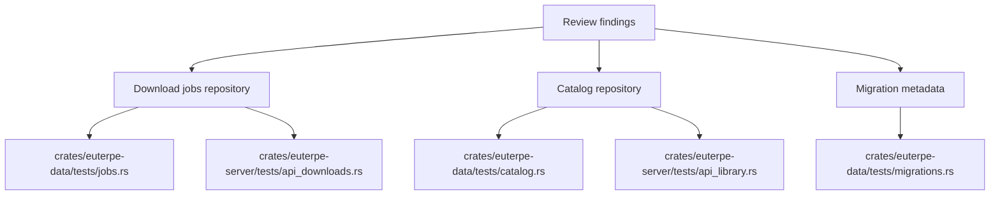
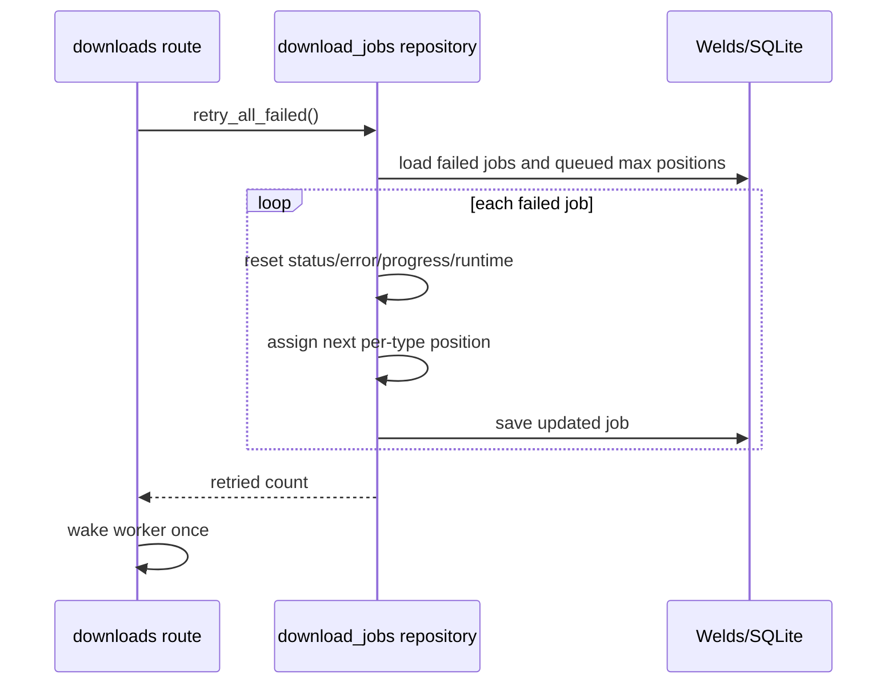

# fix: Address data-layer review findings

## Goal Capsule

| Field | Value |
|---|---|
| Objective | Fix the review findings around bulk SQL behavior and duplicated migration metadata while preserving the current Download queue, Library, and migration compatibility behavior. |
| Authority | User request and AGENTS.md database rule: use Welds for first-party data access; raw SQL only when Welds cannot reasonably express the operation and the reason is documented at the call site. |
| Execution profile | Backend-focused, TDD/characterization-first, Welds-first. |
| Stop conditions | Stop if Welds cannot express the Library album listing query without raw SQL and no acceptable documented fallback can preserve keyset semantics. |
| Tail ownership | No frontend/OpenAPI contract change is expected; if implementation reveals a contract change, stop and re-plan that slice. |

---

## Product Contract

### Summary

This follow-up addresses three code-review findings from the current branch: `Retry all` should not repeatedly rescan the full download queue, Library album listing should not defeat backend pagination by loading every related row, and migration tests should not duplicate the production `_welds_migrations` model.

### Problem Frame

The feature work already added useful Download queue and Library behavior, but the review found backend maintenance and performance risks in the implementation shape.
The fixes should preserve observable behavior and improve the data-layer boundary rather than moving persistence logic into routes or frontend code.

### Requirements

- R1. `retry_all_failed` requeues every failed download job with the same reset semantics as `retry_failed`, including torrent runtime cleanup, without calling `next_queue_position` once per failed row.
- R2. Download queue ordering remains deterministic after bulk retry: retried jobs are appended after the existing queued jobs for their own `DownloadJobType`, preserving a stable order among retried rows.
- R3. `list_albums_keyset` applies Library search, sorting, cursor filtering, limit, and track counts through the data layer without loading all albums, artists, and tracks into memory for each page.
- R4. Library album list API behavior remains unchanged for `title`, `artist`, `album_date`, and `date_added`, including unknown album dates sorting last and cursor fingerprints matching normalized search input.
- R5. Migration metadata access has one production-owned source of truth; tests call an exported data-layer helper instead of defining their own `MigrationLog` Welds model.
- R6. New data access remains Welds-first. Any raw SQL fallback is allowed only for a query Welds cannot reasonably express, with a short call-site reason and focused regression coverage.

### Scope Boundaries

In scope:
- Fix repository implementation in `crates/euterpe-data`.
- Update server compatibility/test helper wrappers only where repository signatures or helpers change.
- Strengthen Rust repository/API tests around the corrected behavior.

Out of scope:
- Changing Download queue or Library UI behavior.
- Adding new OpenAPI fields or frontend controls.
- Reworking unrelated in-memory repository patterns outside the reviewed functions.
- Replacing Welds migrations or changing existing migration files.

### Acceptance Examples

- AE1. Given two failed album jobs and one already queued album job, when Retry all runs, then both failed jobs become queued after the existing queued album job and no failed row keeps an error/progress/runtime state.
- AE2. Given many Library albums and tracks, when requesting the first page with `limit=2`, then the repository reads only the page-shaped album result plus the data needed for those rows, not the entire catalog.
- AE3. Given a legacy SQLx-era database repaired by `migrations::migrate`, when the test checks applied migration count, then it calls the production migration helper and does not define a test-local `_welds_migrations` model.

---

## Planning Contract

### Key Technical Decisions

- KTD1. Keep all fixes in `euterpe-data` repositories/migrations first.
  Routes should continue to orchestrate HTTP responses, job wakeups, and filesystem cleanup; database semantics belong in the data layer.
- KTD2. Fix `retry_all_failed` by separating queue-position assignment from single-row retry.
  The single-job path can keep `next_queue_position`; the bulk path should compute per-type starting positions once and increment in memory as it saves each retried job.
- KTD3. Move Library album page shaping closer to Welds instead of adding frontend sorting or route-level post-processing.
  Keyset pagination is only correct when filtering and ordering happen before page boundaries are selected.
- KTD4. Prefer Welds `select`/`join`/aggregation/query-builder features for Library rows.
  If Welds cannot express a required aggregate such as track counts with grouped joins cleanly, use a narrowly documented fallback inside `crates/euterpe-data/src/repositories/catalog.rs`, not in server routes.
- KTD5. Expose migration metadata through a small public helper rather than making `MigrationLog` public.
  This removes the duplicated test model while keeping the private production model private.

### High-Level Technical Design

### Assumptions

- Welds can express enough filtered/ordered queries for the Library album listing to avoid loading all albums and tracks for each page.
- A small raw SQL fallback remains acceptable only if it is localized, documented, covered by tests, and demonstrably replaces an operation Welds cannot express clearly.
- Query-count instrumentation may require SQLite tracing or a test helper; if that is too invasive, behavior tests plus targeted code review of query shape are acceptable for this plan.

### Sources and Research

- `docs/solutions/architecture-patterns/welds-first-party-data-layer.md`
- `docs/solutions/conventions/library-album-sorting-openapi-welds-keyset.md`
- `docs/solutions/conventions/download-queue-controls-openapi-contract.md`
- `crates/euterpe-data/src/repositories/download_jobs.rs`
- `crates/euterpe-data/src/repositories/catalog.rs`
- `crates/euterpe-data/src/migrations/mod.rs`
- `crates/euterpe-data/tests/migrations.rs`

---

## Implementation Units

### U1. Bulk retry queue-position fix

- **Goal:** Remove the O(failed jobs * all jobs) queue scan from `retry_all_failed` while preserving single-job retry behavior.
- **Requirements:** R1, R2, AE1.
- **Dependencies:** None.
- **Files:**
  - `crates/euterpe-data/src/repositories/download_jobs.rs`
  - `crates/euterpe-data/tests/jobs.rs`
  - `crates/euterpe-server/tests/api_downloads.rs`
- **Approach:** Add characterization coverage first for bulk retry ordering with multiple failed jobs per type and an existing queued row.
  Keep `retry_failed` on the existing single-job helper or a single-row wrapper.
  Introduce a bulk-specific path that loads candidate failed jobs once, computes max queued position per `DownloadJobType` once from the current job set, then increments a per-type counter as rows are reset and saved.
  Keep torrent session cleanup in the shared reset logic so single and bulk retry do not drift.
- **Patterns to follow:** Existing `retry_all_failed` tests in `crates/euterpe-data/tests/jobs.rs`; queue-control convention in `docs/solutions/conventions/download-queue-controls-openapi-contract.md`.
- **Test scenarios:**
  - Failed album jobs are retried after an existing queued album job with increasing queue positions.
  - Failed torrent jobs are retried after existing queued torrent jobs and have `librqbit_id`/runtime fields removed.
  - Completed, cancelled, running, and queued jobs are not retried.
  - `POST /api/v1/downloads/retry` still returns the retried count and wakes the worker once after repository success.
- **Verification:** Repository and API tests show the same visible retry behavior with deterministic queue positions and no per-row call to `next_queue_position` in the bulk path.

### U2. Library album listing query shape

- **Goal:** Rework `list_albums_keyset` so filtering, sorting, cursor application, limit, artist name lookup, and track counts are page-shaped rather than full-catalog in-memory work.
- **Requirements:** R3, R4, AE2.
- **Dependencies:** None.
- **Files:**
  - `crates/euterpe-data/src/repositories/catalog.rs`
  - `crates/euterpe-data/tests/catalog.rs`
  - `crates/euterpe-server/src/routes/library.rs`
  - `crates/euterpe-server/tests/api_library.rs`
- **Approach:** Start with characterization tests that would fail if page boundaries are selected after loading and sorting all rows.
  Build the album query in the repository using Welds filters/order/limit and a stable id tie-breaker.
  Keep the existing `AlbumListParams`, `AlbumListCursor`, and `AlbumListRow` contract unless implementation proves a narrower internal DTO is needed.
  Apply normalized search consistently to title/artist matching before cursor generation and validation.
  Fetch or aggregate track counts for only the album ids in the selected page; prefer a Welds grouped aggregate, with a documented local fallback only if Welds cannot express the aggregate cleanly.
- **Patterns to follow:** `docs/solutions/conventions/library-album-sorting-openapi-welds-keyset.md`; current keyset cursor handling in `crates/euterpe-server/src/routes/library.rs`; Welds query guidance in `~/.agents/skills/rust/weldsorm.md`.
- **Test scenarios:**
  - Title sort, artist sort, album date sort, and date added sort return the same order as current API tests for first and next pages.
  - Unknown album dates remain last in both ascending and descending album-date sorts.
  - Search by album title and artist name is applied before cursor page selection.
  - Track counts are correct for albums in the returned page and do not require loading unrelated album track rows.
  - Stale cursor still fails when sort/order/search fingerprint changes.
- **Verification:** Existing Library repository/API tests remain green and new tests prove page-shaped behavior or the chosen query shape; no frontend test updates are needed unless the internal response contract changes unexpectedly.

### U3. Migration metadata helper

- **Goal:** Remove the duplicate test-local `MigrationLog` Welds model and route migration metadata assertions through production-owned code.
- **Requirements:** R5, AE3.
- **Dependencies:** None.
- **Files:**
  - `crates/euterpe-data/src/migrations/mod.rs`
  - `crates/euterpe-data/tests/migrations.rs`
- **Approach:** Expose a narrowly named helper such as `applied_migration_count` or make the existing `welds_migration_count` public within the crate API if that name is clearer.
  Keep `MigrationLog` private in `migrations::mod`.
  Update tests to call the helper instead of deriving a second model for `_welds_migrations`.
- **Patterns to follow:** Migration compatibility tests in `crates/euterpe-data/tests/migrations.rs`; data-layer boundary guidance in `docs/solutions/architecture-patterns/welds-first-party-data-layer.md`.
- **Test scenarios:**
  - A repaired legacy database reports at least the current migration count through the production helper.
  - Fresh migration tests continue to assert current schema shape without depending on a duplicate metadata model.
- **Verification:** `rg "struct MigrationLog" crates/euterpe-data` shows only the production model in `crates/euterpe-data/src/migrations/mod.rs`.

### U4. Guardrails and regression verification

- **Goal:** Ensure the fixes stay Welds-first and do not regress public behavior across repository and server tests.
- **Requirements:** R1, R2, R3, R4, R5, R6.
- **Dependencies:** U1, U2, U3.
- **Files:**
  - `crates/euterpe-data/src/repositories/download_jobs.rs`
  - `crates/euterpe-data/src/repositories/catalog.rs`
  - `crates/euterpe-data/src/migrations/mod.rs`
  - `crates/euterpe-data/tests/jobs.rs`
  - `crates/euterpe-data/tests/catalog.rs`
  - `crates/euterpe-data/tests/migrations.rs`
  - `crates/euterpe-server/tests/api_downloads.rs`
  - `crates/euterpe-server/tests/api_library.rs`
- **Approach:** Audit the final diff for raw SQL and document any unavoidable fallback at the call site.
  Keep route signatures and OpenAPI-generated frontend contracts untouched unless implementation reveals a real contract change.
  Add only targeted tests for the reviewed behavior; avoid broad unrelated cleanup of other repository functions that still use in-memory filtering.
- **Patterns to follow:** AGENTS.md Database Access rule; `docs/solutions/architecture-patterns/welds-first-party-data-layer.md`.
- **Test scenarios:**
  - Raw SQL audit finds no new first-party application query unless a documented Welds limitation required it.
  - Download queue API tests still validate `DownloadRetryResponse` and completed-only purge behavior.
  - Library API tests still validate cursor, sort, and search behavior.
- **Verification:** Focused backend tests pass, formatting/clippy pass for touched Rust crates, and `git diff --check` reports no whitespace issues.

---

## Verification Contract

| Gate | Applies to | Done signal |
|---|---|---|
| `cargo test -p euterpe-data --test jobs` | U1 | Bulk retry behavior and queue positions pass. |
| `cargo test -p euterpe-data --test catalog` | U2 | Library repository sort/search/cursor/track-count behavior passes. |
| `cargo test -p euterpe-data --test migrations` | U3 | Migration compatibility tests pass without a test-local `MigrationLog`. |
| `cargo test -p euterpe-server --test api_downloads` | U1, U4 | Retry endpoint and purge endpoint behavior pass. |
| `cargo test -p euterpe-server --test api_library` | U2, U4 | Library API cursor/sort/search behavior passes. |
| `cargo fmt --check` | All units | Rust formatting is clean. |
| `cargo clippy --workspace --all-targets --locked -- -D warnings` | All units | No lint regressions in the workspace. |
| `git diff --check` | All units | No whitespace errors. |

---

## Definition of Done

- U1 is done when `retry_all_failed` no longer calls `next_queue_position` per failed row and tests prove per-type ordering after existing queued jobs.
- U2 is done when `list_albums_keyset` no longer builds the page by loading all artists, all tracks, and all albums for every request, while preserving existing Library API behavior.
- U3 is done when `MigrationLog` exists only in production migration code and migration tests use a production helper.
- U4 is done when the final diff is Welds-first, any raw SQL exception is documented at the call site, and the Verification Contract gates pass or any skipped gate is explicitly explained with the blocking reason.
- The final implementation leaves no abandoned exploratory helpers, duplicate models, or route-level database logic introduced by the fix.
